# **Informe Trabajo Final**

<p align="center">
  
</p>

<p align="center"><strong>Universidad Peruana de Ciencias Aplicadas</strong></p>

<p align="center"><strong>Ingeniería de Software</strong><br>
Fundamentos de Arquitectura de Software <br>
<strong>Profesor: Jorge Luis Delgado Vite</strong> </p>

<h2 align="center">INFORME</h2>

<h3 align="center">Startup: Grupo 2</h3>
<p align="center"><strong>Producto: Workstation</strong></p>

<h3 align="center">Team Members:</h3>

<div align="center">

| **Member**                       | **Code**   |
| -------------------------------- | ---------- |
| Rodrigo Liberato Saldana         | U202215623 |
| Renzo Miguel Llerena Delgado     | U202312399 |
| Henry Kevin Diaz Gutierrez       | U201819674 |
| Diego Sebastián Zúñiga Murillo   | U202310636 |
| Braulio Rodrigo Torrejon Navarro | U201711828 |

</div>

<p align="center"><strong>Septiembre 2025</strong></p>

# Registro de Versiones del Informe

| Versión | Fecha      | Autor(es)                                                                                                                                      | Descripción de la modificación                                                                                                     |
| ------- | ---------- | ---------------------------------------------------------------------------------------------------------------------------------------------- | ---------------------------------------------------------------------------------------------------------------------------------- |
| TB1     | 25-04-2025 | Liberato Rodrigo, Renzo Miguel Llerena Delgado, Henry Kevin Diaz Gutierrez , Diego Sebastián Zúñiga Murillo y Braulio Rodrigo Torrejon Navarro | Los 3 capitulos del primer avance fueron completados, junto a las conclusiones e informacion necesaria para el avance del trabajo. |
| TP      | 08-10-2025 | Liberato Rodrigo, Renzo Miguel Llerena Delgado, Henry Kevin Diaz Gutierrez , Diego Sebastián Zúñiga Murillo y Braulio Rodrigo Torrejon Navarro | El nuevo capitulo 4 y 5 fue completado con exito y las conclusiones fueron avanzadas, asi mismo como la solucion fue avanzada.     |

# Project Report Collaboration Insights


# Contenido

- [Registro de Versiones del Informe](#registro-de-versiones-del-informe)
- [Project Report Collaboration Insights](#project-report-collaboration-insights)
- [Student Outcome](#student-outcome)

---

## Capítulo I: Introducción

- [1.1 Start-up Profile](#11-start-up-profile)
  - [1.1.1. Descripción de la Startup](#111-descripción-de-la-startup)
  - [1.1.2. Perfiles de integrantes del equipo](#112-perfiles-de-integrantes-del-equipo)
- [1.2. Solution Profile](#12-solution-profile)
  - [1.2.1 Antecedentes y problemática](#121-antecedentes-y-problemática)
  - [1.2.2 Lean UX Process](#122-lean-ux-process)
    - [1.2.2.1. Lean UX Problem Statements](#1221-lean-ux-problem-statements)
    - [1.2.2.2. Lean UX Assumptions](#1222-lean-ux-assumptions)
    - [1.2.2.3. Lean UX Hypothesis Statements](#1223-lean-ux-hypothesis-statements)
    - [1.2.2.4. Lean UX Canvas](#1224-lean-ux-canvas)
- [1.3. Segmentos objetivo](#13-segmentos-objetivo)

---

## Capítulo II: Requirements Elicitation & Analysis

- [2.1. Competidores](#21-competidores)
  - [2.1.1. Análisis competitivo](#211-análisis-competitivo)
  - [2.1.2. Estrategias y tácticas frente a competidores](#212-estrategias-y-tácticas-frente-a-competidores)
- [2.2. Entrevistas](#22-entrevistas)
  - [2.2.1. Diseño de entrevistas](#221-diseño-de-entrevistas)
  - [2.2.2. Registro de entrevistas](#222-registro-de-entrevistas)
  - [2.2.3. Análisis de entrevistas](#223-análisis-de-entrevistas)
- [2.3. Needfinding](#23-needfinding)
  - [2.3.1. User Personas](#231-user-personas)
  - [2.3.2. User Task Matrix](#232-user-task-matrix)
  - [2.3.3. User Journey Mapping](#233-user-journey-mapping)
  - [2.3.4. Empathy Mapping](#234-empathy-mapping)
  - [2.3.5. As-is Scenario Mapping](#235-as-is-scenario-mapping)
- [2.4. Ubiquitous Language](#24-ubiquitous-language)

---

## Capítulo III: Requirements Specification

- [3.1. To-Be Scenario Mapping](#31-to-be-scenario-mapping)
- [3.2. User Stories](#32-user-stories)
- [3.3. Impact Mapping](#33-impact-mapping)
- [3.4. Product Backlog](#34-product-backlog)

---

## Capítulo IV: Design

- [4.1 Design Concepts, ViewPoints & ER Diagrams](#41-design-concepts-viewpoints--er-diagrams)

  - [4.1.1 Principles Statements](#411-principles-statements)
  - [4.1.2 Approaches Statements Architectural Styles & Patterns](#412-approaches-statements-architectural-styles--patterns)
  - [4.1.3 Context Diagram](#413-context-diagram)
  - [4.1.4 Approach driven ViewPoints Diagrams](#414-approach-driven-viewpoints-diagrams)
  - [4.1.5 Relational/Non Relational Database Diagram](#415-relationalnon-relational-database-diagram)
  - [4.1.6 Design Patterns](#416-design-patterns)
  - [4.1.7 Tactics](#417-tactics)

- [4.2 Architectural Drivers](#42-architectural-drivers)

  - [4.1.8 Design Purpose](#418-design-purpose)
  - [4.1.9 Primary Functionality (Primary User Stories)](#419-primary-functionality-primary-user-stories)
  - [4.1.10 Quality Attribute Scenarios](#4110-quality-attribute-scenarios)
  - [4.1.11 Constraints](#4111-constraints)
  - [4.1.12 Architectural Concerns](#4112-architectural-concerns)

- [4.3 ADD Iterations](#43-add-iterations)

  - [4.2.1 Iteration 1: Workstation Office Recommendation](#421-iteration-1-workstation-office-recommendation)
    - [4.2.1.1 Architectural Design Backlog 1](#4211-architectural-design-backlog-n)
    - [4.2.1.2 Establish Iteration Goal by Selecting Drivers](#4212-establish-iteration-goal-by-selecting-drivers)
    - [4.2.1.3 Choose One or More Elements of the System to Refine](#4213-choose-one-or-more-elements-of-the-system-to-refine)
    - [4.2.1.4 Choose One or More Design Concepts That Satisfy the Selected Drivers](#4214-choose-one-or-more-design-concepts-that-satisfy-the-selected-drivers)
    - [4.2.1.5 Instantiate Architectural Elements, Allocate Responsibilities, and Define Interfaces](#4215-instantiate-architectural-elements-allocate-responsibilities-and-define-interfaces)
    - [4.2.1.6 Sketch Views (C4 & UML) and Record Design Decisions](#4216-sketch-views-c4--uml-and-record-design-decisions)
    - [4.2.1.7 Analysis of Current Design and Review Iteration Goal (Kanban Board)](#4217-analysis-of-current-design-and-review-iteration-goal-kanban-board)

- [Avance de Conclusiones, Bibliografía y Anexos (links)](#avance-de-conclusiones-bibliografía-y-anexos-links)

## Capítulo I: Introducción

### 1.1. Start-up Profile

#### 1.1.1. Descripción de la Startup

WorkStation es una aplicación web innovadora diseñada para optimizar la reserva ágil y eficiente de espacios de trabajo en oficinas compartidas. Su misión es conectar a freelancers, profesionales remotos, startups y compañías de todo tamaño con espacios de coworking disponibles en su ciudad o en cualquier parte del mundo.

La plataforma permitirá a los usuarios explorar, comparar y reservar en tiempo real escritorios, salas de reuniones, oficinas privadas y otros recursos. Cada espacio ofrecerá información detallada sobre su ubicación, tarifas, horarios, disponibilidad, fotografías, servicios incluidos (como Wi-Fi, café, impresoras, entre otros) y valoraciones de la comunidad.

Considerando la flexibilidad y adaptabilidad como factores clave en el crecimiento de las startups y en la dinámica del trabajo independiente, WorkStation se presenta como una alternativa moderna frente a la rigidez de los contratos tradicionales, brindando una solución práctica, accesible y contemporánea para cubrir las necesidades de los equipos y profesionales de hoy.

#### 1.1.2. Perfiles de integrantes del equipo

| Foto                                                                                                                                                                                                                                                                                 | Alumno                         | Descripción                                                                                                                                                                                                                                                                                                                                      |
| ------------------------------------------------------------------------------------------------------------------------------------------------------------------------------------------------------------------------------------------------------------------------------------ | ------------------------------ | ------------------------------------------------------------------------------------------------------------------------------------------------------------------------------------------------------------------------------------------------------------------------------------------------------------------------------------------------ |
|                                                                                                                                                                                          | Liberato Saldaña Rodrigo       | Estudiante de Ingeniería de Software que planea enfocarse en Ciencia de Datos y Ciberseguridad. Planea dar apoyo activo al grupo y asumir el rol de líder para encaminar al equipo hacia el cumplimiento de sus metas.                                                                                                                           |
|                                                                                                                                                                      | Renzo Miguel Llerena Delgado   | Me destaco por ser responsable, trabajador y tener un enfoque en la perfección y la calidad en todos mis proyectos. Disfruto trabajando en equipo, colaborando para alcanzar mis objetivos y siempre buscando superar expectativas. Me mantengo en constante aprendizaje, dispuesto a enfrentar desafíos con una actitud proactiva y resolutiva. |
|                                                                                                                                                                             | Henry Kevin Diaz Gutierrez     | Soy estudiante de Ingenieria de Software en la UPC.Me caracterizo por ser creativo , cumplir con lo que se me brinda y ayudar a resolver problemas si se presenta.Desde siempre me intereso el tema de los videojuegos y de el tipo de diseño que se empleaba, eso hizo que me guste el desarrollo de software.                                  |
|  | Diego Sebastián Zúñiga Murillo | Estudiante en el sexto ciclo de la carrera de Ingenieria de Software que busca expandir sus conocimientos en diversas tecnologías, soy una persona participativa y colaborativa y siempre me adapto rápido a las situaciones de cambio, estoy preparado para afrontar las adversidades que este trabajo signifca para mi y como grupo            |
|                                                                                                                                                                                                                                          | Braulio Torrejon Navarro       | Estudiante de Ingenieria de software del 7mo ciclo, planeo dar lo mejor de mi en este grupo, tambien deseo aprender mucho del curso para mi futuro profesional                                                                                                                                                                                   |

### 1.2. Solution Profile

#### 1.2.1. Antecedentes y problemática

| Aspecto                                           | Descripción                                                                                                                                                                                                                                                                                                                                                                                                                                     |
| ------------------------------------------------- | ----------------------------------------------------------------------------------------------------------------------------------------------------------------------------------------------------------------------------------------------------------------------------------------------------------------------------------------------------------------------------------------------------------------------------------------------- |
| **Who (¿Quiénes somos los involucrados?)**        | Nosotros, como principales usuarios, somos freelancers, trabajadores remotos, startups, pequeñas empresas y nómadas digitales que necesitamos espacios de trabajo profesionales, cómodos y flexibles sin tener que alquilar oficinas a largo plazo. <br><br> También forman parte clave los dueños y administradores de espacios de coworking, quienes buscan mayor visibilidad, una gestión más ágil de sus reservas y captar nuevos clientes. |
| **What (¿Qué necesitamos?)**                      | Necesitamos una plataforma centralizada, intuitiva y fácil de usar que nos permita buscar, comparar, reservar y pagar espacios de coworking en distintas ubicaciones, con información clara y disponibilidad en tiempo real. <br><br> Hoy en día, el proceso suele ser manual, lento y disperso en múltiples canales poco estandarizados (páginas web propias, redes sociales, WhatsApp, etc.).                                                 |
| **Where (¿Dónde ocurre el problema?)**            | En ciudades con alta actividad profesional y creciente demanda de espacios flexibles, como Lima, Arequipa, Medellín, Bogotá o Ciudad de México. <br><br> Esta necesidad puede extenderse tanto a nivel nacional como internacional a medida que el trabajo remoto sigue consolidándose.                                                                                                                                                         |
| **When (¿Cuándo surge esta necesidad?)**          | La necesidad está presente en todo momento y puede surgir de forma imprevista. <br><br> A veces necesitamos espacios por horas, días o semanas, y en otras ocasiones soluciones de último minuto para reuniones o trabajo inmediato.                                                                                                                                                                                                            |
| **Why (¿Por qué tenemos esta necesidad?)**        | El mundo laboral cambió. La pandemia aceleró el trabajo remoto y la cultura freelance. <br><br> Necesitamos trabajar en entornos productivos y profesionales, pero sin asumir compromisos de largo plazo. Sin embargo, aún no existe una solución masiva y eficiente que reúna toda la oferta disponible y simplifique el proceso de reserva.                                                                                                   |
| **How (¿Cómo podemos solucionarlo?)**             | Con el desarrollo de una aplicación web llamada **WorkStation**, que nos permita explorar una amplia variedad de espacios de coworking, revisar disponibilidad, leer opiniones, aplicar filtros, reservar en tiempo real y pagar desde una sola interfaz.                                                                                                                                                                                       |
| **How Much (¿Cuánto cuesta y cómo se monetiza?)** | Los precios cambian según la ciudad, el tipo de espacio, los servicios y el tiempo de uso. <br><br> La plataforma mostrará tarifas claras y actualizadas. El modelo de negocio se basará en comisiones por reserva, planes de suscripción para coworkings y membresías premium para usuarios frecuentes.                                                                                                                                        |

#### 1.2.2. Lean UX Process

##### 1.2.2.1. Lean UX Problem Statements

##### Dominio del Problema

El proyecto **WorkStation** se desarrolla en el ámbito de los **espacios de trabajo compartidos (coworking)**, una industria en crecimiento impulsada por el teletrabajo, el autoempleo y la economía digital. Sin embargo, la relación entre la **oferta** (espacios disponibles) y la **demanda** (profesionales o empresas en expansión) sigue siendo fragmentada, sobre todo en Perú, donde aún no existen plataformas de gran alcance que conecten ambas partes de forma eficiente.

#### Segmentos de Cliente

1. **Freelancers, startups y profesionales remotos**  
   Personas de 22 a 40 años que buscan espacios de trabajo flexibles y bien ubicados. Valoran la autonomía, la conectividad y la comodidad, y esperan gestionar sus reservas de forma rápida desde una plataforma digital.

2. **Dueños o administradores de coworkings**  
   Emprendedores o pequeñas empresas que necesitan visibilidad, gestión automatizada de reservas y mejores canales para ocupar sus instalaciones. Muchos aún dependen de procesos manuales o redes sociales.

#### Puntos de Dolor

- **Freelancers y startups**:

  - No cuentan con una oferta centralizada y confiable.
  - Carecen de filtros para comparar por ubicación, precio o servicios.
  - El proceso de reserva suele ser lento, informal y poco transparente.

- **Propietarios de coworkings**:
  - Alta dependencia de canales informales (WhatsApp, redes sociales).
  - Falta de herramientas para gestionar disponibilidad en tiempo real.
  - Pierden ingresos por baja visibilidad y reservas irregulares.

#### Brecha Detectada

En Perú aún no existe una plataforma consolidada que conecte en tiempo real a freelancers y startups con coworkings disponibles. Esto genera una experiencia ineficiente tanto para los usuarios como para los propietarios.

A diferencia de Estados Unidos o Europa —donde plataformas como **LiquidSpace** o **Deskpass** lideran el mercado— el ecosistema local carece de soluciones digitales adaptadas a las necesidades del país.

#### Visión y Estrategia

**Visión**  
Crear una plataforma web tipo **marketplace** que ofrezca a los usuarios una experiencia de reserva ágil, segura y personalizada, y a los propietarios una herramienta de gestión que maximice el uso de sus espacios.

**Estrategia**

- Desarrollar un **MVP** para validar pronto la propuesta de valor.
- Priorizar la usabilidad, accesibilidad y confianza en la plataforma.
- Generar alianzas con coworkings emergentes en Lima.
- Implementar un modelo de monetización basado en comisiones y herramientas analíticas.

#### Segmento Inicial

Para validar la propuesta, se enfocará primero en:

- **Usuarios meta**: Freelancers y profesionales digitales de 22 a 35 años en Lima Metropolitana, que trabajan de forma remota o independiente.
- **Aliados estratégicos**: Coworkings pequeños y medianos en distritos céntricos como Miraflores, Barranco y San Isidro, que no cuenten con sistemas propios de gestión o marketing digital.

##### 1.2.2.2. Lean UX Assumptions

- **Asumimos que los usuarios requieren flexibilidad y comodidad en sus espacios de trabajo**
- **Asumimos que los propietarios de espacios de coworking necesitan mayor visibilidad y eficiencia en la gestión de reservas**
- **Asumimos que la búsqueda y reserva de espacios de coworking es un proceso fragmentado y poco confiable**
- **Asumimos que los usuarios están dispuestos a pagar por una solución eficiente y confiable**
- **Asumimos que la digitalización mejorará la eficiencia operativa de los espacios de coworking**

##### 1.2.2.3. Lean UX Hypothesis Statements

| Nº    | Hipótesis                                                                                                                                                                                                                                   | Impacto Esperado                                                                      |
| ----- | ------------------------------------------------------------------------------------------------------------------------------------------------------------------------------------------------------------------------------------------- | ------------------------------------------------------------------------------------- |
| **1** | Si ofrecemos una **plataforma centralizada, intuitiva y fácil de usar** para reservar espacios de coworking, entonces los **freelancers y pequeñas empresas** la preferirán por la flexibilidad y el acceso a diversas opciones de trabajo. | Mayor adopción de la plataforma por parte de profesionales independientes y startups. |
| **2** | Si los **propietarios de coworkings** obtienen más visibilidad y una herramienta para gestionar reservas de manera eficiente, entonces **aumentará la ocupación** de sus espacios y la **satisfacción de sus clientes**.                    | Incremento en la rentabilidad y fidelización de clientes.                             |
| **3** | Si los usuarios pueden **comparar precios, consultar disponibilidad en tiempo real y leer reseñas**, entonces tomarán decisiones de reserva con **mayor rapidez y confianza**.                                                              | Mejora significativa en la experiencia del cliente y en el nivel de conversión.       |
| **4** | Si la plataforma aplica un **modelo de comisión por reserva o membresía**, entonces se generarán **ingresos recurrentes** para la plataforma y beneficios para los propietarios.                                                            | Sostenibilidad financiera del modelo de negocio e incentivo para la adopción.         |
| **5** | Si se **digitaliza la gestión de reservas**, entonces los propietarios de coworkings podrán **reducir costos operativos** y **mejorar su rentabilidad** a largo plazo.                                                                      | Optimización de recursos y eficiencia en la operación diaria.                         |

##### 1.2.2.4. Lean UX Canvas

| Sección                                                                                      | Descripción                                                                                                                                                                                                                                                                                                                                                                                                                    |
| -------------------------------------------------------------------------------------------- | ------------------------------------------------------------------------------------------------------------------------------------------------------------------------------------------------------------------------------------------------------------------------------------------------------------------------------------------------------------------------------------------------------------------------------ |
| **1. Business Problem**                                                                      | La conexión entre la creciente demanda de espacios de trabajo flexibles y la oferta de coworkings está fragmentada. Los usuarios no cuentan con plataformas confiables y los propietarios carecen de herramientas de gestión efectivas.                                                                                                                                                                                        |
| **2. Business Outcomes**                                                                     | - Incrementar ingresos mediante comisiones y membresías.<br>- Reducir el tiempo promedio de búsqueda y reserva.<br>- Ayudar a miles de peruanos a encontrar un lugar para trabajar con mejores resultados.                                                                                                                                                                                                                     |
| **3. Users**                                                                                 | - **Freelancers y trabajadores remotos** (22–40 años) que buscan espacios acogedores con servicios como Wi-Fi y salas de reuniones.<br>- **Startups y equipos pequeños** que necesitan lugares temporales para colaborar o reunirse.<br>- **Propietarios de coworkings** que desean captar más clientes y administrar reservas de forma sencilla.                                                                              |
| **4. User Benefits**                                                                         | - Acceso a espacios que se adapten a sus necesidades (precio, ubicación, servicios).<br>- Mayor actividad y ocupación para los propietarios, con menos esfuerzo.<br>- Más reservas frecuentes y recomendaciones de usuarios satisfechos.                                                                                                                                                                                       |
| **5. Solutions**                                                                             | - Motor de búsqueda con filtros por ciudad, precio y servicios.<br>- Sistema de reservas con calendario en tiempo real.<br>- Panel para propietarios con gestión de disponibilidad, estadísticas y reseñas.<br>- Notificaciones automáticas (email, push) para recordatorios y confirmaciones.                                                                                                                                 |
| **6. Hypotheses**                                                                            | - Centralizar la oferta de coworkings ahorrará tiempo y generará confianza.<br>- Digitalizar la gestión aumentará la ocupación y reducirá la carga operativa.<br>- Mostrar precios, disponibilidad y reseñas en tiempo real permitirá decisiones más rápidas y acertadas.<br>- Comisiones y membresías premium harán el modelo rentable.<br>- Una plataforma ágil y confiable se convertirá en el canal principal de reservas. |
| **7. What’s the most important thing we need to learn first?**                               | Validar si los usuarios realmente desean una plataforma centralizada de reservas, entender sus preferencias y comprobar si les resulta más cómoda frente a métodos tradicionales.                                                                                                                                                                                                                                              |
| **8. What’s the least amount of work we need to do to learn the next most important thing?** | Realizar entrevistas, recolectar feedback y pruebas de usabilidad para medir la relevancia de las reservas de espacios tanto para usuarios como para propietarios.                                                                                                                                                                                                                                                             |

### 1.3. Segmentos objetivo

En el proyecto nos enfocamos en dos segmentos principales de usuarios, directamente relacionados con el dominio del problema: los propietarios de espacios de coworking y los usuarios que buscan dichos espacios, como freelancers y startups. A continuación, se describen en detalle ambos perfiles.

### Propietarios de Inmuebles (Coworkings)

Corresponde a personas naturales o jurídicas que administran o alquilan espacios acondicionados para trabajo compartido, como oficinas, salas de reuniones, escritorios flexibles, entre otros.

#### Características Demográficas

- **Ubicación:** Principalmente zonas urbanas de alto flujo empresarial, como Miraflores, San Isidro, Surco (Lima).
- **Edad promedio de los administradores:** 30 a 55 años.
- **Nivel socioeconómico:** Medio-alto a alto.
- **Tipo de propiedad:** Empresas formales, pymes inmobiliarias o propietarios individuales.

#### Datos Relevantes

- En Lima existen más de 150 espacios de coworking activos (Andina, 2023).
- El 67% de estos espacios reporta dificultades para llenar su capacidad total, especialmente en horarios valle (CoworkIntel, 2022).
- La mayoría carece de una plataforma de reservas centralizada, y operan mediante WhatsApp, redes sociales o formularios web.

#### Necesidades Clave

- Mayor visibilidad de su espacio.
- Automatización del proceso de reservas.
- Optimización de la ocupabilidad de sus ambientes.
- Acceso a métricas sobre uso y satisfacción de clientes.

---

### Freelancers y Startups

Este grupo está compuesto por trabajadores independientes, equipos pequeños de desarrollo, marketing, diseño, entre otros, así como emprendedores en etapa inicial.

#### Características Demográficas

- **Edad:** Entre 20 y 40 años.
- **Ubicación:** Centros urbanos con alta conectividad.
- **Nivel educativo:** Técnico o universitario completo.
- **Ocupación:** Diseñadores, desarrolladores, consultores, creadores de contenido, equipos de startups.
- **Ingreso promedio mensual:** S/ 2,000 – S/ 5,000 (varía por actividad y clientes).

#### Datos Relevantes

- Se estima que más de 500,000 peruanos trabajan como freelancers (Statista, 2022), y esta cifra crece con el auge del trabajo remoto postpandemia.
- Según un estudio de WeWork (2021), el 78% de los trabajadores remotos en LATAM buscan espacios fuera de casa al menos una vez por semana.
- El 60% de los freelancers jóvenes en Lima considera los coworkings como espacios que fomentan productividad y networking (PUCP, 2023).

#### Necesidades Clave

- Acceso flexible a espacios profesionales sin necesidad de contrato a largo plazo.
- Precios accesibles, según uso (por horas o días).
- Información clara sobre servicios incluidos (wifi, café, salas, etc.).
- Reseñas de otros usuarios para tomar decisiones confiables.

---

## Capítulo II: Requirements Elicitation & Analysis

### 2.1. Competidores

WeWork, fundada en 2010 en Nueva York por Adam Neumann y Miguel McKelvey, empezó como una startup de espacios de coworking. Su modelo de negocio se basaba en alquilar oficinas a largo plazo, rediseñarlas como espacios colaborativos y flexibles, y alquilarlas a empresas, freelancers y emprendedores a corto plazo.

La compañía creció rápidamente, alcanzando una valoración de $47 mil millones en 2019. Sin embargo su estruendoso intento de salir a la bolsa fracaso debido a la mala gestión y al modelo insostenible que la compañía tenia, además uno de sus fundadores renuncio. Todo esto llevo que WeWork a declararse en bancarrota en noviembre de 2023. Actualmente, bajo la nueva dirección de SoftBank, busca reestructurarse y enfocarse en rentabilidad.

**Spaces:**
Spaces fue fundada en 2008 en Ámsterdam (Países Bajos) como una marca de espacios de coworking y oficinas flexibles, enfocada en diseño innovador y comunidad. En 2016, fue adquirida por IWG plc, lo que le permitió expandirse globalmente con mayor respaldo financiero.

**CoWorker:**

Coworker.com es una plataforma global de búsqueda y comparación de espacios de coworking, fundada en 2015 por Leanne Beesley y Sam Marks . A diferencia de WeWork o Spaces, Coworker no opera sus propios espacios, sino que funciona como un marketplace que conecta a usuarios con miles de espacios de coworking en todo el mundo.

La plataforma surgió para resolver un problema clave: la falta de transparencia y acceso a información sobre espacios de trabajo flexibles. Hoy, Coworker.com lista más de 20,000 espacios en 170+ países, ofreciendo reseñas, precios y disponibilidad en tiempo real.

**Oficinas YA!**

Oficinas YA! es una plataforma líder en América Latina especializada en la búsqueda, comparación y arrendamiento de oficinas y espacios de coworking. Fue fundada en 2015 en México y se ha expandido a otros países como Colombia, Argentina y Chile, con un enfoque en facilitar el proceso de encontrar espacios de trabajo flexibles para empresas y profesionales.

#### 2.1.1. Análisis competitivo

| **Competitive Analysis Landscape**        |                                                                                                                                                                                                                                                    |
| ----------------------------------------- | -------------------------------------------------------------------------------------------------------------------------------------------------------------------------------------------------------------------------------------------------- |
| **¿Por qué llevar a cabo este análisis?** | **Escriba en el recuadro la pregunta que busca responder o el objetivo de este análisis.**                                                                                                                                                         |
|                                           | **Identificar que ventajas comerciales podemos obtener por parte de nuestros competidores. Funcionalidades, estrategias de marketing o productos que podriamos agregar, Gracias a esto lograr ser un competidor estable frente a estas companias** |

| **_Competidor_**          |                                                             | WorkStation                                                                                                                                                                                                                                                                                                                                                                                                                                                                                                                                        | WeWork                                                                                                                                                                                                                                                                                                       | Spaces                                                                                                                                                                                                                 | Coworker                                                                                                                                                                                                                                                                                                                                                                                                                                                                                                                      | Oficinas Ya!                                                                                                                                                                                                                                                                                              |
| ------------------------- | ----------------------------------------------------------- | -------------------------------------------------------------------------------------------------------------------------------------------------------------------------------------------------------------------------------------------------------------------------------------------------------------------------------------------------------------------------------------------------------------------------------------------------------------------------------------------------------------------------------------------------- | ------------------------------------------------------------------------------------------------------------------------------------------------------------------------------------------------------------------------------------------------------------------------------------------------------------ | ---------------------------------------------------------------------------------------------------------------------------------------------------------------------------------------------------------------------- | ----------------------------------------------------------------------------------------------------------------------------------------------------------------------------------------------------------------------------------------------------------------------------------------------------------------------------------------------------------------------------------------------------------------------------------------------------------------------------------------------------------------------------- | --------------------------------------------------------------------------------------------------------------------------------------------------------------------------------------------------------------------------------------------------------------------------------------------------------- |
| **_Logo_**                |                                                             | 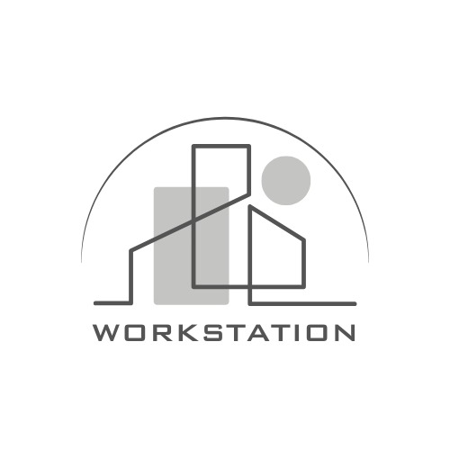                                                                                                                                                                                                                                                                                                                                                                                                                                                                                           | 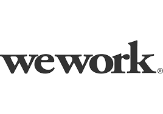                                                                                                                                                                                                                                                                   |                                                                                                                                                                              | 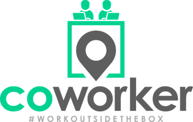                                                                                                                                                                                                                                                                                                                                                                                                                                                                                |                                                                                                                                                                                                                                                         |
| **_Perfil_**              | Overview                                                    | Una aplicación web y móvil que ofrece servicios de su arrendaciones a empresas, freelances o startups a nivel mundial.                                                                                                                                                                                                                                                                                                                                                                                                                             | Una aplicación web y móvil que ofrece servicios de su arrendaciones a empresas, freelances o startups a nivel mundial.                                                                                                                                                                                       | Una aplicación web y móvil que ofrece servicios de su arrendaciones a empresas, freelances o startups a nivel mundial.                                                                                                 | Una aplicación web y móvil que ofrece servicios de su arrendaciones a empresas, freelances o startups a nivel mundial.                                                                                                                                                                                                                                                                                                                                                                                                        | Una aplicación web y móvil que ofrece servicios de su arrendaciones a empresas, freelances o startups a nivel mundial.                                                                                                                                                                                    |
|                           | **_Ventaja competitiva ¿Qué valor ofrece a los clientes?_** | Su propósito es conectar a freelancers, trabajadores remotos, startups y empresas de todos los tamaños con espacios de coworking disponibles en su ciudad o alrededor del mundo. La plataforma permitirá a los usuarios buscar, comparar y reservar escritorios, salas de reuniones, oficinas privadas y otros recursos disponibles en tiempo real. Cada espacio contará con información detallada como ubicación, precios, horarios, disponibilidad, fotos, servicios incluidos (Wi-Fi, café, impresoras, etc.), y valoraciones de otros usuarios | Además de servicios básicos como internet de alta velocidad, oficinas en buen estado, impresoras y cafetería ilimitada, también posee espacios flexibles y con diseños modernos, una comunidad global que permite el acceso a evento, networking y acceso a que los miembros del equipo conecten fácilmente. | Posee contratos cortos, membresías mensuales o planes flexibles que beneficien a los clientes. Oficinas con servicios adicionales, ergonómicos y decoración innovadora que ha resaltado al ganar un premio sobre eso.  | Sus funcionalidades mas resaltantes son la búsqueda inteligente que permite a los usuarios buscar y comprar precios de espacios coworking al rededor de mas de 170 paises. Ofrecen un sistema de reseñas y ratings para la comunidad. Asimismo brindan recursos para nómadas digitales, cómo guías de las ciudades de los mejores espacios coworking e información de visas o papeleo. Por ultimo, da la opción de una membresía llamada "Coworker Pass" que brinda acceso casi ilimitado a espacios y descuentos exclusivos. | Busqueda avanzada, como filtros o tipos de espacios. Asimismo birnda una visualizacion de fotos y videos 360. Ofrece oficinas virtuales, que brindan serivicio de gestion de correo y atencion personalizada de llamadas. UNa gran Flexibilidad de contratos desde horas hasta meses sin compromisos.<br> |
| **_Perfil de Marketing_** | **_Mercado objetivo_**                                      | Startups, emprendedores, freelancers, nomadas digitales o empresas tradicionales. Ademas de propietarios de inmuebles que deseen una optimizacion de ocupacion de sus ambientes.                                                                                                                                                                                                                                                                                                                                                                   | Startups, emprendedores, freelancers, nomadas digitales o empresas tradicionales.                                                                                                                                                                                                                            | Startups, emprendedores, freelancers, nómadas digitales.                                                                                                                                                               | Startups, emprendedores, freelancers, nómadas digitales o empresas tradicionales.                                                                                                                                                                                                                                                                                                                                                                                                                                             | Startups, emprendedores, freelancers, nómadas digitales o empresas tradicionales.                                                                                                                                                                                                                         |
|                           | **_Estrategias de marketing_**                              | Las propuestas que tenemos como marketing son las siguientes; anunciar la aplicación web por Google ads y redes sociales como Facebook, Instagram o en grupos de Telegram de Freelancers o Startups.                                                                                                                                                                                                                                                                                                                                               | Se promocionan por redes sociales queriendo expandir su estilo de vida creativo e innovacion en su comunidad de trabajo. Asimismo tienen eventos gracias a sus alianzas estrategicas con Microsoft y Salesforce. Por ultimo, algunos anuncios en Google Ads y SEO.                                           | Contenido en redes sociales, alianzas estratégicas, enfoque de diseño y experiencia y eventos que llaman a los clientes rápidamente.<br><br>                                                                           | La aplicación se promociona con optimización de búsquedas simples en el navegador, publica artículos y reportes acerca del coworking flexible, tiene una gran presencia en redes sociales y posee alianzas estratégicas con Selina, Outside o Airbnb for work.                                                                                                                                                                                                                                                                | Posee una presencia digital activa, con redes sociales y comunidades empresariales en Linkedin y Facebook. Tienen publicidad en Google Ads y remarketing. Por ultimo, tienen alianzas con espacios asociados en eventos conjuntos.                                                                        |
| **_Perfil de Producto_**  | **_Productos & Servicios_**                                 | Ofrecer la comunicación entre freelancers o startups con los propietarios de los inmuebles.                                                                                                                                                                                                                                                                                                                                                                                                                                                        | Ofrecen sus propias oficinas para el uso de cualquier empresa, startup o que su mercado objetivo necesite.                                                                                                                                                                                                   | Ofrecen sus propias oficinas para el uso de cualquier empresa, startup o que su mercado objetivo necesite.                                                                                                             | Ofrecen oficinas de cualquier parte del mundo para el uso de cualquier empresa, startup o que su mercado objetivo necesite.                                                                                                                                                                                                                                                                                                                                                                                                   | Ofrecen oficinas de cualquier parte del mundo para el uso de cualquier empresa, startup o que su mercado objetivo necesite.                                                                                                                                                                               |
|                           | **_Precios & Costos_**                                      | Los precios variaran dependiendo de los propietarios, ellos decidirán el tiempo que puede estar disponible el inmueble y el precio. Asimismo, se incluirán descuentos dependiendo de las fechas o si alguno de las startups o freelancers posee una membresía con nuestra propuesta.                                                                                                                                                                                                                                                               | Los precios varian entre los diferentes paquetes que posee. Los escritorios compartidos varian entre $250 a $500. Mientras que las oficinas privadas desde $800 a $3000. Pero asimismo poseen planes de solo un dia, que varian entre $25 a $30.                                                             | Varian dependiendo de la ubicación, duracion del contrato o tipo de espacio. SIn embargo, Spaces posee una membrecia llamada "Spaces Global Pass" con acceso a multiples ubicaciones que varian desde $400 a $800.<br> | La búsqueda de espacios es gratuita y disponible para todos, sin embargo la membresía tiene un costo de $50 aproximadamente. <br><br>                                                                                                                                                                                                                                                                                                                                                                                         | La empresa cobra a los espacios una comisión del 10-20%, dependiendo del costo del inmueble.<br>                                                                                                                                                                                                          |
|                           | **_Canales de distribución (Web y/o Móvil)_**               | Los canales que usan son su aplicacion web.                                                                                                                                                                                                                                                                                                                                                                                                                                                                                                        | Web/Móvil                                                                                                                                                                                                                                                                                                    | Los canales que usan son su aplicacion web y movil. Asimismo tienen ventas B2B, aliados coorporativos cmom aceleradoras, bancos y gremios empresariales.                                                               | Los canales que usan son su aplicacion web y movil. Sus redes de afiliados, como sus socios apoyan su distribucion.                                                                                                                                                                                                                                                                                                                                                                                                           | Los canales que usan son una aplicación web y móvil que ofrece servicios de su arrendaciones a empresas, freelances o startups a nivel mundial. Agentes telefónicos y aliados comerciales con inmobiliarias y desarrolladores de oficinas.                                                                |
| **_Análisis SWOT_**       | **_Fortalezas_**                                            | Startup innovadora, precios flexibles, diseno innovador y modelo escalable para futuras actualizaciones.                                                                                                                                                                                                                                                                                                                                                                                                                                           | Marca reconocida globalmente, flexibilidad y escalabilidad, red de comunidades profesionales y diseño innovador                                                                                                                                                                                              | Respaldo de IWG (solvencia financiera), diseño premium y experiencia de usuario, red global con sinergias (Regus, Signature) y modelo escalable y rentable                                                             | Modelo escalable sin costos de operar espacios físicos, base de datos global más amplia que competidores, ideal para nómadas digitales (mercado en crecimiento) y reseñas transparentes y comparación de precios                                                                                                                                                                                                                                                                                                              | Enfoque en Latinoamérica (conocimiento local), amplia red de espacios asociados, Asesoría personalizada sin costo y modelo sin costos fijos de operar espacios                                                                                                                                            |
|                           | **_Debilidades_**                                           | Pocos fondos, sin alianzas poderosas, bajos conocimientos del mercado y competidores mas experimentados en el rubro,                                                                                                                                                                                                                                                                                                                                                                                                                               | Dependencia de arrendamientos caros, alto endeudamiento, mala gestión financiera histórica y perdida de confianza post-bancarrota                                                                                                                                                                            | Menor reconocimiento global vs. WeWork, precios más altos que competidores locales, menor enfoque en "comunidad" que WeWork y crecimiento más lento que startups independientes                                        | Dependencia de espacios asociados (calidad variable), menor reconocimiento frente a marcas como WeWork, ingresos limitados si no aumenta volumen de reservas y Competencia con plataformas de reservas de espacios (ej. Deskpass)                                                                                                                                                                                                                                                                                             | Menor reconocimiento fuera de la región, dependencia de la calidad de los espacios listados, Competencia con plataformas globales (Coworker.com) y rentabilidad limitada si no escala el volumen de transacciones                                                                                         |
|                           | **_Oportunidades_**                                         | Expansion en un mercado emergente como lo seria Latino america, ideas frescas para revolucionar el mercado y futuras alianzas en camino.                                                                                                                                                                                                                                                                                                                                                                                                           | Modelo híbrido post-pandemia, expansión en mercados emergentes y alianzas con gobiernos para espacios públicos                                                                                                                                                                                               | Demanda de espacios híbridos post-pandemia, expansión en Asia y Latinoamérica y alianzas con grandes corporaciones                                                                                                     | Crecimiento del trabajo remoto y nómadas digitales, alianzas con gobiernos para promocionar destinos "workation" y expansión a mercados emergentes (Asia, Latinoamérica)                                                                                                                                                                                                                                                                                                                                                      | Crecimiento del trabajo híbrido en LATAM, alianzas con gobiernos para impulsar emprendimiento y expansión a ciudades secundarias con demanda creciente                                                                                                                                                    |
|                           | **_Amenazas_**                                              | Competencia, pocos recursos que no se puedan recuperar a corto plazo y cambios en tendencias laborales.                                                                                                                                                                                                                                                                                                                                                                                                                                            | Competencia (Spaces o locales independientes), crisis económicas reducen demanda y cambios en tendencias laborales (remote-first)                                                                                                                                                                            | Competencia de WeWork (reestructurada) y actores locales, recesión económica afecta demanda de espacios premium y cambio hacia el trabajo remoto permanente                                                            | Espacios que prefieren vender directamente (evitar comisiones), plataformas más grandes (ej. Airbnb) integrando coworking y saturación de marketplaces de coworking                                                                                                                                                                                                                                                                                                                                                           | Espacios que prefieren gestionar reservas directamente, entrada de competidores globales (ej. WeWork), crisis económicas que reduzcan la demanda de oficinas                                                                                                                                              |

#### 2.1.2. Estrategias y tácticas frente a competidores

| **_MATRIZ FODA y C.A.M.E_**                                                   | **Oportunidades:** Modelo hibrido post pandemia                                                                                                                                               | **Amenazas:** posibles cambios a trabajo remoto permanentemente                                                                                                |
| ----------------------------------------------------------------------------- | --------------------------------------------------------------------------------------------------------------------------------------------------------------------------------------------- | -------------------------------------------------------------------------------------------------------------------------------------------------------------- |
| **Fortalezas:** Innovacion, publico objetivo más amplio y mayor escalabilidad | Debido al modelo hibrido podríamos expandirnos debido a que nuestro publico objetivo llega a ser mas amplio que otros competidores, además de poder innovar en este mercado no tan explorado. | Tener en cuenta que habran mas espacios libres para otros rubros, por lo que se podrian usar de maneras diferentes en otras actividades que puedan ser utiles. |
| **Debilidades:** Sin alianzas poderosas como los competidores.                | Utilizar la oportunidad de modelo hibrido para promocionar nuestra aplicación a otras y así poder formar alianzas que puedan apoyar al crecimiento de nuestra startup                         | Debido al posible cambio a trabajo remoto permanente, las alianzas que se puedan tener en un futuro pueden seguir utilizandolas para otros rubros.             |

### 2.2. Entrevistas

#### 2.2.1. Diseño de entrevistas

**PROPIETARIOS DE INMUEBLES**

- 1. Nombre completo
- 2. Edad
- 3. Distrito de residencia
- 4. Profesión
- 5. Actualmente, ¿tiene propiedades adicionales disponibles o sin uso en su vivienda actual?
- 6. ¿Qué hace con esa(s) propiedad(es)? ¿Tiene algo planeado para hacer?
- 7. ¿Qué piensa de los alquileres de oficina como espacios de coworking?
- 8. ¿Qué opinaría de una aplicación que conecta a dueños de espacios en alquiler con empresas que buscan alquilar estos espacios? Estaría dispuesto(a) a usarla?
- 9.  Que beneficios le gustaría tener a usted dentro de el trato entre usted y la compañía que trabaje en la propiedad?
- 10. Que comportamientos o hábitos no estarían dispuesto(a) a aceptar de la compañía/startup que trabaje en su propiedad?
- 11. Que funcionalidades le gustaría que tenga esta aplicación web?
- 12. ¿De que manera buscaría hacer este espacio uno seguro para ambos?

**FREELANCERS/STARTUPS**

- 1. Nombre completo
- 2. Edad
- 3. Distrito de residencia
- 4. Profesión
- 5. Actualmente, ¿desde donde trabaja?
- 6.  Cree que el lugar donde trabajan afecta la productividad de su trabajo?
- 7. Que es lo que busca en un lugar de trabajo?
- 8. ¿Ha escuchado hablar de los espacios de coworking?
- 9. ¿Qué opinaría de alquilar un espacio destinado para trabajar?
- 10. ¿Qué opinaría de una aplicación que le ofrezca la posibilidad de conectarlo con varios de estos espacios disponibles?
- 11. Que funcionalidades cree que debería tener una aplicación como esta?
- 12. ¿De que manera buscaría hacer este espacio uno seguro para ambas partes?

#### 2.2.2. Registro de entrevistas

##### Propietarios de Inmuebles

| **Campo**                     | **Detalle**                                                                                                                                                                                                                                                                                                                                   |
| ----------------------------- | --------------------------------------------------------------------------------------------------------------------------------------------------------------------------------------------------------------------------------------------------------------------------------------------------------------------------------------------- |
| **Nombre**                    | Alejandra Izaguirre                                                                                                                                                                                                                                                                                                                           |
| **Entrevistador**             | Rodrigo Liberato                                                                                                                                                                                                                                                                                                                              |
| **Edad**                      | 25                                                                                                                                                                                                                                                                                                                                            |
| **Resumen**                   | La entrevistada realizo una entrevista donde comparte sus expectativas acerca de una aplicacion que tenga la funcionalidad descrita con anterioridad y las funcionalidades que esperaria que tuviera, ademas de brindar informacion desde su experiencia para que la aplicacion siga un buen camino escuchando activamente a los usuarios.    |
| **Tiempo que empieza**        | 0:00 minutos                                                                                                                                                                                                                                                                                                                                  |
| **Duración de la entrevista** | 4:26 minutos                                                                                                                                                                                                                                                                                                                                  |
| **URL de la entrevista**      | [Ver entrevista](https://upcedupe-my.sharepoint.com/:v:/g/personal/u202215623_upc_edu_pe/EZQz2DANI71MkOrpc1fJq3EBIRLd8PZ4sQAEEFybRm3YOg?nav=eyJyZWZlcnJhbEluZm8iOnsicmVmZXJyYWxBcHAiOiJPbmVEcml2ZUZvckJ1c2luZXNzIiwicmVmZXJyYWxBcHBQbGF0Zm9ybSI6IldlYiIsInJlZmVycmFsTW9kZSI6InZpZXciLCJyZWZlcnJhbFZpZXciOiJNeUZpbGVzTGlua0NvcHkifX0&e=t6qB71) |

| **Campo**                     | **Detalle**                                                                                                                                                                                                                                                                                                   |
| ----------------------------- | ------------------------------------------------------------------------------------------------------------------------------------------------------------------------------------------------------------------------------------------------------------------------------------------------------------- |
| **Nombre**                    | Patricia Navarro                                                                                                                                                                                                                                                                                              |
| **Entrevistador**             | Braulio Torrejon                                                                                                                                                                                                                                                                                              |
| **Edad**                      | 50                                                                                                                                                                                                                                                                                                            |
| **Resumen**                   | En la entrevista se quiere que la gente que entraria a su propiedad respete lo que ella dice, que no alteren nada, que esten a la par de lo que ella dice al inicio, quiere que las personas sean personas ordenadas y en funcionalidades quiere seguirdad y poder ahi tener toda la información del contrato |
| **Tiempo que empieza**        | 0:00 minutos                                                                                                                                                                                                                                                                                                  |
| **Duración de la entrevista** | 4:57 minutos                                                                                                                                                                                                                                                                                                  |
| **URL de la entrevista**      | [Ver entrevista](https://drive.google.com/file/d/1xUJrZ8oBl1Qq0S6BJiDpcHgHXV1d9MYe/view?usp=sharing)                                                                                                                                                                                                          |

| **Campo**                     | **Detalle**                                                                                                                                                                                                                                                                                                                                                                           |
| ----------------------------- | ------------------------------------------------------------------------------------------------------------------------------------------------------------------------------------------------------------------------------------------------------------------------------------------------------------------------------------------------------------------------------------- |
| **Nombre**                    | Jeremy Uriel Reyes Correa                                                                                                                                                                                                                                                                                                                                                             |
| **Entrevistador**             | Diego Sebastian Zuñiga Murillo                                                                                                                                                                                                                                                                                                                                                        |
| **Edad**                      | 32                                                                                                                                                                                                                                                                                                                                                                                    |
| **Resumen**                   | El entrevistado expresa su necesidad de una aplicacion como "WorkStation" para cubrir el requisito de que las personas puedan usar lugares dedicados al trabajo, con la condicion de que sean ordenados y con total seguridad. El entrevistado menciona funcionalidades que le gustaría ver en una aplicacion así y nos da un enfoque para trabajar en el desarrollo de "WorkStation" |
| **Tiempo que empieza**        | 0:00 minutos                                                                                                                                                                                                                                                                                                                                                                          |
| **Duración de la entrevista** | 3:44 minutos                                                                                                                                                                                                                                                                                                                                                                          |
| **URL de la entrevista**      | [Ver entrevista](https://drive.google.com/file/d/1xet-bnrphJlHN9q8--i8BTqD-KbiidQo/view?usp=sharing)                                                                                                                                                                                                                                                                                  |

##### Freelancers/Startups

| **Campo**                     | **Detalle**                                                                                                                                                                                                                                                                                                                                         |
| ----------------------------- | --------------------------------------------------------------------------------------------------------------------------------------------------------------------------------------------------------------------------------------------------------------------------------------------------------------------------------------------------- |
| **Nombre**                    | Renato Guillermo Calvo Yalan                                                                                                                                                                                                                                                                                                                        |
| **Entrevistador**             | Renzo Miguel Llerena Delgado                                                                                                                                                                                                                                                                                                                        |
| **Edad**                      | 21 años                                                                                                                                                                                                                                                                                                                                             |
| **Resumen**                   | El entrevistado compartio su necesidad de tener espacion coworking para trabajar con su equipo, ya que en su casa carece del espacio indicado para poder trabajar y también compartió su punto de vista sobre cómo debería ser nuestra propuesta bajo su propio criterio teniendo, por encima de todo, ubicaciones accesibles para el en San Isidro |
| **Tiempo que empieza**        | 0:00 minutos                                                                                                                                                                                                                                                                                                                                        |
| **Duración de la entrevista** | 4:29 minutos                                                                                                                                                                                                                                                                                                                                        |
| **URL de la entrevista**      | [Ver entrevista](https://drive.google.com/file/d/18nyxMf-ZdvX-bkOw9eGHqbmN1OXbzshb/view?usp=sharing)                                                                                                                                                                                                                                                |

| **Campo**                     | **Detalle**                                                                                                                                                                                                                                                                                                                                                                                      |
| ----------------------------- | ------------------------------------------------------------------------------------------------------------------------------------------------------------------------------------------------------------------------------------------------------------------------------------------------------------------------------------------------------------------------------------------------ |
| **Nombre**                    | Jonatan David Escobar Laura                                                                                                                                                                                                                                                                                                                                                                      |
| **Entrevistador**             | Diego Sebastian Zuñiga Murillo                                                                                                                                                                                                                                                                                                                                                                   |
| **Edad**                      | 22 años                                                                                                                                                                                                                                                                                                                                                                                          |
| **Resumen**                   | Durante la entrevista, el participante señaló que necesita contar con un espacio de coworking para reunirse y trabajar con su equipo, ya que en casa las herramientas que tiene a mano no siempre son utiles a la hora de realizar su trabajo, el entrevistado reside en el distrito de Comas donde señala que tiene necesidad como él varias personas de un espacio para trabajar adecuadamente |
| **Tiempo que empieza**        | 0:00 minutos                                                                                                                                                                                                                                                                                                                                                                                     |
| **Duración de la entrevista** | 4:19 minutos                                                                                                                                                                                                                                                                                                                                                                                     |
| **URL de la entrevista**      | [Ver entrevista](https://drive.google.com/file/d/18sBgLuViOeTaP_g60ueuV6Y669vgPfMK/view?usp=sharing)                                                                                                                                                                                                                                                                                             |

| **Campo**                     | **Detalle**                                                                                                                                                                                                                                                                                                                                                                                          |
| ----------------------------- | ---------------------------------------------------------------------------------------------------------------------------------------------------------------------------------------------------------------------------------------------------------------------------------------------------------------------------------------------------------------------------------------------------- |
| **Nombre**                    | Jocelyn Damaly Almerco Rojas                                                                                                                                                                                                                                                                                                                                                                         |
| **Entrevistador**             | Henry Kevin Diaz Gutierrez                                                                                                                                                                                                                                                                                                                                                                           |
| **Edad**                      | 22 años                                                                                                                                                                                                                                                                                                                                                                                              |
| **Resumen**                   | Entrevisté a una desarrolladora de software de 22 años de San Juan de Lurigancho. La entrevistada señaló que el lugar de trabajo influye en su productividad y prefiere espacios tranquilos con buena conexión. Considera útil el coworking por horas o días y valora una aplicación que permita comparar opciones, reservar en línea y garantizar seguridad mediante verificación y calificaciones. |
| **Tiempo que empieza**        | 0:00 minutos                                                                                                                                                                                                                                                                                                                                                                                         |
| **Duración de la entrevista** | 3:12 minutos                                                                                                                                                                                                                                                                                                                                                                                         |
| **URL de la entrevista**      | [Ver entrevista](https://drive.google.com/file/d/1J5AS7eGplnLPDjFKJDMXJjuVzqm2OcxO/view?usp=sharing)                                                                                                                                                                                                                                                                                                 |

#### 2.2.3. Análisis de entrevistas

**Segmento 1: Propietarios de espacios de coworking**

Los entrevistados pertenecientes a este segmento manifestaron una preocupación recurrente por la seguridad, el orden y el respeto por las normas del lugar por parte de los usuarios. En particular, se hizo hincapié en la necesidad de que las personas que acceden a sus propiedades respeten las condiciones establecidas desde el inicio, sin alterar el entorno ni generar conflictos. La funcionalidad más valorada en la aplicación sería la capacidad de gestionar contratos, registrar condiciones de uso, y garantizar que los usuarios estén informados y comprometidos con las reglas del espacio.

Además, se destaca el interés de este segmento en que la aplicación permita una comunicación clara entre anfitriones y usuarios, así como herramientas que contribuyan a preservar el orden y brindar una experiencia segura y controlada. Las entrevistas también reflejan una disposición positiva a colaborar con el desarrollo del producto, aportando su experiencia directa para mejorar la propuesta de valor de la plataforma.

**Segmento 2: Usuarios que buscan espacios de coworking**

Este grupo estuvo conformado principalmente por profesionales jóvenes que residen en distritos urbanos como Comas y San Juan de Lurigancho, donde existe una demanda latente por espacios de trabajo adecuados. Los entrevistados señalaron que en sus hogares no cuentan con condiciones óptimas para desarrollar sus actividades laborales, y por ello consideran valioso disponer de espacios accesibles, bien equipados y funcionales para trabajar de manera individual o colaborativa.

La preferencia por espacios tranquilos, con buena conexión a internet y opciones de alquiler por horas o días, fue destacada como un factor decisivo. Asimismo, los usuarios esperan que la aplicación incluya funcionalidades clave como: búsqueda y comparación de espacios disponibles, reservas en línea, y mecanismos de verificación y calificación, que garanticen la seguridad y la calidad del servicio.

Este segmento demuestra una actitud proactiva hacia el uso de tecnología para facilitar sus dinámicas laborales, y valora especialmente las herramientas digitales que simplifican procesos y ofrecen transparencia en las transacciones.

**Conclusionesl analisis**

El análisis de las entrevistas indica que tanto los propietarios de espacios de coworking como los usuarios que buscan estos espacios comparten un interés común por la seguridad, el orden y la facilidad de uso. Sin embargo, cada segmento prioriza diferentes funcionalidades de la aplicación: mientras que los propietarios se enfocan en el control del entorno y cumplimiento de normas, los usuarios valoran la comodidad, accesibilidad y confianza en el servicio.

Esta información sugiere que el desarrollo de WorkStation debe considerar una doble experiencia de usuario, personalizada para anfitriones y para trabajadores, con herramientas específicas que respondan a las necesidades de cada grupo. Escuchar activamente las experiencias y recomendaciones de ambos perfiles será fundamental para construir una aplicación útil, escalable y alineada con las dinámicas reales del mercado.

### 2.3. Needfinding

#### 2.3.1. User Personas

Para esta sección hemos tomado en cuenta dos User Persona que corresponden a los dos segmentos objetivos nombrados anteriormente: los propietarios de inmuebles y los trabajadores independientes.


#### 2.3.2. User Task Matrix

Estamos considerando los segmentos objetivos "Propietario de Inmueble" y "Trabajador independiente" como fueron definidos anteriormente como User Persona

|                                                    | **Propietario de Inmueble** |              | **Trabajador independiente** |              |
| -------------------------------------------------- | --------------------------- | ------------ | ---------------------------- | ------------ |
| Tarea                                              | Importancia                 | Frecuencia   | Importancia                  | Frecuencia   |
| Ofrecer su local                                   | 🔴 Alta                     | 🔴 Frecuente | ❌ N/A                       | ❌ N/A       |
| Buscar espacios de trabajo                         | ❌ N/A                      | ❌ N/A       | 🔴 Alta                      | 🔴 Frecuente |
| Comparar entre las opciones de espacios de trabajo | 🟡 Media                    | 🔵 Rara      | 🔴 Alta                      | 🔴 Frecuente |
| Contactarse el trabajador con el propietario       | 🔴 Alta                     | 🟡 Ocasional | 🔴 Alta                      | 🟡 Ocasional |
| Acordar precio y forma de pago                     | 🔴 Alta                     | 🟡 Ocasional | 🔴 Alta                      | 🟡 Ocasional |
| Observar situación final del local                 | 🟡 Media                    | 🟡 Ocasional | 🟡 Media                     | 🟡 Ocasional |
| Recomendar la experiencia                          | 🔵 Baja                     | 🔵 Rara      | 🟡 Media                     | 🟡 Ocasional |

### Leyenda:

Importancia
🔴 Alta
🟡 Media
🔵 Baja

Frecuencia
🔴 Frecuente
🟡 Ocasional
🔵 Rara

❌ N/A = No aplica para este usuario

Entre las tareas encontradas, la que ambos User Persona coinciden en que es importante y frecuente son tanto el contactarse mutuamente como el acordar precio y forma de pago, se debe a que ambos buscan que el préstamo del servicio se concrete y bajo condiciones favorables para ambos. Además, cada User Persona tiene su tarea particular: para el propietario es importante ofrecer su local y para el freelancer es importante buscar espacios de trabajo. Por último tenemos un tarea particular frecuente para el freelancer la cual es comparar diferentes ofertas de espacios de trabajo para ver lo que más se ajuste a su presupuesto y cuente con las características necesarias. Mientras que para el propietario, esto lo hace rara vez cuando desee ver qué precios ponen sus competidores.

#### 2.3.3. User Journey Mapping

<p align="center">
  
</p>

#### 2.3.4. Empathy Mapping

<p align="center">
  
</p>

#### 2.3.5. As-is Scenario Mapping

**Freelancers**
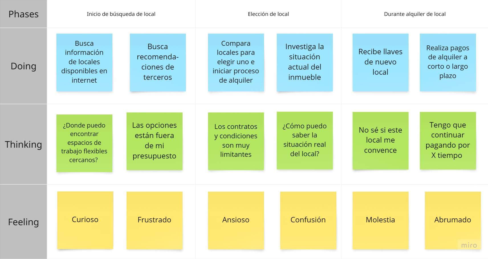

**Propietarios de Inmuebles**
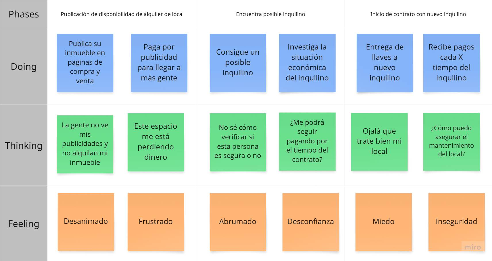

### 2.4. Ubiquitous Language

| Término      | Definición                                                                                                  |
| ------------ | ----------------------------------------------------------------------------------------------------------- |
| Workspace    | Un espacio físico disponible para alquiler como sitio de trabajo.                                           |
| Coworking    | Una modalidad de trabajo donde personas de distintas empresas comparten un mismo workspace.                 |
| Host         | La persona que ofrece su propiedad en alquiler.                                                             |
| Renter       | La persona que alquila este espacio.                                                                        |
| Booking      | Confirmación de un alquiler hecho por un Renter de un Workspace por un periodo de tiempo.                   |
| Rate         | La tarifa por día o por semana para alquilar el Workspace.                                                  |
| Amenities    | Adicionales que ofrezca el host como parte del Workspace. Por ejemplo, WiFi, café, aire acondicionado, etc. |
| Listing      | La publicación de un Workspace disponible incluyendo detalles como ubicación, fotos, Rates y Amenities.     |
| Check-in     | El momento en que comienza el uso del Workspace.                                                            |
| Check-out    | El momento en el que finaliza el uso del Workspace.                                                         |
| Cancellation | La anulación de una reserva, por parte de Host o Renter.                                                    |
| Contract     | El contrato que se realiza entre Renter y Host.                                                             |
| Review       | Las reseñas dadas del Renter al Host después del uso del Workspace, visibles para otros usuarios.           |

---

## Capítulo III: Requirements Specification

### 3.1. To-Be Scenario Mapping

# To-Be Scenario Mapping

| Actor       | Acción Deseada                               | Resultado Esperado                                               | Valor para el Negocio                         |
| ----------- | -------------------------------------------- | ---------------------------------------------------------------- | --------------------------------------------- |
| Propietario | Responde mensajes de freelancers             | Coordinan pago                                                   | Mejor experiencia de usuario                  |
| Freelancer  | Compara precios y lugares                    | Obtiene una mejor elección                                       | Ese cliente seguirá usando nuestro aplicativo |
| Propietario | Obtiene fotos de cómo están dejando el local | Siente seguridad del freelancer al que alquiló                   | Mayor confianza en el aplicativo              |
| Freelancer  | Lee reseñas del local y de su propietario    | Tiene la confianza de que será una experiencia sin incomodidades | Usuarios más confiados en volver a usarlo     |

### 3.2. User Stories

| User Story ID | Título                                                     | Descripción                                                                                                                                                                                    | Criterios de Aceptación                                                                                                                                                                                                                                                                                            | Epic ID |
| ------------- | ---------------------------------------------------------- | ---------------------------------------------------------------------------------------------------------------------------------------------------------------------------------------------- | ------------------------------------------------------------------------------------------------------------------------------------------------------------------------------------------------------------------------------------------------------------------------------------------------------------------ | ------- |
| US-01         | Ubicacion de inmuebles                                     | Como freelancer, quiero encontrar la ubicacion de los inmuebles por localizacion para encontrar los lugares mas cercanos o convenientes                                                        | **Escenario 1**: Encontrar inmueble por ubicación <br><br> Dado que el freelancer busca un inmueble por ubicación <br><br> Entonces se muestra los inmuebles mas cercanos en la ubicacion <br><br>                                                                                                                 | EP-01   |
| US-02         | Disponibilidad de inmuebles                                | Como freelancer, quiero saber la disponibilidad actual del inmueble para hacer una eleccion correcta del tiempo que necesito el local                                                          | **Escenario 1**: Ver disponibilidad <br><br> Dado que el freelancer quiere ver la disponibilidad actual del inmueble, <br><br> Entonces se muestra la disponibilidad del inmueble para el freelancer                                                                                                               | EP-01   |
| US-03         | Filtros de busqueda                                        | Como freelancer quiero hacer una busqueda personalizada como cantidad de aforo, tipo de espacio y servicios disponibles para que pueda encontrar la mejor opcion para mi o mi equipo.          | **Escenario 1**: Busqueda de inmueble <br><br> Dado que el freelancer busca un tipo de espacio especifico <br><br> Entonces se muestran todas las opciones de los lugares con esas especificaciones                                                                                                                | EP-03   |
| US-04         | Valoraciones y opiniones                                   | Como freelancer quiero ver las valoraciones y opiniones de inmuebles sobre los espacios de trabajo para tomar una decisión informada.                                                          | **Escenario 1**: Review de un inmueble <br><br> Dado que el freelancer puede ver las valoraciones de otros usuarios de inmuebles. <br><br> Entonces puede tomar una mejor decision para encontrar el lugar adecuado                                                                                                | EP-02   |
| US-05         | Feeback constructivo                                       | Como propietario de inmueble, quiero recibir las opiniones o un feedback para reconocer posibles nuevas mejoras para el espacio de trabajo                                                     | **Escenario 1**: Recibe feedback <br><br> Dado que el propietario recibe recibir opiniones de los freelancers sobre su experiencia en el inmueble <br><br> Entonces puede hallar formas de mejorar su experiencia para futuros equipos o freelancers.                                                              | EP-04   |
| US-06         | Perfiles de inmuebles                                      | Como freelancer quiero encontrar la suficiente informacion para poder hacer una decision correcta detallada sobre cada inmueble, incluyendo fotos, ubicación, tarifas y servicios disponibles. | **Escenario 1**: Encontrar publicacion <br><br> Dado que el freelancer encuentra detalles como fotos, ubicación, tarifas y servicios disponibles <br><br> Entonces tendra una decision mas informada y adecuada para sus necesidades                                                                               | EP-03   |
| US-07         | Sistema de pagos seguros                                   | Como freelancer quiero tener la certeza de que la aplicacion web tenga un sistema de pago seguro                                                                                               | **Escenario 1**: Pago para la renta <br><br> Dado que el freelancer quiere pagar un mes adicional de renta <br><br> Entonces podra poder realizar el pago de manera segura a través de la aplicación                                                                                                               | EP-05   |
| US-08         | Sistema de devolucion                                      | Como freelancer, quiero tener la posibilidad de tener una devolucion de mi dinero si cancelo una reserva realizada antes del inicio de esta misma.                                             | **Escenario 1**: Devolucion de dinero dias antes de su uso registrado <br><br> Dado que el freelancer cancelo su reserva dias antes de su uso <br><br> Entonces el dinero que pago sera devuelto en los siguientes 15 dias.                                                                                        | EP-05   |
| US-09         | Publicacion de inmueble                                    | Como propietario de inmueble, quiero tener la facilidad de publicar un inmueble de manera sencilla y atractiva para que los freelancers lo encuentren llamativo                                | **Escenario 1**: Publicacion de inmueble <br><br> Dado que el propietario quiere publicar su inmueble con todos los datos necesarios <br><br> Entonces podra registrar toda la información necesaria, incluyendo fotos, descripción, ubicación, tarifas y servicios disponibles                                    | EP-04   |
| US-10         | Modificacion de inmueble                                   | Como propietario de inmueble quiero que se me permita actualizar la información de la publicación de manera sencilla y rápida para no arruinar la experiencia de freelancers.                  | **Escenario 1**: Modificacion de inmuebles <br><br> Dado que el propietario ha hecho remodelaciones en el lugar <br><br> Entonces podra modificar la informacion necesaria y de forma facil en la aplicacion web                                                                                                   | EP-04   |
| US-11         | Lugar libre de distracciones y ruidos                      | Como freelancer quiero estar en un lugar libre de distracciones y ruidos para obtener la mayor concentración y sacar provecho a mi tiempo de trabajo                                           | **Escenario 1**: Lugar libre de distracciones y ruidos<br><br>Dado que el freelancer desea aprovechar su tiempo y comodididad en el espacio alquilado<br><br>Entonces el local alquilado no tendrá ruidos molestos y si los tiene puede dejar una reseña sobre eso                                                 | EP-04   |
| US-12         | Precio altos                                               | Como freelancer, quiero comparar precios entre diferentes locales, para evitar precios y altos                                                                                                 | **Escenario 1**: Precios altos<br><br>Dado que el propietario coloca su precio que espera que le paguen<br><br> Entonces el usuario tendrá la posibilidad de comparar diferentes opciones de lugares, así obtener la que mejor le acomode                                                                          | EP-04   |
| US-13         | Alta demanda, la disponibilidad no abastece                | Como freelancer quiero saber la disponibilidad de los inmuebles, ya que hay horas de mayor necesidad                                                                                           | **Escenario 1**: Alta demanda, la disponibilidad no abastece<br><br>Dado que existe una demanda alta demanda de espacios de coworking en determinadas horas o dias<br><br> Entonces el aplicativo mostrará un cuadro donde se vea los horarios tomados y los horarios disponibles de los espacios                  | EP-04   |
| US-14         | No traigan personas externas                               | Como propietario quiero que el usuario no lleve a personas externas a mi local para que haya un uso correcto de mi local y siga las reglas                                                     | **Escenario 1**: No traigan a personas externas<br><br>Dado que el propietario no desea personas externas pues pueden causar desoren innecesario<br><br>Entonces se le reiteraría al freelancer esta reglas, o en caso contrario se le dejaría una reseña de mala conducta                                         | EP-04   |
| US-15         | Impuntualidad en pagos                                     | Como propietario quiero tener la certeza de que el usuario va a pagarme en el plazo establecido para evitar aquellos que son impuntuales                                                       | **Escenario 1**: Impuntualidad en pagos<br><br>Dado que el propietario quiere tener a tiempo el pago<br><br>Entonces se le reiteraría al freelancer esta reglas, o en caso contrario se le dejaría una reseña de impuntualidad                                                                                     | EP-04   |
| US-16         | Buena iluminación natural                                  | Como freelancer, quiero un ambiente con buena iluminación para que mejore mi rendimiento                                                                                                       | **Escenario 1**: Buena iluminación natural<br><br>Dado que el ambiente influye en el trabajo del freelancer<br><br>Entonces va a buscar un espacio que cumpla con esta característica                                                                                                                              | EP-04   |
| US-17         | Buena conexión a internet                                  | Como freelancer, quiero un ambiente con buena conexión a internet para que mejore mi rendimiento                                                                                               | **Escenario 1**: Buena conexión a internet<br><br>Dado que el freelancer quiere un tiempo de trabajo sin que el internet sea problema<br><br>Entonces el propietario va a poner claro la intensidad de los servicios telefónicas en ese local, o en lo contrario instalar wifi y ponerlo como caracteristica clave | EP-04   |
| US-18         | Tolerancia y respeto entre personas                        | Como freelancer, quiero que exista buena convivencia entre todos los que estemos en el coworking para sentirnos cómodos en el grupo                                                            | **Escenario 1**: Tolerancia y respeto entre personas<br><br>Dado que los freelancer compartirán espacios<br><br>Entonces esperan que todos estén comprometidos con cumplir normas básicas de convivencia                                                                                                           | EP-04   |
| US-19         | Fotos del estado del lugar al llegar y antes de entregarlo | Como propietario quiero que el freelancer mande una foto de cómo encontró el lugar y cómo lo está dejando para evitar malos entendidos                                                         | **Escenario 1**: Fotos del estado del lugar al llegar y al entregarlo<br><br>Dado que el propietario quiero tener la seguridad de que estén cuidadno su local<br><br>Entonces el freelancer va a mandar evidencia mediante fotos d cómo lo encontró y cómo lo está dejando                                         | EP-04   |
| US-20         | Un mapa para visualizar lugares                            | Como freelancer quiero un mapa para navegar a través de este y así elegir el distrito que más me convenga                                                                                      | **Escenario 1**: Mapa para visualizar lugares<br><br>Dado que el freelancer quiere hacer una búsqueda por distrito<br><br>Entonces implementar un mapa le va a facilitar la búsqueda porque asi puede ubicar mejor los puntos                                                                                      | EP-03   |
| US-21         | Amplitud del lugar                                         | Como freelancer quiero saber la amplitud del local a alquiler para ver si se acomodará a mis funciones a desempeñar                                                                            | **Escenario 1**: Amplitud del lugar<br><br>Dado que el freelancer tiene diferentes necesidades para sus actividades<br><br>Entonces el propietario debe especificar el tamaño, también se puede agregar un filtro de búsqueda por amplitud del local                                                               | EP-04   |
| US-22         | Fotos reales                                               | Como freelancer quiero ver imágenes de cómo se ve el local que voy a rentar para saber que es de mi agrado                                                                                     | **Escenario 1**: Fotos reales<br><br>Dado que el freelancer quiere ver de primera mano cómo es el local que va a alquilar<br><br>Entonces el propietario debe colocar fotos del local y actualizarlas periódicamente                                                                                               | EP-03   |
| US-23         | Servicios como estacionamiento, cafetería, entre otros     | Como freelancer quiero saber si el espacio de coworking cuenta con ciertos servicios para tomar una decisión en base a eso                                                                     | **Escenario 1**: Servicios como estacionamiento, cafetería, entre otros<br><br>Dado que el freelancer quiere tener algún servicio<br><br>Entonces habrá un filtro de búsqueda de los locales que sí cuenten con dicho servicio                                                                                     | EP-04   |
| US-24         | Cobro por hora, en vez de por día                          | Como propietario de inmueble quiero opciones en los horarios de alquiler de mi local para ofrecer opciones más flexibles                                                                       | **Escenario 1**: Cobro por hora, en vez de por día<br><br>Dado que el propietario quiere horarios y pagos más flexibles<br><br>Entonces se implementa la opción de alquilar el local por tiempos más pequeños y flexibles                                                                                          | EP-04   |
| US-25         | Sistema fácil de entender e intuitivo                      | Como propietario de inmuebles, quiero que esta propuesta de aplicación se fácil de entender para poder usarla a largo plazo                                                                    | **Escenario 1**: Sistema fácil de entender e intuitivo<br><br>Dado que el propietario tiene conocimientos básicos del uso de plataformas<br><br>Entonces se le brindará una plataforma que sea comprensible o algún tutorial interactivo para que se adapte                                                        | EP-01   |
| US-26         | Reserva rápida                                             | Como freelancer quiero que la aplicación tenga una carga rápida y esté actualizada para tener informacion precisa                                                                              | **Escenario 1**: Reserva rápida<br><br>Dado que el usuario quiere que su reserva se realice lo más pronto posible<br><br>Entonces la plataforma deberá procesar la solicitud de la manera más eficiente                                                                                                            | EP-02   |
| US-27         | Chat directo propietario y cliente                         | Como propietario quiero contactarme directamente con el usuario interesado para tener la certeza de que se concrete el acuerdo                                                                 | **Escenario 1**: Chat directo propietario y cliente<br><br>Dado que el propietario quiere tener una conversacion directa con quien va a alquilar su local<br><br>Entonces la plataforma deberá tener un chat directo entre propietarios y clientes                                                                 | EP-01   |
| US-28         | Calendario para ver la disponibilidad del espacio          | Como freelancer quiero ver en formato de calendario para navegar mejor a través de los días disponibles del inmueble                                                                           | **Escenario 1**: Calendario para ver la disponibilidad del espacio<br><br>Dado que el freelancer quiere tener un calendario para facilitar su búsqueda<br><br>Entonces se implemntará uno en la aplataforma al contratar el local                                                                                  | EP-01   |
| US-29         | Sistema de reseñas pra ambas partes                        | Como propietario, quiero saber opiniones de otros propietarios para estar más convencidos de alquilar mi local a ciertos usuarios                                                              | **Escenario 1**: Sistema de reseñas para ambas partes<br><br>Dado que tanto el freeelancer como el propietario quieren saber más contexto antes de hacer la contrata<br><br>Entonces la plataforma mostrará las reseñas                                                                                            | EP-03   |
| US-30         | Usuarios verficiados con LinkedIn o DNI                    | Como propietario quiero una forma de verificar la informacion del freelancer para estar informado de que su trabajo es serio y va con mis criterios                                            | **Escenario 1**: Usuarios verficiados con LinkedIn o DNI<br><br>DAdo que el porpietario quiere tener la seguridad de a quien está alquilando<br><br>Entonces la plataforma promoverá a sus usuarios a verificarse                                                                                                  | EP-05   |
| US-31         | Navegación por el landing page                             | Como usuario quiero explorar fácilmente el landing page para acceder a la información clave.                                                                                                   | **Escenario 1**: Acceso intuitivo al landing page<br><br> Dado que el usuario necesita navegar con facilidad<br><br> Entonces la página principal estará estructurada de forma simple y clara.                                                                                                                     | EP-05   |
| US-32         | Ver información del startup                                | Como usuario quiero conocer más sobre el proyecto para tomar una decisión informada.                                                                                                           | **Escenario 1**: Información sobre el startup<br><br> Dado que los usuarios desean más detalles<br><br> Entonces se incluirá una sección con datos relevantes de la startup.                                                                                                                                       | EP-05   |
| US-33         | Conocer los servicios                                      | Como usuario quiero revisar los servicios ofrecidos para decidir cuáles se ajustan a mis necesidades.                                                                                          | **Escenario 1**: Exploración de servicios<br><br> Dado que los usuarios necesitan opciones claras<br><br> Entonces la plataforma mostrará servicios categorizados.                                                                                                                                                 | EP-05   |
| US-34         | Contactar al equipo de soporte                             | Como usuario quiero una manera rápida de contactar al equipo para resolver dudas o problemas.                                                                                                  | **Escenario 1**: Contacto rápido con soporte<br><br> Dado que los usuarios pueden enfrentar problemas<br><br> Entonces se incluirá un botón de contacto directo en la interfaz.                                                                                                                                    | EP-05   |
| US-35         | Cambiar lenguaje entre Español e Inglés                    | Como usuario quiero la opción de cambiar el idioma de la plataforma para utilizar el idioma con el que me sienta más cómodo.                                                                   | **Escenario 1**: Cambio de idioma<br><br> Dado que algunos usuarios prefieren otro idioma<br><br> Entonces se incluirá un selector de idioma en la plataforma.                                                                                                                                                     | EP-05   |
| US-36         | Mostrar testimonios y casos de éxito                       | Como usuario quiero leer experiencias reales para ganar confianza en el proyecto.                                                                                                              | **Escenario 1**: Testimonios visibles<br><br> Dado que los usuarios buscan referencias confiables<br><br> Entonces se incluirán testimonios destacados en una sección dedicada.                                                                                                                                    | EP-05   |
| US-37         | Descargar información del proyecto                         | Como usuario quiero una opción para descargar un folleto informativo sobre el proyecto en formato digital.                                                                                     | **Escenario 1**: Folleto descargable<br><br> Dado que los usuarios prefieren tener información detallada<br><br> Entonces se incluirá una opción de descarga en la plataforma.                                                                                                                                     | EP-05   |
| US-38         | Registro de Propietarios                                   | Como propietario, quiero registrar mis datos para poder publicar oficinas y administrar mis espacios                                                                                           | **Escenario 1**: Registro exitoso de propietario <br><br> Dado que un nuevo propietario ingresa sus datos <br><br> Cuando envía el formulario <br><br> Entonces el sistema guarda los datos y retorna confirmación                                                                                                 | EP-02   |
| US-39         | Publicación de Oficinas                                    | Como propietario, quiero publicar detalles de mis oficinas disponibles para que los freelancers puedan verlas y reservarlas                                                                    | **Escenario 1**: Publicar una nueva oficina <br><br> Dado que el propietario tiene acceso al panel de oficinas <br><br> Cuando ingresa la información requerida <br><br> Entonces se publica la oficina con disponibilidad                                                                                         | EP-02   |
| US-40         | Mensajes entre usuarios                                    | Como usuario, quiero enviar y recibir mensajes para poder comunicarme con el propietario o el freelancer relacionado a una oficina                                                             | **Escenario 1**: Enviar un mensaje <br><br> Dado que un usuario accede a la conversación <br><br> Cuando redacta y envía un mensaje <br><br> Entonces el mensaje es visible para el receptor en tiempo real                                                                                                        | EP-02   |
| US-41         | Búsqueda avanzada de oficinas                              | Como freelancer, quiero filtrar oficinas por servicios, precio, capacidad y ubicación para encontrar la opción ideal                                                                           | **Escenario 1**: Búsqueda con filtros <br><br> Dado que el usuario ingresa criterios de búsqueda <br><br> Cuando ejecuta la búsqueda <br><br> Entonces el sistema retorna solo las oficinas que cumplen con los filtros seleccionados                                                                              | EP-02   |
| US-42         | Calificar experiencia de oficina                           | Como freelancer, quiero calificar la oficina y al propietario para ayudar a otros usuarios a tomar decisiones informadas                                                                       | **Escenario 1**: Enviar calificación <br><br> Dado que un freelancer finalizó su estancia <br><br> Cuando envía una calificación y comentario <br><br> Entonces esta se guarda y se refleja en el perfil del propietario y de la oficina                                                                           | EP-02   |

### Epics

| Epic ID | Título                      | Descripción                                                                                                                                                                 |
| ------- | --------------------------- | --------------------------------------------------------------------------------------------------------------------------------------------------------------------------- |
| EP-01   | Desarrollo del Landing Page | Esta enfocado en la creacion de la pagina web inicial que se presentará al consumidor para luego ser redirigido a la aplicacion web                                         |
| EP-02   | Desarrollo del Backend      | Se enfoca en la lógica de negocio, estructuras de datos, endpoints y funcionalidades que permitirán las operaciones y servicios que la aplicacion web ofrece                |
| EP-03   | Desarrollo del Frontend     | Es enfocado en la interfaz de usuario, la experiencia del cliente y la implementación de las funcionalidades visuales que permitirán la interacción con la aplicación.      |
| EP-04   | Experiencia del desarrollo  | Esta enfocada en establecer las metas y la metodología de desarrollo, incluyendo las herramientas y procesos utilizados para asegurar la calidad y eficiencia del proyecto. |
| EP-05   | Seguridad de la aplicacion  | Esta enfocado en ofrecer un entorno seguro y confiable para los usuarios, garantizando la protección de datos y la privacidad en todas las transacciones.                   |

### 3.3. Impact Mapping


### 3.4. Product Backlog

| ID  | Historia de Usuario                                                                                                                                | Prioridad |
| --- | -------------------------------------------------------------------------------------------------------------------------------------------------- | --------- |
| 1   | Como freelancer, quiero encontrar la ubicacion de los inmuebles por localizacion para encontrar los lugares mas cercanos o convenientes            | Alta      |
| 2   | Como freelancer, quiero saber la disponibilidad actual del inmueble para hacer una eleccion correcta del tiempo que necesito el local              | Alta      |
| 8   | Como freelancer, quiero tener la posibilidad de tener una devolucion de mi dinero si cancelo una reserva realizada antes del inicio de esta misma. | Media     |
| 7   | Como freelancer quiero tener la certeza de que la aplicacion web tenga un sistema de pago seguro                                                   | Alta      |

---

# Capítulo 4

## 4.1 Design Concepts, ViewPoints & ER Diagrams

### 4.1.1 Principles Statements

1. Single Responsibility by Bounded Contexts (DDD) — separar dominios: Users, Offices, Bookings, Rating, Messaging, Search/Recommendation. (Apoya la mantenibilidad y evolución del motor de recomendaciones).
2. API-first & Interoperability — diseñar APIs REST estandarizadas para permitir integración con pasarelas de pago, geocoding/maps y proveedores externos.
3. Security-by-Design — autenticación/autorization con OAuth2/JWT; validar entradas y proteger endpoints críticos (pagos, mensajes, creación de oficinas).
4. Progressive Delivery / Incremental MVP — iterar desde el motor de recomendaciones (iteración 1) y exponer funcionalidades mínimas comprobables.
5. Observable & Measurable — telemetría (logs, métricas, traces) en servicios clave (recomendaciones, pagos) para permitir diagnóstico rápido.
6. User-driven UX — priorizar velocidad de búsqueda, filtros y calendario; UI responsiva y accesible.

### 4.1.2 Approaches Statements Architectural Styles & Patterns

Estilos arquitectónicos propuestos:

1. Microservices (bounded contexts) para Recommendations, Users, Offices, Bookings, Ratings, Messaging. Razonamiento: escalabilidad y despliegue independiente del motor de recomendaciones (driver).
2. API Gateway + REST: punto único para exposición pública, manejo de autenticación y rate-limiting.
3. Event-Driven (mensajería asíncrona) para procesos eventual-consistent (p. ej. actualizar índices de búsqueda después de una reserva o rating).
4. Search Index (Elasticsearch / OpenSearch) para búsquedas por ubicación, filtros y recomendaciones rápidas.
5. Patrones de diseño (a nivel de aplicación)
6. Repository Pattern — acceso a datos desacoplado (OficesRepository, BookingRepository).
7. Factory / Builder — para crear objetos complejos (Booking con políticas).
8. Strategy — motores de ranking/recomendación intercambiables (por rating, proximidad, precio).
9. Circuit Breaker / Bulkhead — resiliencia en llamadas a servicios externos (p. ej. pasarela de pagos, mapas).
10. CQRS ligero — separar rutas de lectura intensiva (search) de escrituras (bookings/ratings) cuando sea necesario.

### 4.1.3 Context Diagram

#### Diagrama de Contexto

<p align="center">
  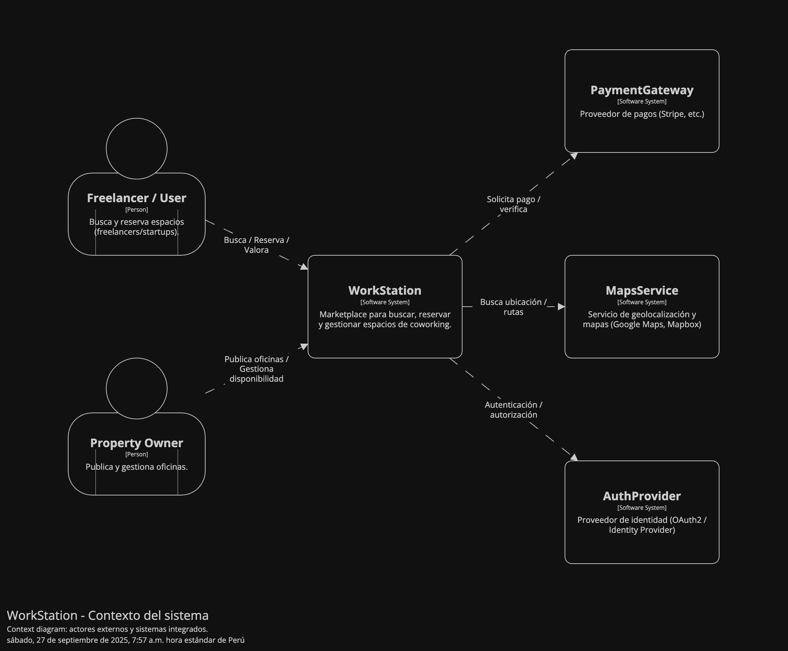
</p>

### 4.1.4 Approach driven ViewPoints Diagrams

#### Diagrama de Contenedores

<p align="center">
  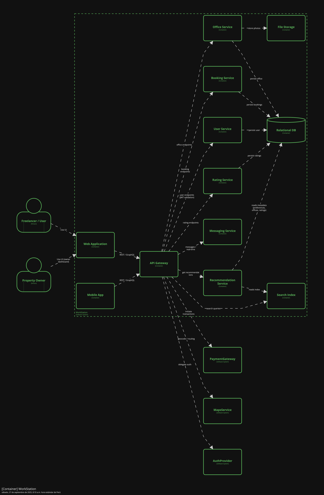
</p>

- Notas de diseño (viewpoint → decisiones):

- El Recommendation Service se separa para poder escalar y experimentar con diferentes estrategias (Strategy pattern).

- Search Index (Elasticsearch) soporta consultas geoespaciales y filtros rápidos (necesario para UX de búsqueda y filtros).
- Messaging separado para permitir WebSockets/Push y no bloquear el flow síncrono de la API.

#### Diagrama de Componentes

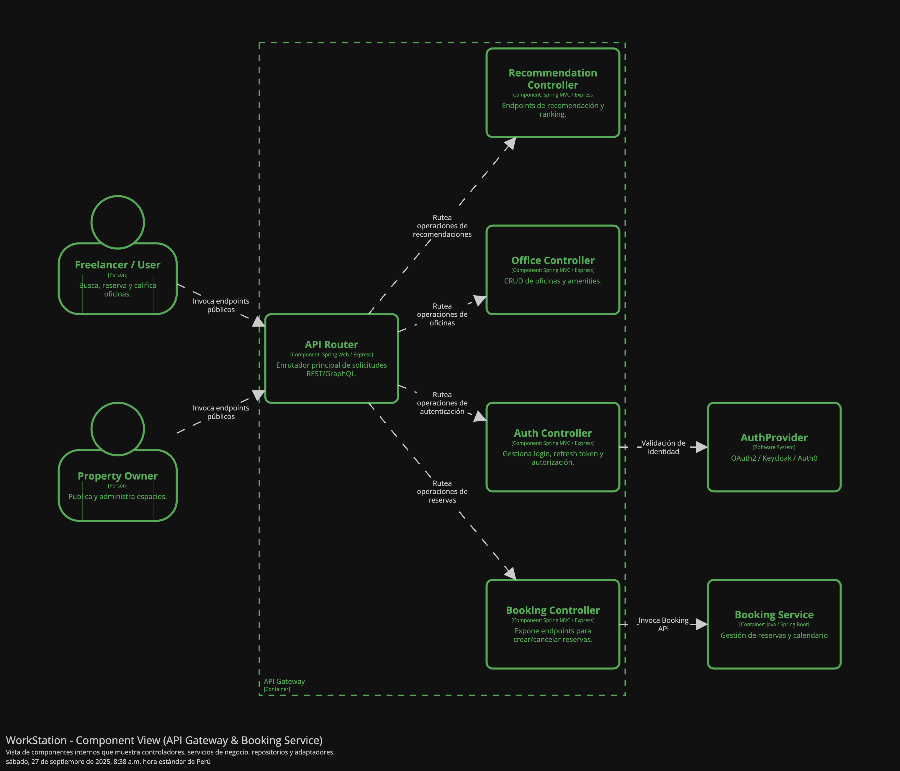

### 4.1.5 Relational/Non Relational Database Diagram

#### Diagrama de Base de Datos Relacional

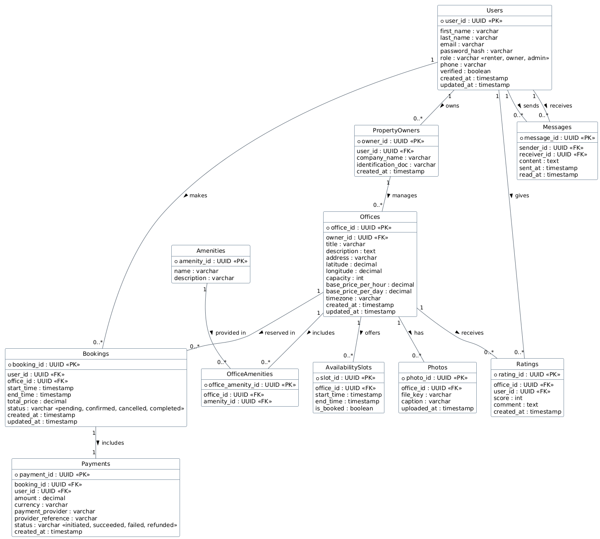

### 4.1.6 Design Patterns

- Repository + Unit of Work — para transacciones en BookingService.
- Strategy — para múltiples algoritmos de ranking en Recommendation Service (proximidad vs rating vs precio).
- Adapter / Facade — para integrar pagos y servicios externos (Maps, Payments).
- Observer / Event pub-sub — publicar eventos BookingCreated, RatingAdded para actualizar índices o generar notificaciones.
- Builder — para crear objetos de reservas con reglas (cálculo de precio, descuentos, impuestos).

### 4.1.7 Tactics

1. Seguridad
2. Autenticación OAuth2/JWT; refresh tokens.
3. Validación y sanitización de entradas (prevención inyección SQL / XSS).
4. Roles y permisos (owner vs renter vs admin).
5. Performance / Scalability
6. Escalar Recommendation Service horizontalmente.
7. Cache de resultados frecuentes y cache del Search Index.
8. Indexar geolocalización y filtros en Elasticsearch.
9. Availability / Resilience
10. Circuit Breaker en llamadas a pasarelas externas (payment/maps).
11. Retry con backoff para operaciones no-idempotentes; compensating transactions para bookings/pagos.
12. Backups regulares de la BD y snapshot del search index.
13. Modifiability
14. Separar servicios por bounded contexts; versionado de APIs; feature toggles para despliegues controlados.
15. Usability / UX
16. Búsqueda con autocompletado y filtros por capacidad, amenities y precio.
17. Calendario visual para disponibilidad y bloqueo de horarios.

## 4.2 Architectural Drivers

### 4.1.8 Design Purpose

En el corazón de Workstation está la convicción de que la tecnología no debe ser un lujo, sino una herramienta accesible que empodere a cada hotelero peruano. Nuestra plataforma nace de escuchar las frustraciones reales: habitaciones que no se actualizan, inventarios que se pierden, tareas que se olvidan, y decisiones que se toman sin datos. HoTech transforma esa realidad en una operación fluida, conectada y estratégica.

Cada módulo ha sido diseñado con propósito: desde la creación de habitaciones hasta la gestión de insumos, pasando por la asignación de tareas y la generación de reportes. No se trata solo de digitalizar procesos, sino de reimaginar cómo se trabaja en el día a día. Con interfaces intuitivas y flujos pensados para usuarios con poca experiencia tecnológica, Workstation democratiza la gestión hotelera.

Además, entendemos que la rentabilidad no solo depende de reducir costos, sino de mejorar la experiencia del huésped. Por eso, nuestro sistema permite anticiparse a sus necesidades, coordinar al personal con precisión y mantener cada espacio en óptimas condiciones. La comunicación interna se convierte en un motor de eficiencia, y los datos dejan de ser un lujo para convertirse en aliados estratégicos.

Workstation no es una solución genérica: es una plataforma construida desde la realidad peruana, con sensibilidad a los ritmos, desafíos y oportunidades del sector. Ya sea en un hostal en Cusco o un hotel en Lima, nuestra arquitectura se adapta, crece y evoluciona contigo. Porque creemos que la excelencia operativa debe estar al alcance de todos, sin importar el tamaño del negocio.

### 4.1.9 Primary Functionality (Primary User Stories)

| Epic ID | User Story ID | Título                                  | Rol         | Justificación Estratégica                                                            |
| ------- | ------------- | --------------------------------------- | ----------- | ------------------------------------------------------------------------------------ |
| EP-02   | US-06         | Crear cuenta empleado                   | Empleado    | Permite acceso al sistema para personal operativo.                                   |
| EP-02   | US-07         | Crear cuenta gerente                    | Gerente     | Habilita la gestión del sistema y la creación de códigos para empleados.             |
| EP-03   | US-10         | Crear habitaciones                      | Gerente     | Configura la infraestructura del hotel en el sistema.                                |
| EP-03   | US-11         | Ver estado de habitaciones              | Gerente     | Proporciona visibilidad operativa en tiempo real.                                    |
| EP-04   | US-14         | Actualizar ítem                         | Empleado    | Mantiene actualizado el inventario asignado a tareas.                                |
| EP-03   | US-09         | Publicación de inmueble                 | Propietario | Permite registrar habitaciones con fotos, tarifas y servicios.                       |
| EP-04   | US-15         | Asignar tareas de limpieza              | Gerente     | Coordina al personal operativo de forma eficiente.                                   |
| EP-04   | US-16         | Confirmar tareas completadas            | Empleado    | Cierra el ciclo operativo de limpieza y mantenimiento.                               |
| EP-05   | US-27         | API de verificación clave gerente       | Developer   | Asegura autenticación segura y control de acceso.                                    |
| EP-05   | US-28         | Seguridad de empleado                   | Empleado    | Garantiza acceso seguro y personalizado al sistema.                                  |
| EP-05   | US-29         | Canal de comunicación interna           | Empleado    | Mejora la coordinación entre personal y gerencia.                                    |
| EP-05   | US-30         | Usuarios verificados con LinkedIn o DNI | Propietario | Refuerza la confianza en la contratación de personal.                                |
| EP-05   | US-31         | Navegación por el landing page          | Usuario     | Facilita el acceso inicial a la plataforma.                                          |
| EP-05   | US-32         | Ver información del startup             | Usuario     | Brinda contexto sobre el proyecto y sus beneficios.                                  |
| EP-05   | US-33         | Conocer los servicios                   | Usuario     | Permite evaluar si la plataforma se ajusta a sus necesidades.                        |
| EP-05   | US-34         | Contactar el equipo de soporte          | Usuario     | Resuelve dudas y problemas operativos.                                               |
| EP-05   | US-35         | Cambiar lenguaje e idioma               | Usuario     | Asegura accesibilidad para usuarios con distintos niveles de alfabetización digital. |

### 4.1.10 Quality Attribute Scenarios

| ID  | Atributo de Calidad  | Escenario                                                                                      | Historia de Usuario Relacionada                                                 |
| --- | -------------------- | ---------------------------------------------------------------------------------------------- | ------------------------------------------------------------------------------- |
| QA1 | Usabilidad           | Un empleado nuevo puede actualizar un ítem en el inventario en menos de 2 minutos              | US-14 (Actualizar ítem), US-06 (Crear cuenta empleado)                          |
| QA2 | Disponibilidad       | El sistema permite visualizar el estado de habitaciones sin interrupciones durante el check-in | US-11 (Ver estado de habitaciones)                                              |
| QA3 | Seguridad            | El sistema bloquea el acceso tras 3 intentos fallidos de autenticación de gerente              | US-27 (API verificación gerente), US-28 (Seguridad empleado)                    |
| QA4 | Rendimiento          | El sistema responde a 100 solicitudes de creación de habitaciones en menos de 5 segundos       | US-10 (Crear habitaciones)                                                      |
| QA5 | Mantenibilidad       | El gerente puede modificar la información de un ítem sin afectar otras funcionalidades         | US-14 (Actualizar ítem), US-09 (Publicación de inmueble)                        |
| QA6 | Escalabilidad        | El sistema soporta la incorporación de 50 nuevas habitaciones sin degradar el rendimiento      | US-10 (Crear habitaciones), US-11 (Ver estado)                                  |
| QA7 | Interoperabilidad    | El sistema sincroniza datos de reservas con plataformas externas cada 10 minutos sin errores   | US-27 (API verificación), EP-05 (Integraciones externas)                        |
| QA8 | Comunicación interna | Un gerente puede asignar tareas y recibir confirmaciones sin pérdida de información            | US-15 (Asignar tareas), US-16 (Confirmar tareas), US-29 (Canal de comunicación) |

### 4.1.11 Constraints

En proyectos de software y arquitectura, las constraints son los límites que debemos respetar al planear y construir la solución.
Pueden ser de tipo legal, técnico, económico u operativo (por ejemplo, normas de datos, compatibilidad de navegadores, presupuesto o plazos) y condicionan nuestras decisiones sobre tecnologías, diseño y despliegue.

| ID    | Constraint                                                                                                                        |
| ----- | --------------------------------------------------------------------------------------------------------------------------------- |
| CON01 | Cumplimiento legal: adherir a la Ley de Protección de Datos Personales (Ley N° 29733) y a la Ley de Comercio Electrónico peruana. |
| CON02 | Disponibilidad: 99.9 % de uptime en horario crítico (06:00–22:00, Lima), con recuperación ante fallos < 30 s.                     |
| CON03 | Compatibilidad: soportar Chrome, Firefox y Safari (últimas 3 versiones); WebView en Android e iOS.                                |
| CON04 | Rendimiento: búsqueda de espacios y filtrado en < 2 s; confirmación de reserva en < 1 s bajo carga normal.                        |
| CON05 | Escalabilidad: escalar horizontalmente hasta un 200 % más de usuarios o listados sin refactorización ni degradar el desempeño.    |
| CON06 | Seguridad: autenticación OAuth 2.0/JWT; cifrado TLS 1.2+ en tránsito y AES-256 en reposo; pruebas de penetración anuales.         |
| CON07 | Internacionalización: interfaz bilingüe (ES/EN) en MVP; soporte para agregar al menos 3 idiomas más sin retrabajo de código.      |
| CON08 | Accesibilidad: cumplir WCAG 2.1 nivel AA para usuarios con discapacidad (teclado, lector de pantalla, contraste de colores).      |
| CON09 | Integración: Google Maps Geocoding y pasarelas de pago (Stripe, PayPal); tolerancia a fallos y retry con back-off en 3 intentos.  |

### 4.1.12 Architectural Concerns

En el contexto de **WorkStation**, las preocupaciones arquitectónicas son aquellas decisiones de diseño con alto impacto en la capacidad del sistema para cumplir con los requisitos funcionales y no funcionales de propietarios de coworkings y usuarios finales. Estas preocupaciones se derivan tanto de las _user stories_ como de riesgos asociados a la operación de la plataforma.

### Principales Preocupaciones

| Preocupación                               | Justificación                                                                                                                                | Riesgo Asociado                                                                         |
| ------------------------------------------ | -------------------------------------------------------------------------------------------------------------------------------------------- | --------------------------------------------------------------------------------------- |
| **Autenticación y Seguridad de Acceso**    | Historias como **US-06**, **US-07**, **US-27** y **US-28** evidencian la necesidad de controlar el acceso y proteger datos sensibles.        | Acceso indebido a información de usuarios o propietarios; vulneración de datos.         |
| **Escalabilidad y Disponibilidad**         | La reserva y consulta en tiempo real (**US-09**, **US-11**) requieren que el sistema soporte alta concurrencia y tiempos de respuesta bajos. | Caídas del sistema en horas punta; mala experiencia de usuario.                         |
| **Gestión de Información en Tiempo Real**  | Funcionalidades como **US-14** (actualizar ítem) o **US-11** (estado de habitaciones) exigen consistencia y sincronización inmediata.        | Inconsistencias de datos entre usuarios concurrentes.                                   |
| **Comunicación y Coordinación Interna**    | La existencia de un canal interno (**US-29**) obliga a integrar servicios de mensajería seguros.                                             | Filtración de información sensible del personal.                                        |
| **Accesibilidad y Experiencia de Usuario** | Historias como **US-31**, **US-33** y **US-35** muestran la necesidad de accesibilidad y usabilidad para perfiles diversos.                  | Baja adopción del sistema por usuarios con distintos niveles de alfabetización digital. |

### Riesgos como Preocupaciones Gestionadas

Los riesgos se aceptan formalmente como preocupaciones arquitectónicas que deben ser mitigadas.  
Por ejemplo, brindar acceso administrativo a clientes o gerentes puede ser necesario para la operación, pero representa un riesgo alto si no se controla. La arquitectura debe contemplar medidas como:

- Autenticación multifactor.
- Definición clara de roles y permisos.
- Auditoría y trazabilidad de cambios.

De esta forma, las preocupaciones arquitectónicas no solo responden a los requisitos planteados en las _user stories_, sino también a la necesidad de reducir riesgos que impactan en la confiabilidad, seguridad y crecimiento de la plataforma.

## 4.3 ADD Iterations

### 4.2.1 Iteration 1: Workstation Office Recommendation

#### 4.2.1.1 Architectural Design Backlog 1

Para esta primera iteracion del diseño de Arquitectura de Workstation, el equipo se centrará en enfocar las historias de usuario en el desarrollo de las recomendaciones de las oficinas dependiendo de su rating, ubicacion, necesidades o preferencias del usuario con un efoque funcional y escalable. Los principales atributos que se pudieron identificar fueron:

- Modificabilidad:
  Para este punto lo que se busca es permitir ajustes o modificaciones en los espacios sin impactar el resto del sistema.
- Usabilidad:
  La experiencia durante la busqueda en el contexto de Searching debe ser intuitiva y clara. El UI responsive, filtros dinamicos y catching eficiente
- Seguridad:
  Para la seguridad se requiere una autenticacion con OAuth 2.0 por roles y proteccion contra inyeccion de consultas
- Interoperabilidad:
  Por ultimo, la logica de recomendaciones se debe poder utilizar datos de diferentes fuentes, para ello el uso de microservicios.

**Historias de Usuario**

- Como **usuario**, quiero ver oficinas recomendadas con capacidad adecuada y alto rating para asegurar comodidad de mi equipo.
- Como **Propietario de oficina**, quiero que mi espacio sea recomendado a usuarios con necesidades compatibles para aumentar la tasa de reservas.
- Como **usuario**, quiero ver oficinas con detalles claros (ubicación, capacidad, costo y servicios) para comparar opciones fácilmente.
- Como **usuario**, quiero que el sistema me recomiende oficinas cercanas con buen rating y que se ajusten a mis preferencias, para ahorrar tiempo al elegir
- Como **usuario**, quiero ver el historial de mensajes con cada propietario, para tener contexto antes de tomar decisiones.
- Como **propietario de oficina**, quiero asegurar que el sistema de mensajería filtre spam o mensajes inapropiados.

**Tareas iniciales del backlog de la arquitectura**

| **Contexto**       | **Tarea**                                                                    | **Descripción**                                                          |
| ------------------ | ---------------------------------------------------------------------------- | ------------------------------------------------------------------------ |
| **Usuarios**       | Diseñar entidad `User` con campos de perfil y preferencias                   | Modelo con datos básicos (nombre, email, rol, preferencias de búsqueda). |
|                    | Implementar autenticación básica con JWT                                     | Seguridad inicial para proteger endpoints.                               |
|                    | Exponer endpoint `GET /users/{id}/preferences`                               | Permitir que el motor de recomendaciones acceda a las preferencias.      |
| **Property Owner** | Definir entidad `PropertyOwner`                                              | Modelo con datos del propietario.                                        |
|                    | Implementar CRUD de oficinas ligadas al propietario (`/owners/{id}/offices`) | Crear, editar y eliminar oficinas.                                       |
|                    | Validar disponibilidad y capacidad en la creación de oficinas                | Evitar inconsistencias en reservas futuras.                              |
| **Offices**        | Modelar entidad `Office` con ubicación, capacidad, costo y servicios         | Incluyendo soporte geoespacial.                                          |
|                    | Crear endpoint básico `/offices` con filtros iniciales                       | Filtrar por ubicación, capacidad y servicios.                            |
| **Rating**         | Crear entidad `Rating` (userId, officeId, score, comment)                    | Asociar puntuaciones y comentarios.                                      |
|                    | Implementar endpoint `POST /offices/{id}/ratings`                            | Permitir registrar valoraciones.                                         |
|                    | Implementar cálculo de promedio y normalización de puntuaciones              | Exponerlo en `/offices/{id}` y en recomendaciones.                       |
| **Search**         | Diseñar servicio `RecommendationService` extensible                          | Permitir agregar criterios de búsqueda sin romper arquitectura.          |
|                    | Implementar endpoint `GET /search/recommendations`                           | Recibir filtros y devolver resultados.                                   |
| **Messaging**      | Modelar entidad `Message` (senderId, receiverId, officeId?, body, timestamp) | Permitir registrar comunicaciones.                                       |
|                    | Implementar endpoint `POST /messages`                                        | Enviar mensajes entre usuario ↔ propietario.                             |
|                    | Implementar endpoint `GET /messages/conversation/{userId}/{ownerId}`         | Recuperar historial de conversación.                                     |
|                    | Integrar notificaciones en tiempo real (WebSockets / SignalR / STOMP)        | Recibir mensajes instantáneamente.                                       |
|                    | Diseñar moderación inicial de contenido (spam/inapropiado)                   | Garantizar seguridad y confianza en la mensajería.                       |

#### 4.2.1.2 Establish Iteration Goal by Selecting Drivers

En este punto, definiremos los Drivers necesarios para establecer la meta de esta iteración y de las siguientes. Asimismo, estas metas estarán alineadas a los atributos anteriormente mencionados para poder cumplir aquellos atributos de calidad y proporcionar un producto que cumpla con los estándares establecidos por el equipo.

**Meta de Modificabilidad**  
Diseñar la arquitectura del motor de recomendaciones de manera modular, permitiendo incorporar fácilmente nuevos criterios de recomendación sin necesidad de reestructurar el sistema completo.

**Meta de Usabilidad**  
Proporcionar una interfaz de búsqueda simple e intuitiva que permita a los usuarios encontrar oficinas basadas en ubicación, rating y servicios clave, ofreciendo resultados claros y ordenados que faciliten la toma de decisiones.

**Meta de Seguridad**  
Implementar un mecanismo básico de autenticación y autorización con JWT y OAuth 2.0, asegurando que solo usuarios registrados puedan acceder a funcionalidades sensibles como recomendaciones personalizadas, mensajería y valoraciones.

**Meta de Interoperabilidad**  
Definir APIs REST estandarizadas para los contextos de Usuarios, Oficinas, Ratings y Mensajería, permitiendo la integración futura con servicios externos (ej. pasarelas de pago, proveedores de geolocalización, o plataformas de terceros).

**Objetivo de la Iteración 1**  
Construir un MVP funcional que permita a los usuarios autenticados buscar y recibir recomendaciones de oficinas basadas en ubicación y rating, con capacidad de aplicar filtros iniciales (capacidad, servicios), registrar valoraciones y enviar mensajes básicos a propietarios. Esto sentará la base técnica y funcional para escalar el producto en siguientes iteraciones.

#### 4.2.1.3 Choose One or More Elements of the System to Refine

Luego de haber revisado y establecido los Drivers para nuestra solución, se eligió uno de estos con el fin de hacer un refinamiento. Este elemento es: el motor de recomendaciones (Search Context).

**Razón de la elección**  
El motor de recomendaciones es el núcleo funcional de la primera iteración y el principal diferenciador competitivo de la plataforma WorkStation. Refinarlo desde el inicio permite:

- **Alineación con los Drivers**:

  - _Modificabilidad_: diseñar la lógica de recomendaciones como un servicio modular y extensible.
  - _Usabilidad_: garantizar que los usuarios reciban resultados claros, ordenados y relevantes.
  - _Seguridad_: restringir recomendaciones personalizadas solo a usuarios autenticados.
  - _Interoperabilidad_: exponer las recomendaciones mediante un endpoint REST estandarizado que pueda integrarse con otros módulos o servicios externos en el futuro.

- **Impacto en la experiencia del usuario**: si las recomendaciones no son rápidas, precisas o fáciles de entender, el valor de la plataforma disminuye drásticamente.

- **Dependencia de otros contextos**: el motor requiere datos de _Usuarios_ (preferencias), _Offices_ (información de espacios) y _Rating_ (calidad de oficinas), lo que lo convierte en un punto central que asegura la coherencia e integración inicial entre los bounded contexts.

Por estas razones, refinar el **motor de recomendaciones** garantiza que la primera iteración entregue valor tangible y escalable, sentando la base para las funcionalidades futuras.

#### 4.2.1.4 Choose One or More Design Concepts That Satisfy the Selected Drivers

Tras identificar el motor de recomendaciones como el elemento crítico a refinar, se seleccionaron conceptos de diseño clave que satisfacen los drivers arquitectónicos definidos para Workstation Office Recommendation. Estos conceptos permitirán construir una arquitectura segura, modular, interoperable y con una experiencia de usuario clara e intuitiva.

**Modificabilidad**

- **Concepto de Diseño:** Arquitectura modular con servicios desacoplados.

- **Descripción:** Diseñar el motor de recomendaciones y los servicios de soporte (Usuarios, Oficinas, Ratings, Mensajería) como módulos independientes comunicados por APIs REST.

- **Justificación:** Permite incorporar nuevos criterios de recomendación (ej. costo, disponibilidad en tiempo real) sin necesidad de reestructurar la solución completa.

**Usabilidad**

- **Concepto de Diseño:** Interfaz responsiva con filtros dinámicos y caching.

- **Descripción:** Implementar un UI adaptable a dispositivos móviles y de escritorio, con opciones de filtrado (capacidad, servicios, ubicación).

- **Justificación:** Mejora la experiencia de búsqueda, ofreciendo resultados claros y ordenados que facilitan la comparación de oficinas.

**Seguridad**

- **Concepto de Diseño:** Autenticación con JWT y autorización con OAuth 2.0 por roles.

- **Descripción:** Proteger el acceso a recomendaciones personalizadas, mensajería y valoraciones mediante un esquema de autenticación y autorización robusto basado en roles (usuario, propietario).

- **Justificación:** Garantiza que solo usuarios registrados accedan a funcionalidades sensibles, reduciendo riesgos de accesos indebidos e inyecciones de consultas.

**Interoperabilidad**

- **Concepto de Diseño:** Uso de microservicios con APIs estandarizadas.

- **Descripción:** Diseñar los contextos principales (Usuarios, Oficinas, Ratings, Contratos) como microservicios con APIs REST bien definidas en conjunto a un API Gateway, preparados para futuras integraciones.

- **Justificación:** Permite conectar el motor de recomendaciones con servicios externos (pagos, geolocalización, notificaciones) y asegura escalabilidad en la evolución del producto.

**Objetivo de los Conceptos de Diseño:**

- Proveer una base arquitectónica que garantice la modificabilidad mediante módulos desacoplados, la usabilidad con un buscador rápido e intuitivo, la seguridad con mecanismos de autenticación y control de acceso robustos, y la interoperabilidad a través de microservicios y APIs estandarizadas.

#### 4.2.1.5 Instantiate Architectural Elements, Allocate Responsibilities, and Define Interfaces

| **Decisiones**                                                           | **Justificación**                                                                                                                                                                                                                                                                                      |
| ------------------------------------------------------------------------ | ------------------------------------------------------------------------------------------------------------------------------------------------------------------------------------------------------------------------------------------------------------------------------------------------------ |
| Utilizar **Spring Boot con Spring Security (OAuth 2.0 + JWT)**           | Se selecciona Spring Boot junto con Spring Security para manejar la autenticación y autorización. OAuth 2.0 por roles y generación de tokens JWT ofrecen un estándar moderno, seguro y ampliamente probado que protege el acceso a recursos sensibles como recomendaciones, mensajería y valoraciones. |
| Implementar **arquitectura de microservicios desacoplados**              | Cada contexto (Usuarios, Propietarios, Oficinas, Ratings, Mensajería, Búsqueda) será un microservicio independiente comunicado mediante APIs REST. Esto permite escalabilidad horizontal, mantenibilidad modular y despliegues independientes.                                                         |
| Utilizar **PostgreSQL con soporte geoespacial (PostGIS)**                | PostgreSQL se selecciona como base de datos principal por su robustez en transacciones, soporte para índices geoespaciales y extensiones como PostGIS, necesarias para consultas de ubicación de oficinas. Asegura consistencia e integridad de la información.                                        |
| Utilizar **Angular con Material Design**                                 | Angular proveerá una interfaz responsiva y modular, mientras que Material Design asegurará consistencia, accesibilidad y una experiencia visual clara. Los filtros dinámicos permitirán búsquedas más intuitivas.                                                                                      |
| Usar **AuthGuard en Angular**                                            | Se protegerán las rutas del frontend mediante AuthGuard, asegurando que solo usuarios autenticados y con roles correctos puedan acceder a funciones sensibles como mensajería o valoraciones.                                                                                                          |
| Implementar **API Gateway con Spring Cloud Gateway**                     | Un API Gateway permitirá centralizar la autenticación, seguridad, enrutamiento, logging y monitoreo de tráfico hacia los microservicios. Esto fortalece la gobernanza y control de la arquitectura distribuida.                                                                                        |
| Integrar **WebSockets (SignalR / STOMP)** para mensajería en tiempo real | Se añade un canal de comunicación en tiempo real entre usuarios y propietarios, mejorando la interacción directa y la experiencia de uso.                                                                                                                                                              |
| Integrar **Prometheus y Grafana para monitoreo**                         | Prometheus recopilará métricas de cada microservicio y Grafana visualizará dashboards de disponibilidad, latencia y uso. Esto permite identificar cuellos de botella y reaccionar ante fallos.                                                                                                         |

#### 4.2.1.6 Sketch Views (C4 & UML) and Record Design Decisions

<p align="center">
  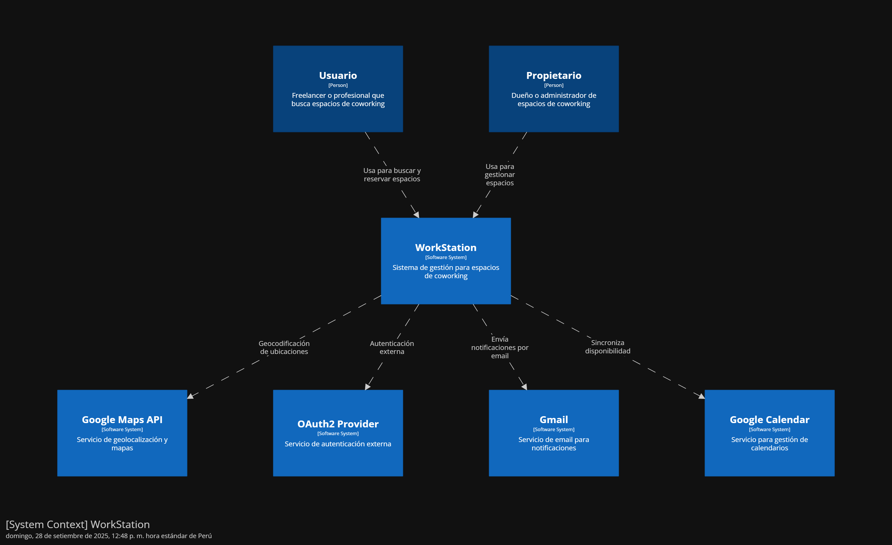
</p>

##### Diagrama de clases:

Auth Context:
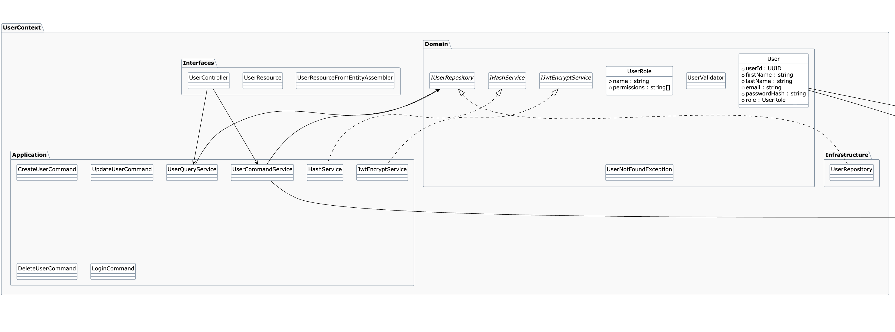
Shared Context:

<p align="center">
  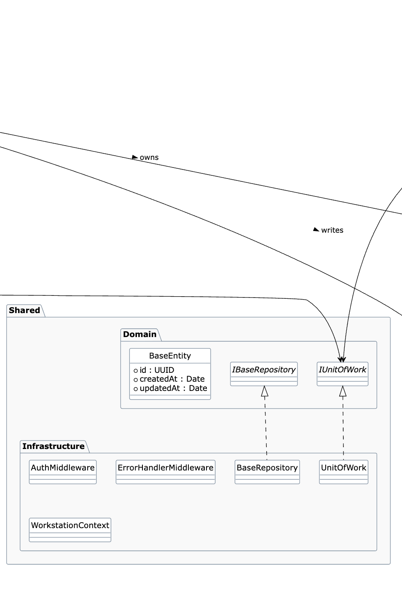
</p>

Offices Context:

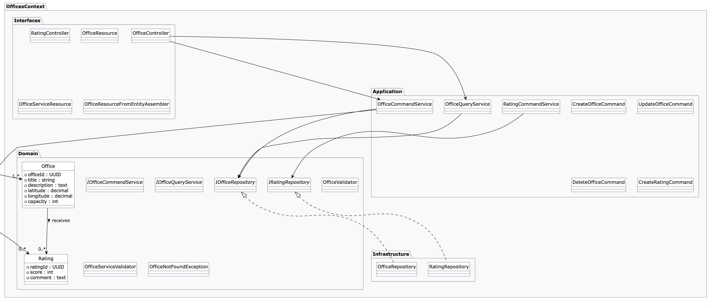

##### Diagrama de clases completo: https://github.com/1ASI0732-Grupo-2/report/blob/develop/assets/img/Chapter-4/iu.svg

**Elementos y Responsabilidades del Sistema Workstation**
| Elemento | Tipo | Responsabilidad |
|----------|------|----------------|
| **Usuario** | Person | Freelancer o profesional que busca espacios de coworking. Usa el sistema para buscar y reservar espacios. |
| **Propietario** | Person | Dueño o administrador de espacios de coworking. Usa el sistema para gestionar espacios. |
| **WorkStation** | Software System | Sistema de gestión para espacios de coworking. Envía notificaciones por email y sincroniza disponibilidad. |
| **Google Maps API** | External System | Servicio de geolocalización y mapas. Proporciona geocodificación de ubicaciones. |
| **OAuth2 Provider** | External System | Servicio de autenticación externa. Gestiona la autorización externa de usuarios. |
| **Gmail** | External System | Servicio de email para notificaciones. Envía notificaciones por email a los usuarios. |
| **Google Calendar** | External System | Servicio para gestión de calendarios. Sincroniza disponibilidad de espacios. |

#### 4.2.1.7 Analysis of Current Design and Review Iteration Goal (Kanban Board)

## In Progress

| ID     | Descripción                                                                                                                                         |
| ------ | --------------------------------------------------------------------------------------------------------------------------------------------------- |
| CON-04 | El sistema se desarrollará utilizando un enfoque de microservicios para facilitar el mantenimiento y la escalabilidad del motor de recomendaciones. |

## Done (Conceptos y Arquitectura)

| ID     | Descripción                                                                                                                              |
| ------ | ---------------------------------------------------------------------------------------------------------------------------------------- |
| CON-01 | El sistema será desarrollado en Java Spring Boot (backend), React/TypeScript (frontend) y PostgreSQL como base de datos principal.       |
| CON-02 | La aplicación podrá usarse en navegadores modernos como Chrome, Firefox, Safari y Edge con UI responsive.                                |
| CON-03 | Se emplearán tecnologías Open Source para reducir costos y garantizar flexibilidad.                                                      |
| CON-05 | El sistema adoptará el patrón Domain Driven Design (DDD) para estructurar los microservicios de manera alineada al negocio de coworking. |
| ARC-01 | Aplicar conocimientos previos en tecnologías como Java Spring Boot, React, PostgreSQL, Elasticsearch y herramientas de CI/CD.     |
| ARC-02 | Reconocer las habilidades del equipo para distribuir tareas según fortalezas individuales.                                               |
| ARC-04 | Entender que todos estamos en constante aprendizaje y fomentar la colaboración para resolver desafíos técnicos.                          |

## Done (Criterios de Aceptación y User Stories)

| ID               | Descripción                                                                                                                                 |
| ---------------- | ------------------------------------------------------------------------------------------------------------------------------------------- |
| AC-01 Usabilidad | El usuario podrá navegar fácilmente por la aplicación para buscar espacios de coworking, gestionar reservas y comunicarse con propietarios. |
| AC-04 Seguridad  | El usuario iniciará sesión con OAuth2/JWT; se generará un token para mantener la sesión activa y segura.                                    |
| US-01            | Como usuario, quiero ver oficinas recomendadas con capacidad adecuada y alto rating para asegurar comodidad de mi equipo.                   |
| US-02            | Como propietario, quiero que mi espacio sea recomendado a usuarios con necesidades compatibles para aumentar la tasa de reservas.           |
| TS-08            | Como desarrollador, necesito crear un endpoint que permita iniciar sesión a los usuarios con autenticación OAuth2 segura.                   |
| TS-09            | Como desarrollador, necesito implementar endpoints para actualizar la información del usuario y sus preferencias de búsqueda.               |

# Capítulo 5

## 5.1 Testing Suites & General Patterns

### 5.1.1 Backend Application Core Testing Suite

Para las pruebas de nuestro [Backend](https://github.com/1ASI0732-Grupo-2/Backend.git) hecho en .NET 9, se utilizo la libreria de Nunit. De esta manera se lograron hacer las pruebas de Integracion.

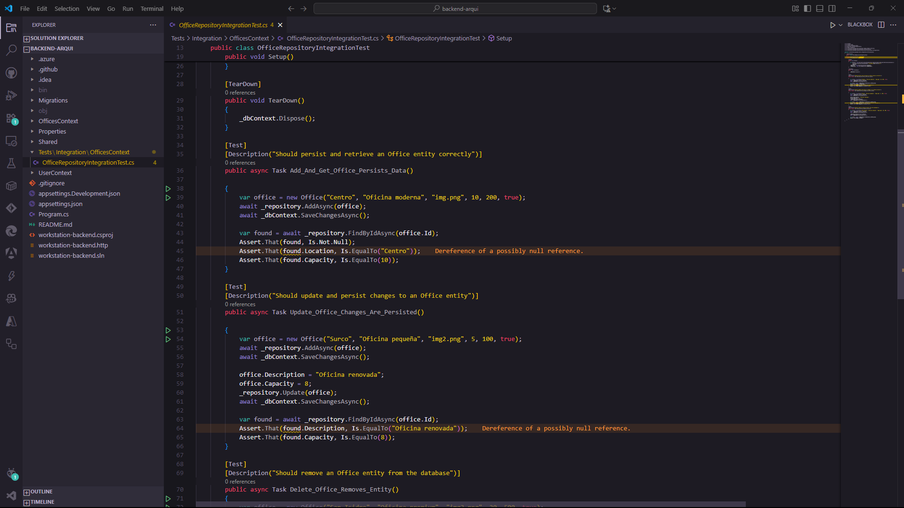

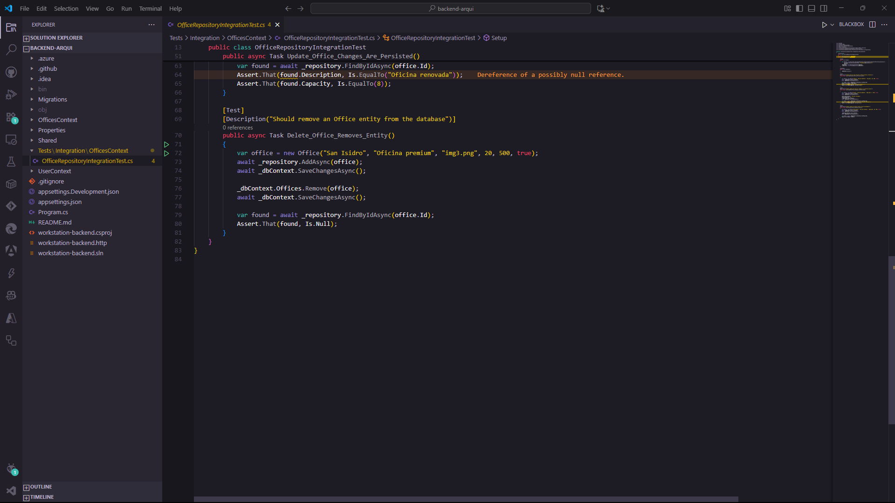

En total 3 pruebas de integracion que ven la persistencia de los datos en una base de datos de testeo. Todas estas corriendo satisfactoriamente.

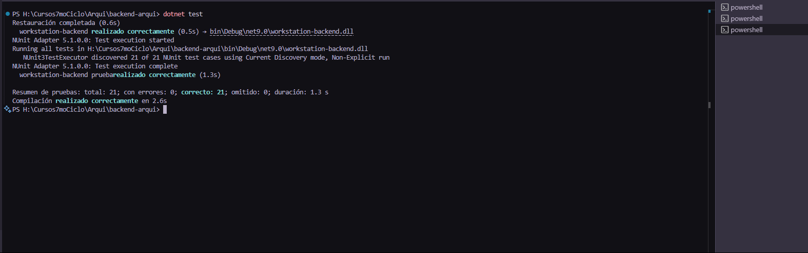

### 5.1.2 Pattern Based Backend Application(s)

Dentro del backend podemos encontrar diferentes patrones utilizados para seguir buenas practicas durante el desarrollo y despliegue de la aplicacion:

#### 1. Patrón Repository

Las interfaces como `IOfficeRepository`, `IRatingRepository` y sus implementaciones concretas como `OfficeRepository` y `RatingRepository` abstrae el acceso a los datos y permite realizar pruebas más fácilmente, además de facilitar el cambio de la fuente de datos.

#### 2. Patrón Unit of Work

La presencia de `IUnitOfWork` y su uso en los servicios (por ejemplo, `OfficeCommandService`) quiere decir que la aplicación del patrón Unit of Work, el cual coordina la escritura de los cambios y gestiona las transacciones.

#### 3. Patrón Command / CQRS

El uso de clases de comando como `CreateOfficeCommand`, `DeleteOfficeCommand`, `UpdateOfficeCommand` y los servicios correspondientes hace que la aplicación siga el patrón Command y el enfoque CQRS, que separa las operaciones de lectura y escritura.

#### 4. Patrón Service Layer

Clases como `OfficeCommandService`, `OfficeQueryService` y servicios similares en la capa de Aplicación encapsulan la lógica de negocio, siguiendo el patrón de Capa de Servicio (Service Layer).

#### 5. Patrón Domain Model

La presencia de entidades de dominio como `Office`, `OfficeService`, `Rating` y sus relaciones, así como los servicios de dominio, indica la aplicación del patrón Domain Model.

#### 6. Inyección de Dependencias

Usado:
Se utiliza la inyección por constructor en los servicios y repositorios, lo cual es una práctica central del patrón de Inyección de Dependencias (Dependency Injection).

#### 7. Patrón DTO/Assembler

La existencia de carpetas como Transform dentro de la capa de Interface y archivos como `OfficeResourceFromEntityAssembler.cs` hubo uso de Objetos de Transferencia de Datos y Assemblers para mapear entre entidades de dominio y recursos de la API.

#### 8. Patrón de Validación

El uso de `FluentValidation` y validadores para los comandos represento el patrón clásico de Validación, que separa la lógica de validación de la lógica de negocio.

#### 9. Patrón de Pruebas de Integración

La estructura dentro de la carpeta Integration y el uso de bases de datos en memoria para las pruebas de repositorios sigue el patrón de Pruebas de Integración (Integration Test Pattern).

### 5.1.3 Pattern-Based Custom Software Library

El proyecto **Workstation API** implementa una arquitectura basada en **Domain-Driven Design (DDD)** y **Command Query Responsibility Segregation (CQRS)**, apoyada en una biblioteca interna de componentes reutilizables que siguen patrones de diseño bien definidos. Esta aproximación permitió desarrollar un sistema modular, escalable y fácilmente mantenible.

**Patrones aplicados en la biblioteca:**

- **Repository Pattern:**  
  Implementado en las clases `OfficeRepository` y `RatingRepository`, ubicadas en el módulo `Infrastructure/Repositories`. Este patrón abstrae la lógica de acceso a datos y desacopla las operaciones CRUD del dominio, permitiendo una fácil sustitución de la capa de persistencia sin afectar la lógica de negocio.

- **Unit of Work Pattern:**  
  Representado en la clase `UnitOfWork.cs`, permite coordinar múltiples repositorios bajo una única transacción, asegurando la consistencia de los datos en operaciones complejas.

- **Command Pattern:**  
  Las clases `CreateOfficeCommand`, `UpdateOfficeCommand` y `CreateRatingCommand` encapsulan solicitudes de modificación de estado, separando claramente las operaciones de escritura del dominio. Estas son procesadas por los servicios de comando (`OfficeCommandService`, `RatingCommandService`).

- **Query Pattern:**  
  En paralelo, las consultas se manejan mediante clases de query (`GetOfficeByIdQuery`, `GetAllOfficesQuery`) y servicios especializados (`OfficeQueryService`), alineados con el principio CQRS.

- **Assembler Pattern:**  
  La clase `OfficeResourceFromEntityAssembler` implementa un transformador que convierte entidades del dominio a recursos de interfaz (`DTOs`), promoviendo el principio de separación entre la capa de dominio y la capa de presentación.

- **Dependency Injection Pattern:**  
  ASP.NET Core permite inyectar dependencias en los controladores y servicios (por ejemplo, en el `OfficeController`), facilitando la extensibilidad y las pruebas unitarias al eliminar dependencias rígidas.

**Beneficios obtenidos:**

- Reducción del acoplamiento entre capas.
- Reutilización de componentes comunes (servicios, repositorios y validadores).
- Mayor legibilidad y mantenibilidad del código.
- Facilita la incorporación de pruebas unitarias y de integración.
- Flexibilidad para reemplazar tecnologías (por ejemplo, el motor de base de datos o el ORM) sin alterar la lógica de negocio.

### 5.1.4 Framework Pattern-Driven Refactoring Report

Durante el desarrollo de **Workstation API**, se aplicó un proceso de **refactorización guiado por patrones de diseño** con el fin de mejorar la calidad estructural del código, la mantenibilidad y la separación de responsabilidades.

**Refactorizaciones realizadas:**

1. **Separación del controlador y la lógica de negocio (Controller → Service):**  
   Inicialmente, parte de la lógica de validación y persistencia se encontraba dentro del `OfficeController`. Mediante la aplicación del **Service Pattern**, se trasladó la lógica a los servicios `OfficeCommandService` y `OfficeQueryService`. Esto permitió que el controlador se enfocara exclusivamente en el manejo de solicitudes HTTP y respuestas JSON.

2. **Introducción del patrón Repository y Unit of Work:**  
   El acceso a datos se refactorizó desde implementaciones directas en los servicios hacia los repositorios dedicados (`OfficeRepository` y `RatingRepository`), coordinados por un `UnitOfWork`. Esta modificación mejoró la cohesión y garantizó la atomicidad de las transacciones.

3. **Aplicación del patrón Assembler (DTO Transformation):**  
   Se eliminó la exposición directa de las entidades de dominio en las respuestas del API, implementando `OfficeResourceFromEntityAssembler` para convertir entidades en recursos. Esto mejoró la seguridad y permitió personalizar las respuestas de la API sin modificar el dominio.

4. **Manejo centralizado de excepciones y validaciones:**  
   A través de `ErrorHandleMiddleware` y excepciones personalizadas (`OfficeNotFoundException`, `NotServicesFoundException`), se implementó una estrategia de manejo de errores coherente, siguiendo el patrón **Middleware** de ASP.NET Core. Esto simplificó la gestión de respuestas HTTP y redujo la duplicación de código.

5. **Aplicación del patrón Dependency Injection:**  
   Se eliminó la creación manual de dependencias en los controladores, aprovechando la inyección de dependencias del framework. Esto fortaleció el desacoplamiento y permitió la fácil sustitución de implementaciones (por ejemplo, repositorios falsos para pruebas).

**Resultados de la refactorización:**

- Se logró un aumento de la **cohesión interna** en las capas Application, Domain e Infrastructure.
- Se redujo el **acoplamiento entre el controlador y la lógica de negocio**.
- La arquitectura se alineó con los principios **SOLID** y **Clean Architecture**.
- La cobertura de pruebas unitarias mejoró al facilitar la **mockeabilidad** de las dependencias.
- Se optimizó la mantenibilidad del código para futuras extensiones (nuevas entidades o endpoints).

---

## 5.2 Software Configuration Management

### 5.2.1 Software Development Environment Configuration

**Project Management**

Whatsapp: Aplicación de mensajeria, utilizada para coordinar mediante mensajes el avance del proyecto, asi como consultar por ayuda cuando es necesario<br>
https://web.whatsapp.com <br>

Zoom: Aplicación para videollamadas, por donde se realizaron reuniones para coordinar el trabajo<br>
https://www.zoom.com/es <br><br>

**Requirements Management**

UXPresia: Software que sirve para la creacion de User personas, junto con otros graficos necesarios para encontrar las necesidades de los usuarios<br>
https://uxpressia.com<br>

Miro: Programa en linea usado en la creación de gráficos mediante distintas formas<br>
https://miro.com/es/<br><br>

**Product Design**

Structurizr: Plataforma en línea para la creación de diagramas de arquitectura de software basada en el modelo C4 <br>
https://structurizr.com/<br>

Plantuml: Herramienta de modelado basada en texto que permite crear diagramas de manera declarativa. <br>
https://plantuml.com/es/<br><br>

**Software Development:**

Github: Repositorio en linea, usado para almacenar archivos y ordenar el desarrollo de proyectos <br>
https://github.com/ <br>

Visual Studio Code: Entorno de desarrollo integrado (IDE) creado por Microsoft, utilizado para la programación en múltiples lenguajes como C#.<br>
https://code.visualstudio.com/<br>

### 5.2.2 Source Code Management

El código se subió a repositorios de Github para un mejor manejo de versiones, en este se crearon las ramas: Main, de la que hereda la rama develop, y de esta se crearon los diversos feature para cada aspecto a modificar

URL del repositorio en Github para el backend: https://github.com/1ASI0732-Grupo-2/Backend

### 5.2.3 Source Code Style Guide & Conventions

El lenguaje a utilizar en el código será únicamente ingles.

El Backend se desarrolló en el framework de .NET, haciendo uso de C#

En cuanto a la nomenclatura se utilizó UpperCammelCase para las clase, y lowerCammelCase para los metodos y vaiables.

### 5.2.4 Software Deployment Configuration

Para el despliegue del backend se utilizó Docker para contenerizar la aplicación. Esto permite una mejor organización del sistema mediante el uso de microservicios, cada uno ejecutándose en su propio contenedor.
El backend fue desplegado en una plataforma compatible con contenedores, permitiendo que los servicios se comuniquen entre sí de forma eficiente.

## 5.3 Microservices Implementation

Durante esta etapa del proyecto, el equipo de desarrollo implementó la arquitectura del backend de **WorkStation** siguiendo un enfoque basado en **microservicios**, con el objetivo de garantizar la modularidad, escalabilidad y mantenibilidad del sistema.  
Cada microservicio fue diseñado para cumplir una función específica dentro del ecosistema de la aplicación, permitiendo la comunicación entre ellos mediante interfaces bien definidas y el uso de contenedores **Docker**.

Los principales microservicios implementados fueron:

- **AuthService:** encargado de la autenticación y autorización de usuarios mediante JWT.
- **WorkspaceService:** gestiona la información de los espacios de coworking, incluyendo disponibilidad, servicios y precios.
- **BookingService:** administra las reservas realizadas por los usuarios y la comunicación con los propietarios.
- **ReviewService:** almacena y procesa las reseñas y valoraciones de los usuarios.

El backend fue desarrollado con **.NET 9**, empleando una arquitectura **Domain-Driven Design (DDD)** con principios de separación de responsabilidades.  
Cada servicio cuenta con sus propias entidades, repositorios e interfaces para promover el bajo acoplamiento.

Las **pruebas de integración** se realizaron utilizando la biblioteca **NUnit**, asegurando el correcto funcionamiento de la interacción entre los servicios y la base de datos.  
Este proceso permitió validar escenarios como la creación de reservas, el manejo de sesiones de usuario y la actualización de estados de los espacios.

### 5.2.1.5 Microservices Documentation Evidence for Sprint Review

Con el fin de mantener la trazabilidad y comprensión técnica del sistema, se elaboró una **documentación de los microservicios** empleando herramientas propias del entorno de desarrollo .NET y colecciones de **Postman** para validar los endpoints.

### Endpoints principales

| **Servicio**     | **Endpoint**                 | **Método HTTP** | **Descripción**                                   |
| ---------------- | ---------------------------- | --------------- | ------------------------------------------------- |
| AuthService      | `/api/auth/login`            | POST            | Autenticación de usuario y emisión de token JWT   |
| AuthService      | `/api/auth/register`         | POST            | Registro de nuevos usuarios                       |
| WorkspaceService | `/api/workspaces`            | GET             | Obtiene la lista de espacios disponibles          |
| WorkspaceService | `/api/workspaces/{id}`       | GET             | Devuelve la información detallada de un workspace |
| BookingService   | `/api/bookings`              | POST            | Registra una nueva reserva                        |
| ReviewService    | `/api/reviews/{workspaceId}` | GET             | Obtiene las reseñas de un espacio específico      |

Cada endpoint fue probado y validado con **Postman**, verificando tanto las respuestas esperadas (códigos **200**, **201**, **400** y **404**) como el manejo de excepciones.  
Además, se documentó el flujo de interacción entre servicios mediante diagramas UML y archivos **Swagger/OpenAPI** generados automáticamente desde el entorno de desarrollo.

#### Ejemplo de respuesta JSON

```json
{
  "bookingId": "BKG-2025-014",
  "workspaceId": "WS-09",
  "userId": "USR-1036",
  "checkIn": "2025-10-15T09:00:00",
  "checkOut": "2025-10-15T17:00:00",
  "status": "Confirmed"
}
```

URL de los endpints en swagger: https://workstation-arqui-fgbngphuh0g4a8at.canadacentral-01.azurewebsites.net/swagger/index.html

### 5.2.1.6 Software Deployment Evidence for Sprint Review

El despliegue del sistema **WorkStation** se realizó utilizando **Docker**, lo que permitió contenerizar los microservicios y asegurar un entorno uniforme entre desarrollo y producción.  
Cada servicio se ejecuta dentro de su propio contenedor, con una red interna que facilita la comunicación segura entre ellos.  
El uso de **Docker Compose** simplificó la orquestación de múltiples contenedores, permitiendo definir dependencias y volúmenes persistentes.

### Pasos de despliegue

1. **Construcción de imágenes:**  
   Se generaron imágenes de Docker para cada microservicio mediante sus respectivos archivos `Dockerfile`.  
   Cada uno contiene las instrucciones necesarias para compilar y ejecutar el servicio de forma independiente.

2. **Configuración de contenedores:**  
   Se definieron variables de entorno, puertos expuestos y dependencias entre servicios en el archivo `docker-compose.yml`, garantizando una comunicación eficiente.

3. **Ejecución con Docker Compose:**  
   Se levantó el entorno completo con el comando:
   ```bash
   docker-compose up --build
   ```

Esto permitió que los servicios se comunicaran a través de una red virtual compartida dentro del entorno Docker.

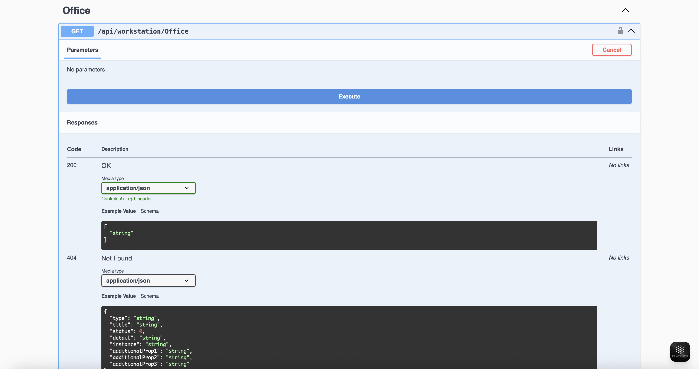


Verificación y pruebas:
Se validó la correcta ejecución mediante logs y pruebas de endpoints desde Postman y Swagger, asegurando que los microservicios respondan adecuadamente.

#### Plataforma de despliegue

El backend fue desplegado en una plataforma compatible con contenedores, lo que permite escalar los servicios de manera dinámica según la demanda.
Este enfoque asegura una mayor disponibilidad, resiliencia y facilidad de mantenimiento, permitiendo futuras integraciones con el frontend web o móvil.

La utilización de Docker garantiza que el sistema mantenga la misma configuración en todos los entornos, evitando inconsistencias entre desarrollo, prueba y producción.
Además, la estructura basada en microservicios facilita la actualización independiente de cada módulo sin afectar el resto del sistema.

### 5.2.1.8 Kanban Board

El siguiente tablero Kanban representa el estado de avance del equipo durante el **Sprint 1** del proyecto _WorkStation_.  
Refleja las tareas planificadas, en desarrollo, en validación y completadas, de acuerdo con la metodología ágil aplicada en el ciclo de desarrollo.

| **To Do**                                        | **In Progress**                     | **Testing / Review**               | **Done**                               |
| ------------------------------------------------ | ----------------------------------- | ---------------------------------- | -------------------------------------- |
| API de Mensajería (US-40)                        | Integración Pasarela de Pago (WI07) | Validación de endpoints en Swagger | API Búsqueda por Ubicación (WI01)      |
| Implementar verificación con LinkedIn/DNI (WI16) | API Pagos Seguros (WI06)            | Pruebas de integración con NUnit   | API Disponibilidad de Espacios (WI04)  |
| Diseño UI de reservas                            | Servicio de Geolocalización (WI02)  | Suite Testing Backend (WI18)       | Modelo de Reservas (WI05)              |
| Documentación de microservicios adicionales      |                                     |                                    | Configuración de Microservicios (WI17) |
|                                                  |                                     |                                    | API Reseñas y Valoraciones (WI15)      |
|                                                  |                                     |                                    | Deployment con Docker Compose          |

### 📊 Análisis del flujo

- **To Do:** Tareas planificadas para el siguiente sprint (mensajería, verificación y mejoras UI).
- **In Progress:** Actividades en desarrollo, priorizando pasarela de pagos, servicios de geolocalización y seguridad.
- **Testing / Review:** Pruebas unitarias y de integración realizadas con **NUnit** y validadas con **Swagger**.
- **Done:** Módulos completados e integrados, incluyendo despliegue con Docker y servicios principales funcionales.

### 📊 Descripción general

- **To Do:** Contiene las tareas planificadas para futuros sprints, priorizando funcionalidades críticas como mensajería y verificación de usuarios.
- **In Progress:** Actividades actualmente en desarrollo por los integrantes del equipo, centradas en integración de servicios y funcionalidades de pago.
- **Testing / Review:** Tareas en revisión o fase de pruebas unitarias e integraciones (NUnit y Swagger).
- **Done:** Tareas completadas y validadas en los sprints anteriores, con despliegue operativo en Docker y endpoints funcionales.

### 5.2.1 Sprint 1

#### 5.2.1.1 Sprint Backlog 1

<table> <thead> <tr class="header"> <th>Sprint #</th> <th colspan="7">Sprint 1</th> </tr> <tr class="odd"> <th colspan="2">User Story</th> <th colspan="6">Work-Item / Task</th> </tr> <tr class="header"> <th>Id</th> <th>Title</th> <th>Id</th> <th>Title</th> <th>Description</th> <th>Estimation (Hours)</th> <th>Assigned To</th> <th>Status</th> </tr> </thead> <tbody> <tr class="odd"> <td colspan="2" rowspan="3">US-01</td> <td>WI01</td> <td>API Búsqueda Ubicación</td> <td>Endpoint para buscar inmuebles por ubicación con filtros de proximidad</td> <td>6</td> <td>[Rodrigo]</td> <td>Done</td> </tr> <tr class="header"> <td>WI02</td> <td>Servicio Geolocalización</td> <td>Servicio para geocodificación de direcciones y coordenadas</td> <td>4</td> <td>[Renzo]</td> <td>In process</td> </tr> <tr class="odd"> <td>WI03</td> <td>Tests Ubicación</td> <td>Pruebas unitarias para funcionalidades de ubicación</td> <td>3</td> <td>[Henry]</td> <td>Done</td> </tr><tr class="header"> <td colspan="2" rowspan="2">US-02</td> <td>WI04</td> <td>API Disponibilidad</td> <td>Endpoints para consultar disponibilidad de inmuebles</td> <td>5</td> <td>[Rodrigo]</td> <td>Done</td> </tr> <tr class="odd"> <td>WI05</td> <td>Modelo Reservas</td> <td>Modelo de datos para gestión de disponibilidad</td> <td>4</td> <td>[Diego]</td> <td>Done</td> </tr><tr class="header"> <td colspan="2" rowspan="2">US-07</td> <td>WI06</td> <td>API Pagos Seguros</td> <td>Endpoints para procesamiento de pagos</td> <td>8</td> <td>[Braulio]</td> <td>In process</td> </tr> <tr class="odd"> <td>WI07</td> <td>Integración Pasarela</td> <td>Conexión con pasarela de pago externa</td> <td>6</td> <td>[Braulio]</td> <td>In process</td> </tr><tr class="header"> <td colspan="2" rowspan="2">US-38</td> <td>WI08</td> <td>API Registro Propietarios</td> <td>Endpoints para registro y autenticación</td> <td>6</td> <td>[Rodrigo]</td> <td>Done</td> </tr> <tr class="odd"> <td>WI09</td> <td>Autenticación JWT</td> <td>Sistema de autenticación con tokens JWT</td> <td>4</td> <td>[Diego]</td> <td>In process</td> </tr><tr class="header"> <td colspan="2" rowspan="2">US-39</td> <td>WI10</td> <td>API Gestión Inmuebles</td> <td>CRUD completo para inmuebles</td> <td>7</td> <td>[Henry]</td> <td>Done</td> </tr> <tr class="odd"> <td>WI11</td> <td>Upload Imágenes</td> <td>Servicio para carga de imágenes de inmuebles</td> <td>5</td> <td>[Henry]</td> <td>Done</td> </tr><tr class="header"> <td colspan="2" rowspan="2">US-03</td> <td>WI12</td> <td>API Filtros Búsqueda</td> <td>Endpoints para búsqueda avanzada con filtros</td> <td>6</td> <td>[Renzo]</td> <td>Done</td> </tr> <tr class="odd"> <td>WI13</td> <td>Lógica Filtrados</td> <td>Filtros por aforo, servicios, tipo de espacio</td> <td>5</td> <td>[Diego]</td> <td>Done</td> </tr><tr class="header"> <td colspan="2">US-40</td> <td>WI14</td> <td>API Mensajería</td> <td>Endpoints para mensajes entre usuarios</td> <td>6</td> <td>[Renzo]</td> <td>Done</td> </tr><tr class="odd"> <td colspan="2">US-04</td> <td>WI15</td> <td>API Reseñas</td> <td>Endpoints para valoraciones y opiniones</td> <td>5</td> <td>[Braulio]</td> <td>Done</td> </tr><tr class="header"> <td colspan="2">US-30</td> <td>WI16</td> <td>API Verificación</td> <td>Verificación con LinkedIn/DNI</td> <td>7</td> <td>[Henry]</td> <td>In process</td> </tr><tr class="odd"> <td colspan="2" rowspan="2">Técnicas</td> <td>WI17</td> <td>Configuración Microservicios</td> <td>Arquitectura base de microservicios</td> <td>6</td> <td>[Rodrigo]</td> <td>Done</td> </tr> <tr class="header"> <td>WI18</td> <td>Suite Testing</td> <td>Suite completa de pruebas backend</td> <td>8</td> <td>[Diego]</td> <td>In process</td> </tr> </tbody> </table>

#### 5.2.1.2 Development Evidence for Sprint Review

| **Repository**                                                                                        | **Branch** | **Commit Id** | **Commit messages** | **Commit Messages Body** | **Commit On (Date)** |
| ----------------------------------------------------------------------------------------------------- | ---------- | ------------- | ------------------- | ------------------------ | -------------------- |
| **[<u>https://github.com/1ASI0732-Grupo-2/report</u>](https://github.com/1ASI0732-Grupo-2/report)**   | develop    | 0fc3e38       | update Readme.md    | feat: update Readme.md   | 08/10/2025           |
| **[<u>https://github.com/1ASI0732-Grupo-2/Backend</u>](https://github.com/1ASI0732-Grupo-2/Backend)** | main       | 12877eb       | fix: added log      | fix: added log           | 06/10/2025           |

#### 5.2.1.3 Testing Suite Evidence for Sprint Review

En el alcance del sprint 1 se ha desarrollado el backend, priorizando la funcionalidad de los servicios.
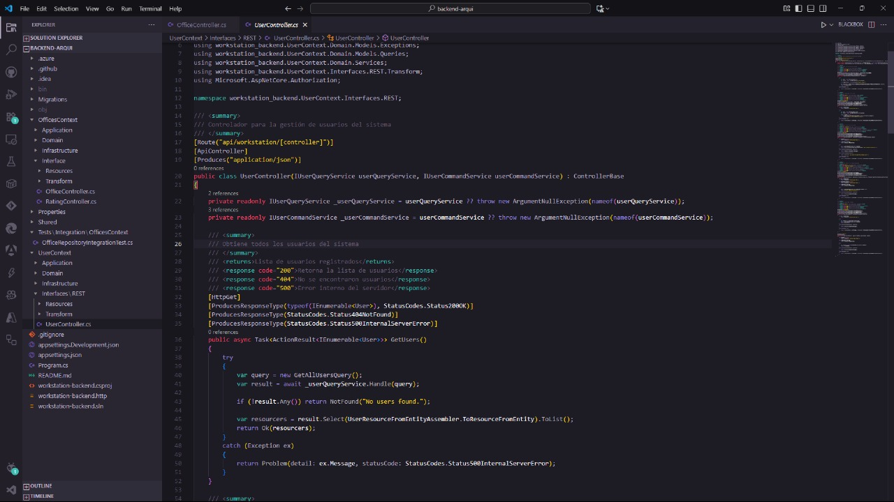

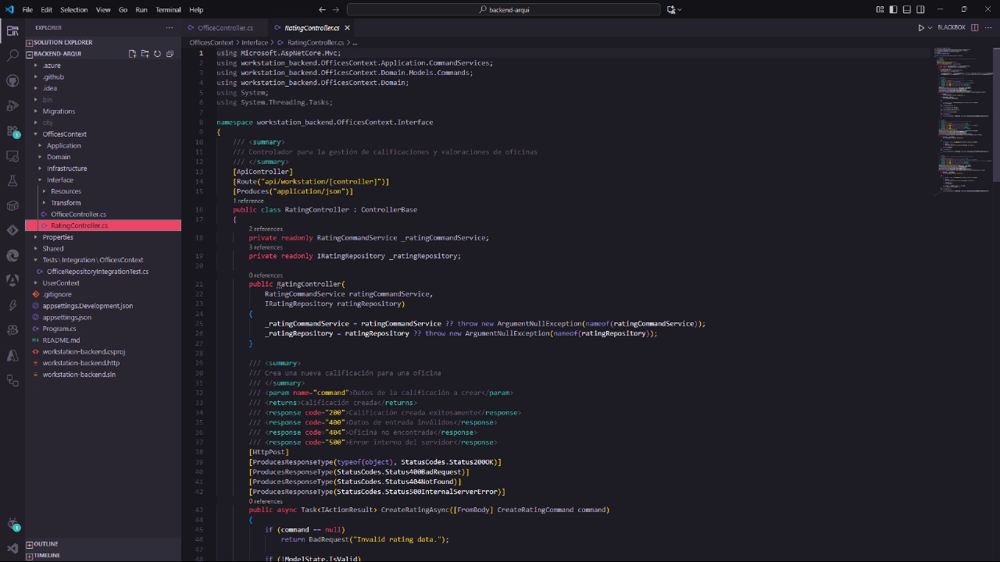

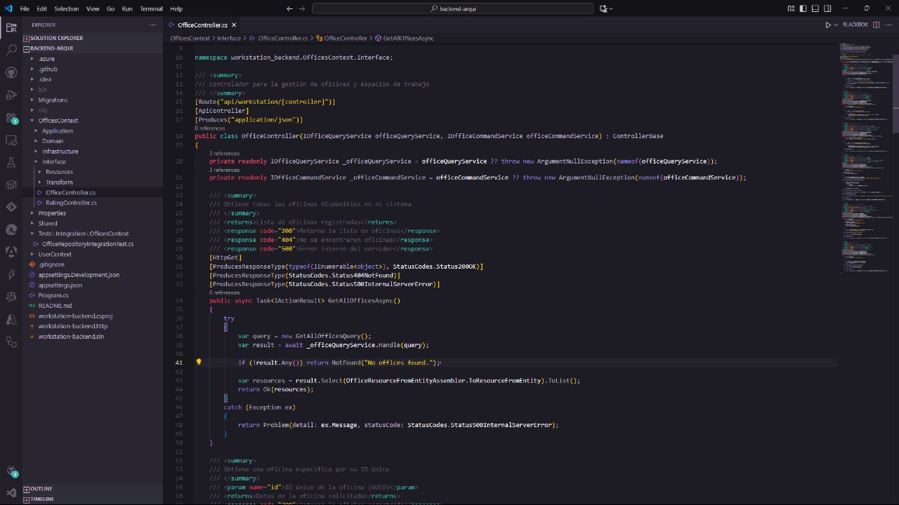

#### 5.2.1.4 Execution Evidence for Sprint Review

Para esta entrega, se realizo el backend ,desplegandolo asi mismo en swagger.
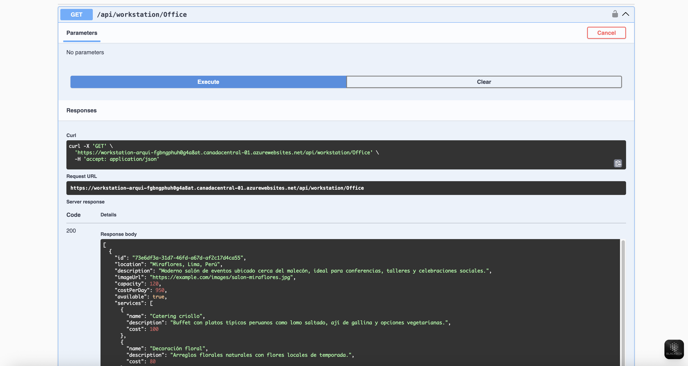

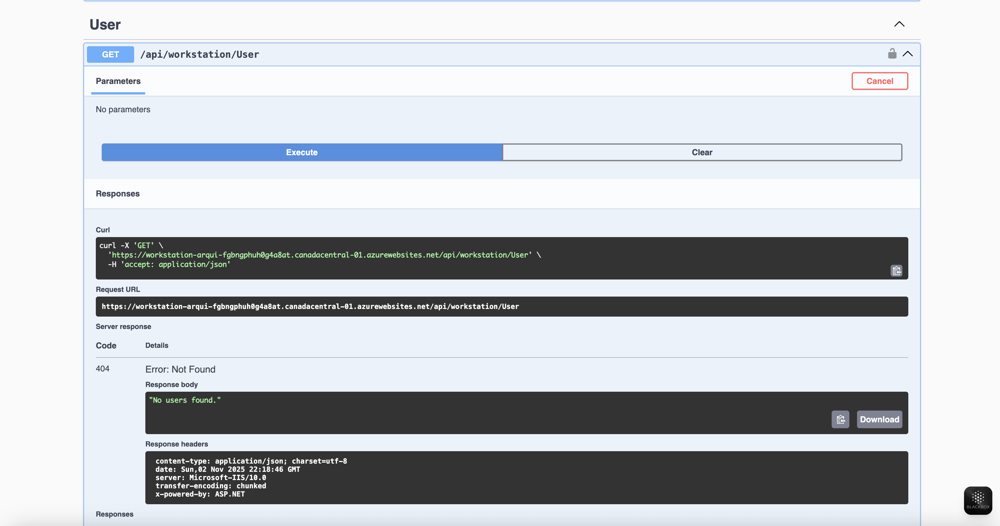

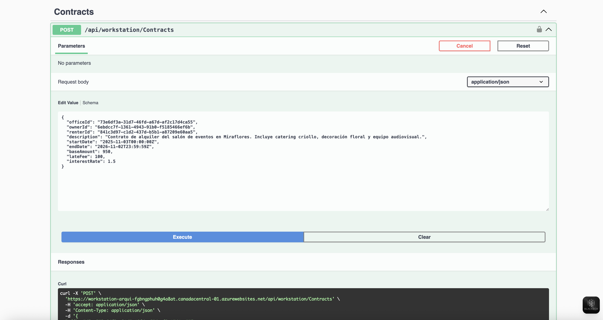

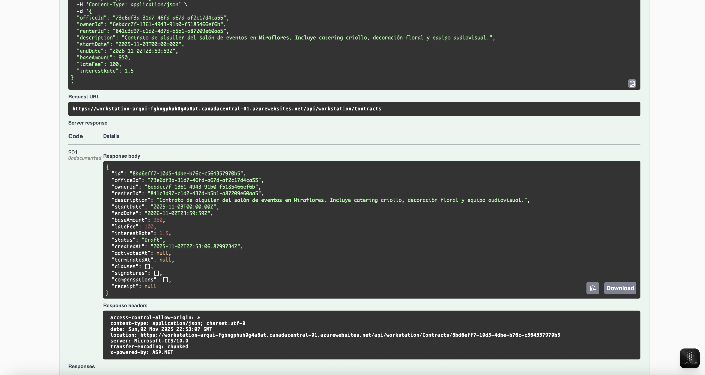
Link del despliegue del backend : [https://workstation-arqui-fgbngphuh0g4a8at.canadacentral-01.azurewebsites.net/swagger/index.html](https://workstation-arqui-fgbngphuh0g4a8at.canadacentral-01.azurewebsites.net/swagger/index.html)

#### 5.2.1.7 Team Collaboration Insights during Sprint

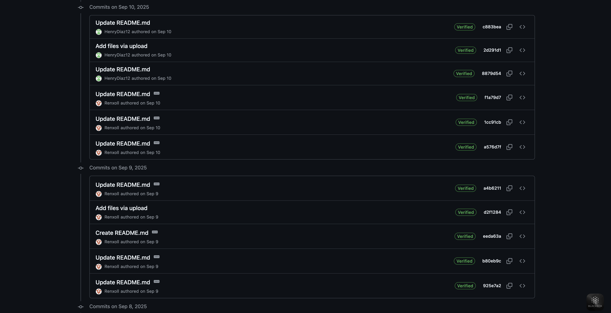


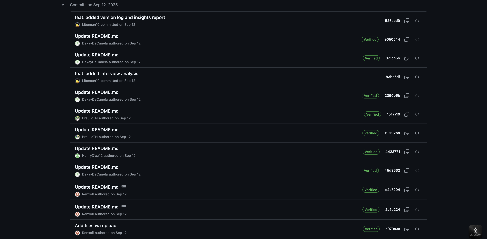

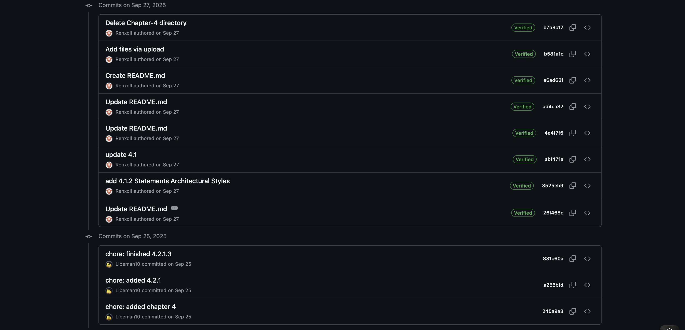

## 5.2.2 Sprint 2
#### 5.2.2.1 Sprint Backlog 2

<table>
<thead>
<tr class="header"><th>Sprint #</th><th colspan="7">Sprint 2</th></tr>
<tr class="odd"><th colspan="2">User Story</th><th colspan="6">Work-Item / Task</th></tr>
<tr class="header"><th>Id</th><th>Title</th><th>Id</th><th>Title</th><th>Description</th><th>Estimation (Hours)</th><th>Assigned To</th><th>Status</th></tr>
</thead>
<tbody>

<!-- CONTRACTS - US-07 -->
<tr class="odd"><td colspan="2" rowspan="3">US-07</td>
<td>WI19</td><td>API Gestión Contratos</td>
<td>CRUD completo para contratos entre freelancers y propietarios</td><td>7</td>
<td>[Braulio]</td><td>Done</td></tr>
<tr class="header"><td>WI20</td><td>Endpoints Contratos Usuario</td>
<td>Endpoints para gestionar contratos por usuario y contratos activos</td><td>5</td>
<td>[Rodrigo]</td><td>Done</td></tr>
<tr class="odd"><td>WI21</td><td>Lógica Activación Contratos</td>
<td>Endpoint para activación y finalización de contratos</td><td>4</td>
<td>[Diego]</td><td>Done</td></tr>

<!-- CONTRACTS - US-08 -->
<tr class="header"><td colspan="2" rowspan="2">US-08</td>
<td>WI22</td><td>API Compensaciones</td>
<td>Sistema de devoluciones y compensaciones por cancelaciones</td><td>6</td>
<td>[Braulio]</td><td>Done</td></tr>
<tr class="odd"><td>WI23</td><td>Lógica Receipts</td>
<td>Generación y gestión de recibos de pago y devoluciones</td><td>5</td>
<td>[Renzo]</td><td>In process</td></tr>

<!-- CONTRACTS - US-15 -->
<tr class="header"><td colspan="2">US-15</td>
<td>WI24</td><td>Cláusulas Contractuales</td>
<td>Gestión de cláusulas específicas para impuntualidad</td><td>4</td>
<td>[Henry]</td><td>Done</td></tr>

<!-- CONTRACTS - US-19 -->
<tr class="odd"><td colspan="2">US-19</td>
<td>WI25</td><td>Sistema Firmas Digitales</td>
<td>Endpoint para gestión de firmas en contratos</td><td>5</td>
<td>[Diego]</td><td>Done</td></tr>

<!-- OFFICE - US-39 -->
<tr class="header"><td colspan="2" rowspan="2">US-39</td>
<td>WI26</td><td>API Oficinas Mejorada</td>
<td>Extender funcionalidades de publicación de oficinas</td><td>6</td>
<td>[Henry]</td><td>Done</td></tr>
<tr class="odd"><td>WI27</td><td>Integración Contratos-Oficinas</td>
<td>Vincular sistema de oficinas con gestión de contratos</td><td>5</td>
<td>[Rodrigo]</td><td>In process</td></tr>

<!-- OFFICE - US-09 -->
<tr class="header"><td colspan="2">US-09</td>
<td>WI28</td><td>Publicación Simplificada</td>
<td>Mejoras en usabilidad para publicación de inmuebles</td><td>4</td>
<td>[Renzo]</td><td>Done</td></tr>

<!-- TECHNICAL -->
<tr class="odd"><td colspan="2" rowspan="2">Técnicas</td>
<td>WI29</td><td>Documentación APIs</td>
<td>Documentación completa de endpoints nuevos</td><td>6</td>
<td>[Diego]</td><td>In process</td></tr>
<tr class="header"><td>WI30</td><td>Pruebas Integración</td>
<td>Pruebas de integración entre Contracts y Office</td><td>7</td>
<td>[Braulio]</td><td>Done</td></tr>

</tbody>
</table>


#### 5.2.2.2 Development Evidence for Sprint Review

Para este Sprint, como se puede ver se desarrollo el nuevo contexto de Contracts sigiendo la arquitectura DDD. Como se pueden ver, aqui hay algunos avances relacionados al codigo del programa, donde se crearon nuevas entidades para este nuevo contexto, asimismo con reglas de negocio incluidas con FluentValidation.

Aqui su diagrama de clases.

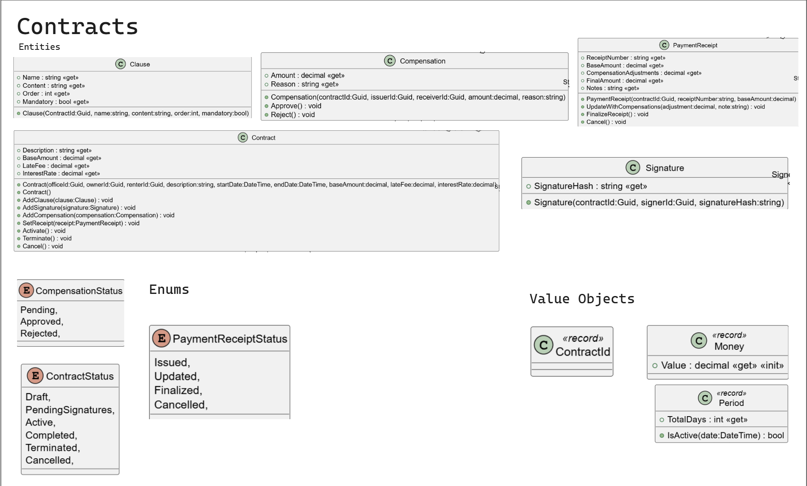

En esta imagen se puede ver el desarrollo de la clase Contacts dentro de Visual Studio Code.

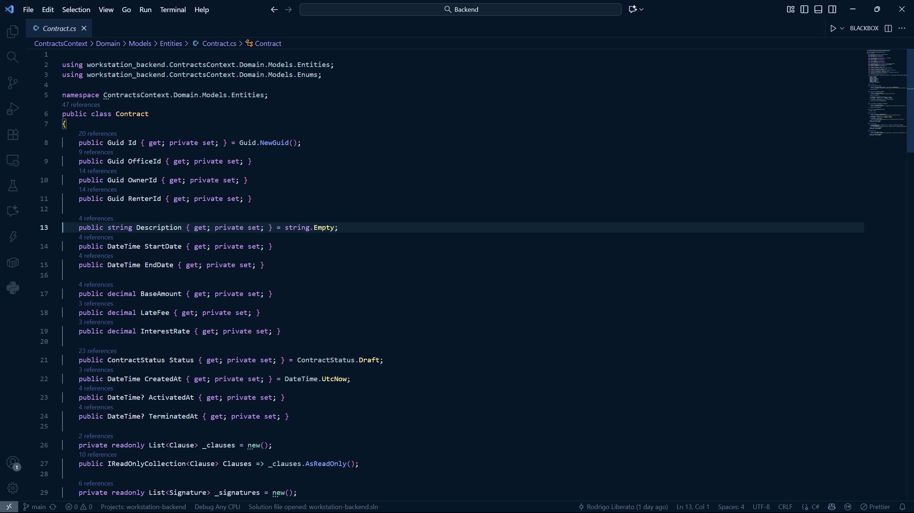

En la siguiente imagen se puede ver el servicio para los comandos de Contratos. Dentro de los mismos se encuentran la validacion y funcionalidad de distintos comandos.

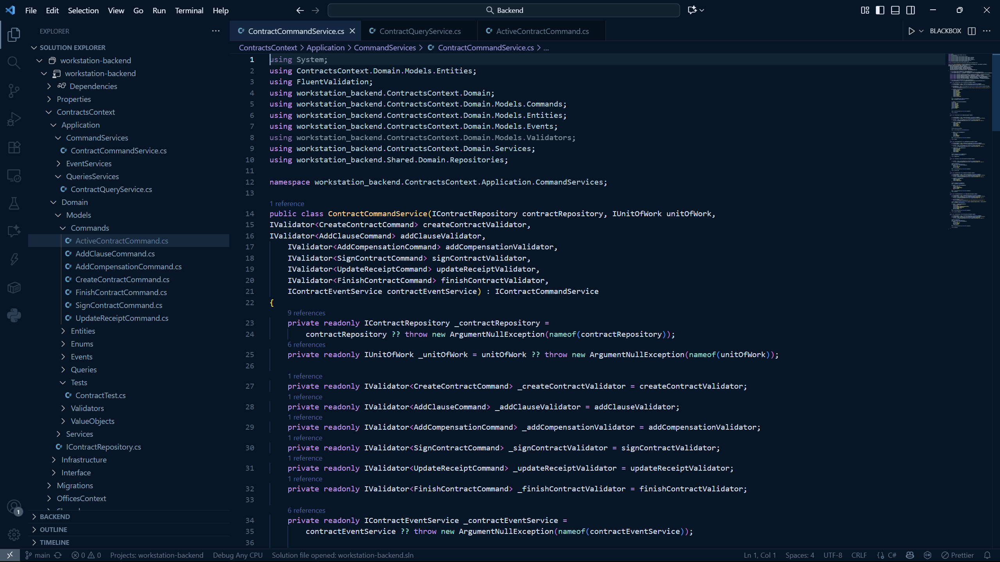

**Lista de comandos creados:**

| Comando                | Descripcion                                                                             | Variables                                                                                                                                                         |
| ---------------------- | --------------------------------------------------------------------------------------- | ----------------------------------------------------------------------------------------------------------------------------------------------------------------- |
| ActiveContractCommand  | Activa los contratos cuando las firmas estan listas.                                    | `Guid ContractId`                                                                                                                                                 |
| AddClauseCommand       | Añade clausulas a los contratos creados.                                                | `Guid ContractId, string Name, string Content, int Order, bool Mandatory`                                                                                         |
| AddCompensationCommand | Si es que el periodo de pago es saltado, la compensacion se añade al pago del contrato. | `Guid ContractId, Guid IssuerId, Guid ReceiverId, decimal Amount, string Reason`                                                                                  |
| CreateContractCommand  | Crea el contrato                                                                        | `Guid OfficeId, Guid OwnerId, Guid RenterId, string Description, DateTime StartDate, DateTime EndDate, decimal BaseAmount, decimal LateFee, decimal InterestRate` |
| FinishCotntractCommand | Acaba el contrato en el periodo de tiempo establecido y con el pago realizado.          | `Guid ContractId, string Reason`                                                                                                                                  |
| SignContractCommand    | Firma el contrato de un solo participante                                               | `Guid ContractId, Guid SignerId, string SignatureHash`                                                                                                            |
| UpdateReceiptCommand   | Cuando se genera una compensacion, el recibo se actualiza                               | `Guid ContractId, decimal CompensationAdjustments, string Notes`                                                                                                  |

En la siguiente imagen se puede ver el servicio de Queries que se utilizo para manejar los queries de este contexto.

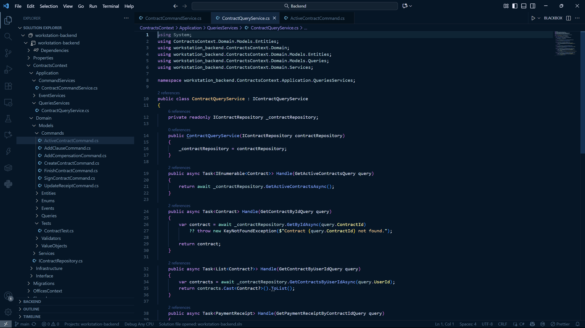

**Lista de Queries**

| Query                              | Descripcion                                            | Variables         |
| ---------------------------------- | ------------------------------------------------------ | ----------------- |
| GetActiveContractsQuery            | Regresa los Contratos activos                          |                   |
| GetCompensationByContractIdQuery   | Regresa el valor de la compensacion por id de contrato | `Guid ContractId` |
| GetContractByIdQuery               | Retorna el contrato por id.                            | `Guid ContractId` |
| GetContractByUserIdQuery           | Retorna el contrato por el id del usuario relacionado  | `Guid UserId`     |
| GetPaymentReceiptByContractIdQuery | Retorna el recibo de pago por el Id del contrato       | `Guid ContractId` |

Por ultimo aqui se puede ver el controlador donde se hace la salida de datos hacia la API, donde se encuentran todos los comandos y queries que se establecieron anteriormente.

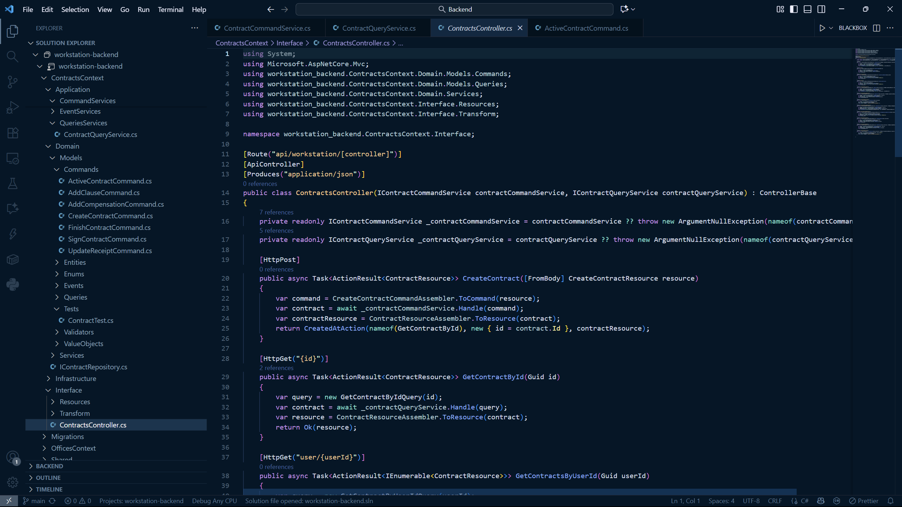


#### 5.2.2.3 Testing Suite Evidence for Sprint Review

Para el testing de este context primero se vio los diferentes escenarios para la creacion de los contratos con todos sus atributos.

En la primera imagen tenemos el Setup de los tests de contratos, donde se generan nuevos ids de prueba para las oficinas, el dueño y la persona que busca la oficina, todo esto para establecer un contrato con estos datos.

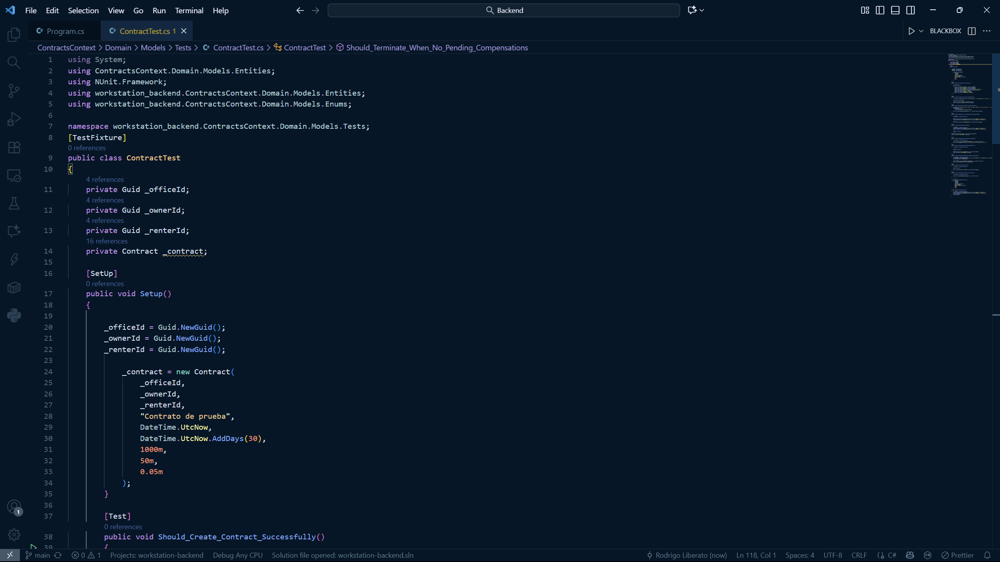

Los unit test que son visibles en la siguiente imagen son casos de prueba basicos, donde se prueba la creacion de un contrato satisfactoriamente. Asimismo, en el segundo caso es cuando el contrato esta en su fase inicial de borrador se puedan agregar clausulas y no cuando este ya activo, ya que va tirar una excepcion.

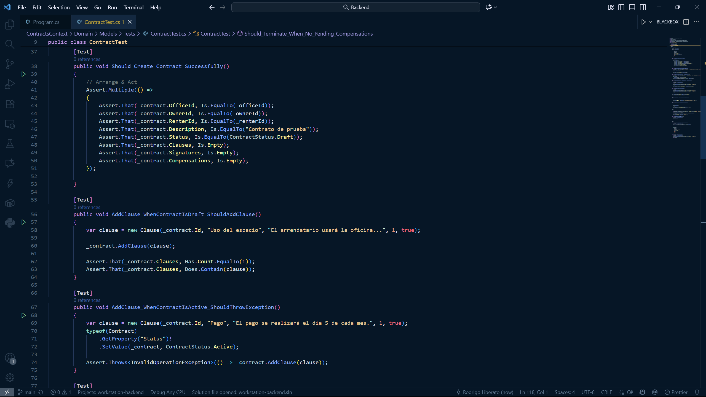

En los siguientes tests, el primero indica que el contrato debe de cambiar su estado de draft a Active cuando las dos firmas son establecidas. Por otro lado, se debe de generar una excepcion cuando una de las dos firmas no estan.

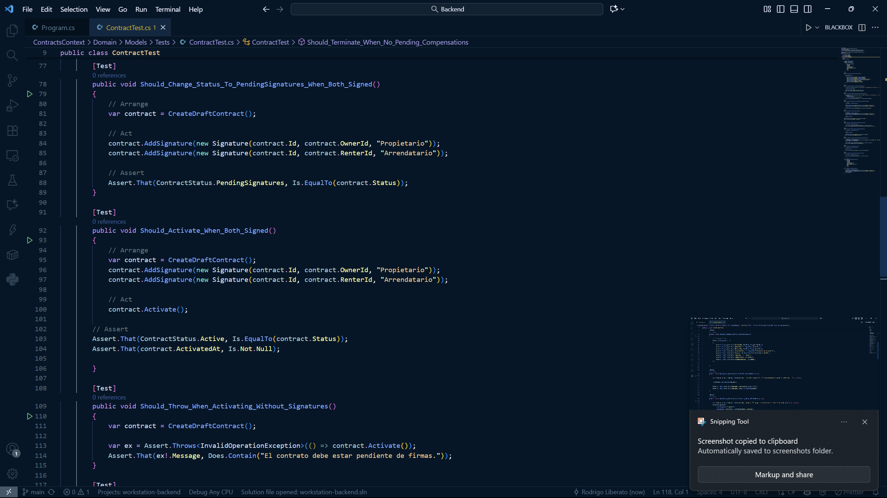

En estos tests, el primero indica que el contrato debe terminar cuando no se encuentran compensaciones pendientes, sino debe lanzar una excepcion. Asimismo, el contrato se puede cancelr cuando no esta activo, pero cuando este activo no es posible de cancelar y una excepcion es lanzada.

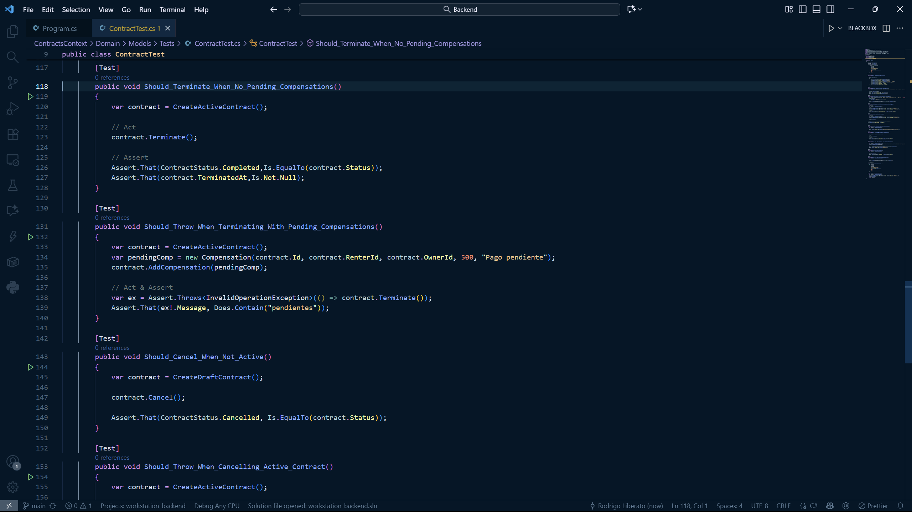

Por ultimo, estos son algunso helpers que se utilizaron las pruebas unitarias.

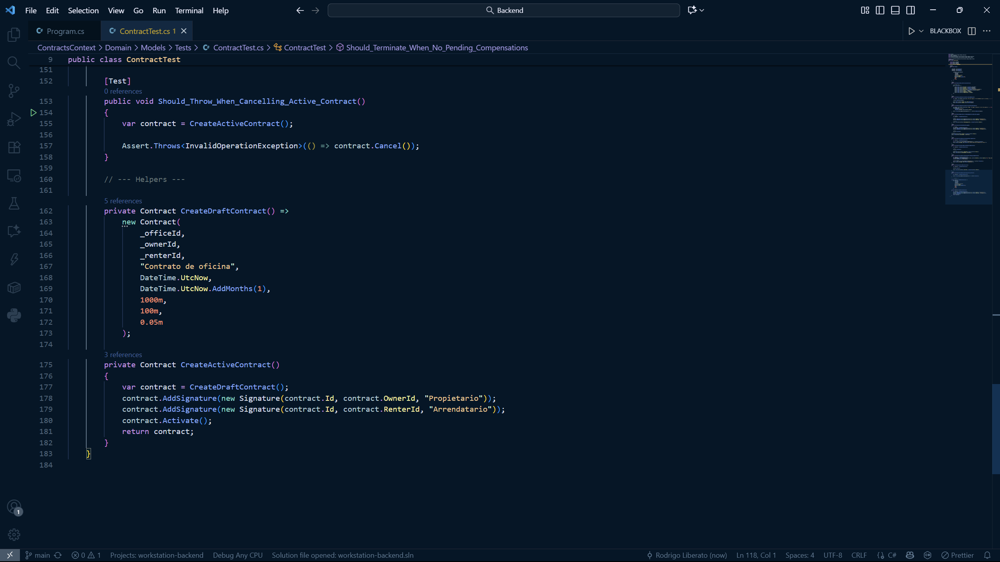

Por ultimo, se corrieron todos los tests de estos casos y su resultado fue el esperado.

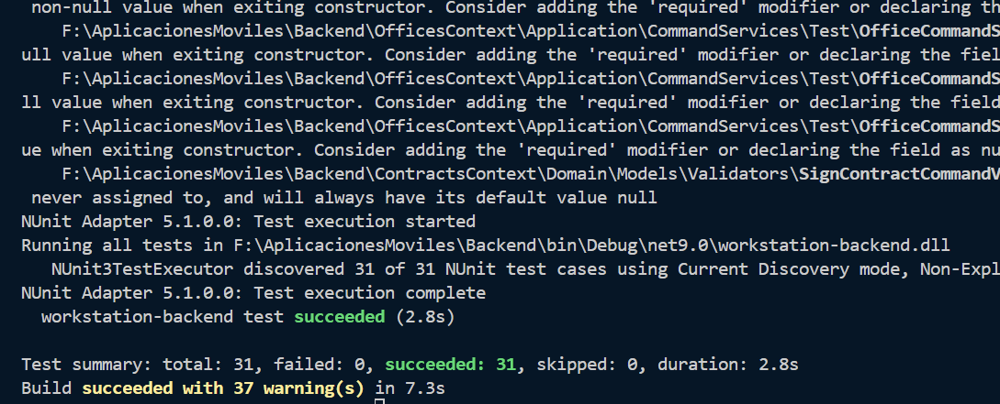

#### 5.2.2.4 Execution Evidence for Sprint Review

Para la ejecuccion del programa, se verifico primero dentro de un entorno controlado para ver que el nuevo contexto sea funcional. Para luego ser desplegado en Azure.

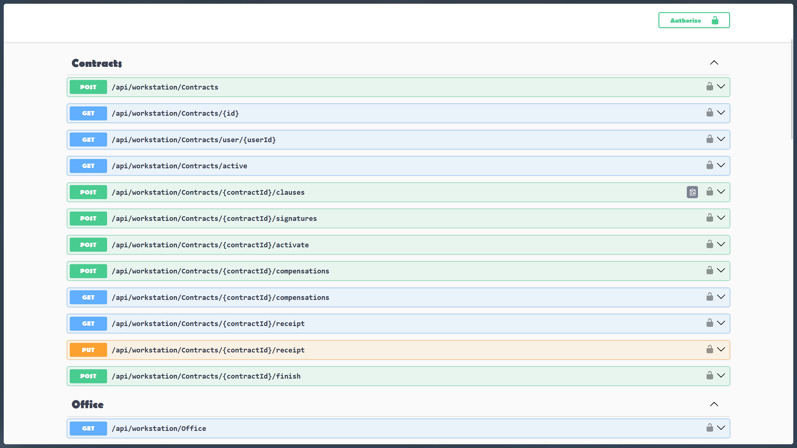

#### 5.2.2.5 Microservices Documentation Evidence for Sprint Review

Con el fin de mantener la trazabilidad y comprensión técnica del sistema, se elaboró una **documentación de los microservicios** empleando herramientas propias del entorno de desarrollo .NET y colecciones de **Postman** para validar los endpoints.

### Endpoints principales

| **Servicio**    | **Endpoint**                                            | **Método HTTP** | **Descripción**                                           |
| --------------- | ------------------------------------------------------- | --------------- | --------------------------------------------------------- |
| ContractService | `/api/workstation/Contracts`                            | POST            | Crear nuevo contrato entre freelancer y propietario       |
| ContractService | `/api/workstation/Contracts/(id)`                       | GET             | Obtener detalles específicos de un contrato               |
| ContractService | `/api/workstation/Contracts/user/(userid)`              | GET             | Obtener todos los contratos de un usuario específico      |
| ContractService | `/api/workstation/Contracts/active`                     | GET             | Listar contratos activos en el sistema                    |
| ContractService | `/api/workstation/Contracts/(contractId)/clauses`       | POST            | Gestionar cláusulas específicas del contrato              |
| ContractService | `/api/workstation/Contracts/(contractId)/signatures`    | POST            | Manejar firmas digitales de las partes involucradas       |
| ContractService | `/api/workstation/Contracts/(contractId)/activate`      | POST            | Activar un contrato previamente creado                    |
| ContractService | `/api/workstation/Contracts/(contractId)/compensations` | POST            | Gestionar compensaciones y devoluciones por cancelaciones |
| ContractService | `/api/workstation/Contracts/(contractId)/receipt`       | GET/PUT         | Generar y actualizar recibos de pago                      |
| ContractService | `/api/workstation/Contracts/(contractId)/finish`        | POST            | Finalizar un contrato activo                              |

Cada endpoint fue probado y validado con **Postman**, verificando tanto las respuestas esperadas.
Además, se documentó el flujo de interacción entre servicios mediante diagramas UML y archivos **Swagger/OpenAPI** generados automáticamente desde el entorno de desarrollo.
URL de los endpints en swagger: https://workstation-arqui-fgbngphuh0g4a8at.canadacentral-01.azurewebsites.net/swagger/index.html

#### 5.2.2.6 Software Deployment Evidence for Sprint Review

En el Sprint 2 se amplió el despliegue del sistema WorkStation, incorporando el nuevo Contract Service y sus integraciones con los microservicios existentes. El despliegue continuó realizándose con Docker y Docker Compose, asegurando consistencia entre entornos y facilitando la orquestación de múltiples contenedores.

### Pasos de despliegue

1. **Actualización de imágenes:**  
   Se construyeron nuevas imágenes Docker para el Contract Service y se actualizaron las de OfficeService y AuthService

2. **- Configuración extendida en docker-compose.yml:**  
   Se añadieron variables de entorno específicas para el Contract Service, incluyendo conexión a base de datos y dependencias con OfficeService y AuthService.

3. **- Ejecución:**  
    El entorno completo se levantó con:
   ```bash
   docker-compose up --build
   ```
   Esto permitió que los servicios se comunicaran en la red interna de Docker, garantizando la integración entre contratos, oficinas y autenticación

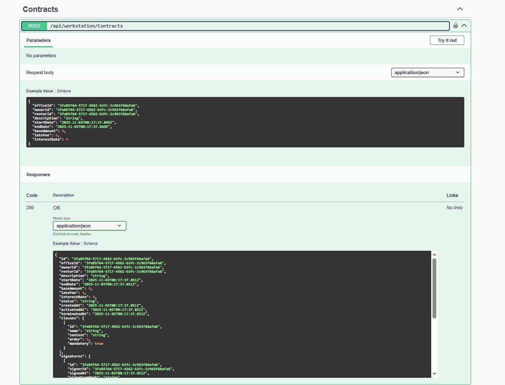

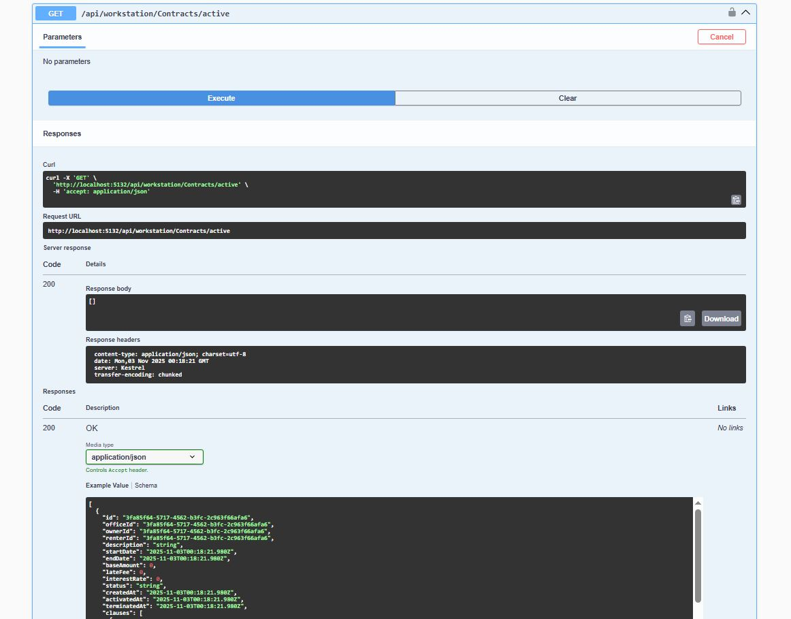

Verificación y pruebas:
Se validó la correcta ejecución mediante logs y pruebas de endpoints desde Postman y Swagger, asegurando que los microservicios respondan adecuadamente.

#### Plataforma de despliegue

El backend fue desplegado en una plataforma compatible con contenedores, lo que permite escalar los servicios de manera dinámica según la demanda.
Este enfoque asegura una mayor disponibilidad, resiliencia y facilidad de mantenimiento, permitiendo futuras integraciones con el frontend web o móvil.

La utilización de Docker garantiza que el sistema mantenga la misma configuración en todos los entornos, evitando inconsistencias entre desarrollo, prueba y producción.
Además, la estructura basada en microservicios facilita la actualización independiente de cada módulo sin afectar el resto del sistema.

### Modelo C4 de Componentes

Se actualizó el modelo C4 para reflejar la incorporación del Contract Service y sus componentes internos:
• Contract Controller (exposición de endpoints).
• Contract Command Service y Contract Query Service (separación de responsabilidades CQRS).
• Contract Repository (persistencia).
• Compensation Module y Signature Module (lógica de negocio especializada).

Modelo C4 de Contenedores

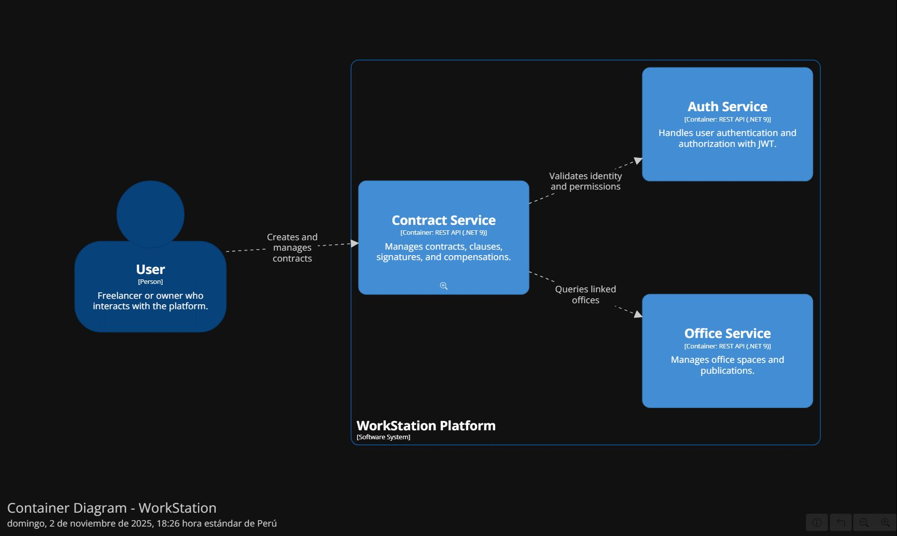

Modelo C4 de Componentes

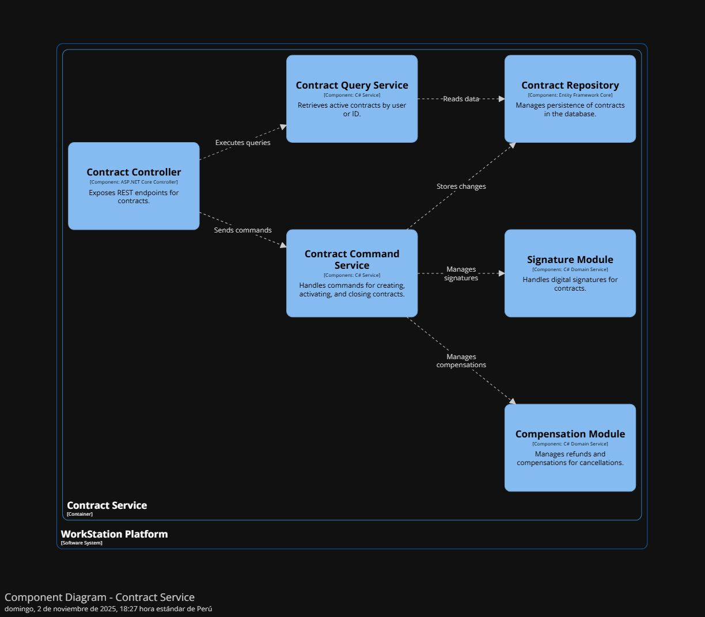

#### 5.2.2.7 Team Collaboration Insights during Sprint

##### Reporte

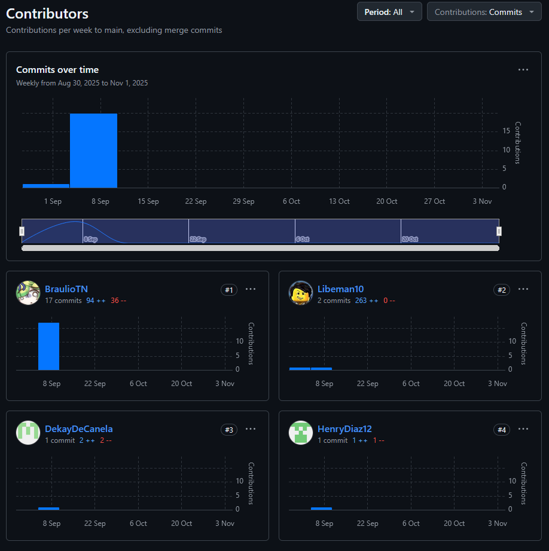

##### Backend

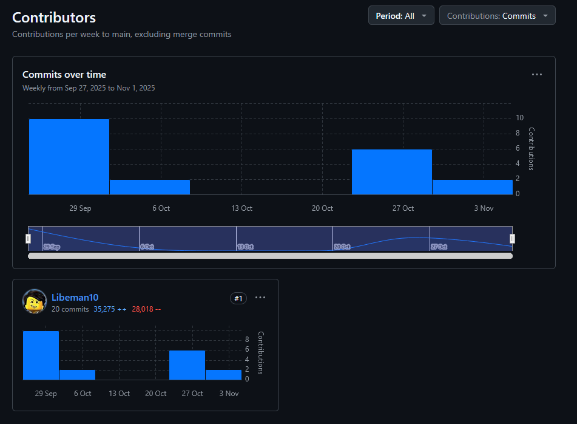

#### 5.2.2.8 Kanban Board

| **Backlog**                                                 | **To Do**                                                                        | **In Progress**                                                                     | **Done**                                                                    |
| ----------------------------------------------------------- | -------------------------------------------------------------------------------- | ----------------------------------------------------------------------------------- | --------------------------------------------------------------------------- |
| B1 – Autenticación con JWT y roles (freelancer/host/admin). | T1 – Diagramar arquitectura de despliegue (C4 Level 4 / Deployment).             | P1 – Actualización del Diagrama de Componentes (C4 Level 3).                        | D1 – Lean UX Canvas, entrevistas y Customer Journey Map.                    |
| B2 – Sistema de reservas + calendario + pagos.              | T2 – Documentar pipeline CI/CD (GitHub Actions / Azure DevOps).                  | P2 – Definición de microservicios y dominios DDD (User, Booking, Listing, Payment). | D2 – User Personas, Empathy Map y As-Is Scenario.                           |
| B3 – Servicio de notificaciones (email/push).               | T3 – Registrar ADR (Architecture Decision Records) de tecnologías seleccionadas. | P3 – Diseño del modelo ER + normalización de base de datos.                         | D3 – User Stories + Product Backlog priorizado.                             |
| B4 – API de mapas (Google Maps / Leaflet).                  | T4 – Documentar endpoints REST con Swagger/OpenAPI.                              | P4 – Selección de arquitectura backend (.NET / Spring Boot / NestJS).               | D4 – Diagrama C4 Nivel 1 (Context Diagram).                                 |
| B5 – Despliegue en la nube (Docker + AWS/Render/Railway).   | T5 – Diagrama de secuencia del flujo de reserva.                                 | P5 – Arquitectura hexagonal + patrones (Repository, Factory, DI).                   | D5 – Diagrama C4 Nivel 2 (Container Diagram).                               |
| B6 – Pruebas unitarias e integración.                       |                                                                                  |                                                                                     | D6 – Quality Attribute Scenarios definidos.                                 |
|                                                             |                                                                                  |                                                                                     | D7 – Drivers arquitectónicos documentados (business, constraints, quality). |

---

## Narrativa del Kanban Board

El tablero Kanban actualizado representa la planificación y el estado de avance del proyecto *WorkStation*, organizado en cuatro columnas principales: **Backlog**, **To Do**, **In Progress** y **Done**. Esta estructura permite visualizar de manera clara el flujo de trabajo y el progreso del equipo durante el desarrollo arquitectónico del sistema.

### Backlog
En esta columna se encuentran las tareas planificadas pero aún no iniciadas. Incluyen funcionalidades principales del MVP como:
- Autenticación con JWT y roles.
- Sistema de reservas, calendario y pagos.
- Servicio de notificaciones.
- API de mapas.
- Despliegue en la nube.
- Pruebas unitarias e integración.

Estas tareas están destinadas a fases posteriores del desarrollo.

### To Do
Contiene actividades priorizadas para el avance actual. Están relacionadas con decisiones arquitectónicas clave:
- Diagrama de despliegue (C4 Level 4).
- Documentación del pipeline CI/CD.
- Registro de ADR.
- Diagrama de secuencia del flujo de reserva.

Representan el puente entre el diseño conceptual y la futura implementación técnica.

### In Progress
Incluye los elementos en desarrollo activo:
- Actualización del diagrama de componentes (C4 Level 3).
- Definición de microservicios mediante DDD.
- Diseño del modelo ER.
- Selección de la arquitectura backend.
- Arquitectura hexagonal y patrones de diseño.

Esta columna refleja la transición del análisis hacia un diseño técnico más profundo.

### Done
Reúne los entregables completados del proyecto:
- Lean UX Canvas, entrevistas y Customer Journey Map.
- User Personas, Empathy Map y escenarios actuales.
- User Stories y Product Backlog priorizado.
- Diagramas C4 niveles 1 y 2.
- Drivers arquitectónicos.
- Quality Attribute Scenarios.

Estos artefactos fueron fundamentales para comprender el problema, diseñar la solución y justificar decisiones de arquitectura.


## 5.2.3 Sprint 3  
#### 5.2.3.1 Sprint Backlog 3

<table>
<thead>
<tr class="header"><th>Sprint #</th><th colspan="7">Sprint 3</th></tr>
<tr class="odd"><th colspan="2">User Story</th><th colspan="6">Work-Item / Task</th></tr>
<tr class="header"><th>Id</th><th>Title</th><th>Id</th><th>Title</th><th>Description</th><th>Estimation (Hours)</th><th>Assigned To</th><th>Status</th></tr>
</thead>
<tbody>

<!-- REVIEWS - US-29 -->
<tr class="odd"><td colspan="2" rowspan="2">US-29</td>
<td>WI39</td><td>API Reseñas</td>
<td>CRUD de reseñas entre propietarios y freelancers</td><td>7</td>
<td>[Braulio]</td><td>Planned</td></tr>
<tr class="header"><td>WI43</td><td>Pruebas Reseñas</td>
<td>Tests unitarios e integración para reseñas</td><td>5</td>
<td>[Renzo]</td><td>Planned</td></tr>

<!-- VERIFICATION - US-30 -->
<tr class="odd"><td colspan="2">US-30</td>
<td>WI40</td><td>API Verificación Usuarios</td>
<td>Integración con LinkedIn/DNI para verificación</td><td>6</td>
<td>[Diego]</td><td>Planned</td></tr>

<!-- SEARCH - US-41 -->
<tr class="header"><td colspan="2">US-41</td>
<td>WI41</td><td>API Búsqueda Avanzada</td>
<td>Endpoints con filtros de servicios, precio, capacidad y ubicación</td><td>7</td>
<td>[Rodrigo]</td><td>Planned</td></tr>

<!-- RATINGS - US-42 -->
<tr class="odd"><td colspan="2">US-42</td>
<td>WI42</td><td>API Calificaciones</td>
<td>Endpoint para calificar oficinas y propietarios</td><td>6</td>
<td>[Henry]</td><td>Planned</td></tr>

<!-- TECHNICAL -->
<tr class="header"><td colspan="2" rowspan="2">Técnicas</td>
<td>WI44</td><td>Seguridad Básica</td>
<td>Roles mínimos y validación de inputs en endpoints críticos</td><td>5</td>
<td>[Renzo]</td><td>Planned</td></tr>
<tr class="odd"><td>WI45</td><td>Documentación Sprint 3</td>
<td>Documentación APIs, microservicios y despliegue</td><td>6</td>
<td>[Diego]</td><td>Planned</td></tr>

<!-- MIGRATION -->
<tr class="header"><td colspan="2" rowspan="3">Migración</td>
<td>WI46</td><td>Cierre WI23</td>
<td>Finalizar lógica de recibos</td><td>4</td>
<td>[Renzo]</td><td>In process</td></tr>
<tr class="odd"><td>WI47</td><td>Cierre WI27</td>
<td>Integración contratos-oficinas</td><td>5</td>
<td>[Rodrigo]</td><td>In process</td></tr>
<tr class="header"><td>WI48</td><td>Cierre WI29</td>
<td>Documentación APIs contratos</td><td>6</td>
<td>[Diego]</td><td>In process</td></tr>

</tbody>
</table>


### 5.2.3.2 Development Evidence for Sprint Review
Para este Sprint, se actualizo el contexto contracts y ademas se actualizaron algunos aspectos mas del backend 

Dentro de la siguiente imagen se puede ver la creacion de Tests para la creacion de Contratos.

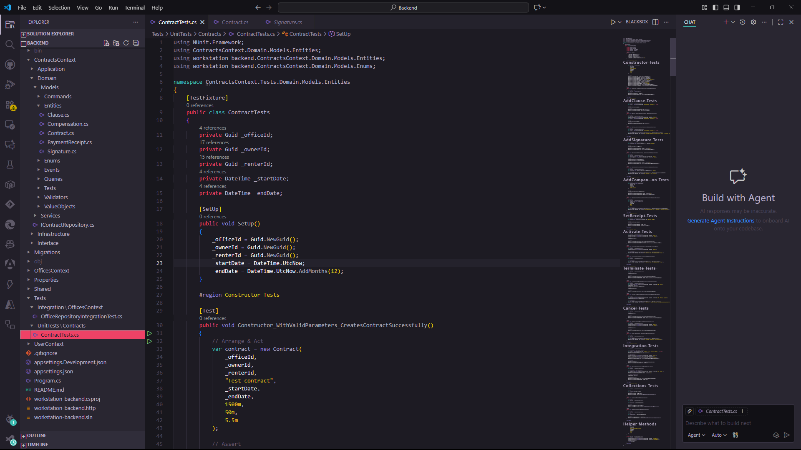

Sin embargo, el sprint mayormente se baso en la documentacion de las clases para un entendimiento mas facil para todas las personas que vayan a utilizar el API. Como se puede ver en las siguientes imagenes, las clases como Contracts, Compensations, Clauses, Signatures o PaymentReceipt se les agrego documentacion en XML. Asimismo dentro de los servicios de la capa Application y en el controller dentro de la capa de Interface.

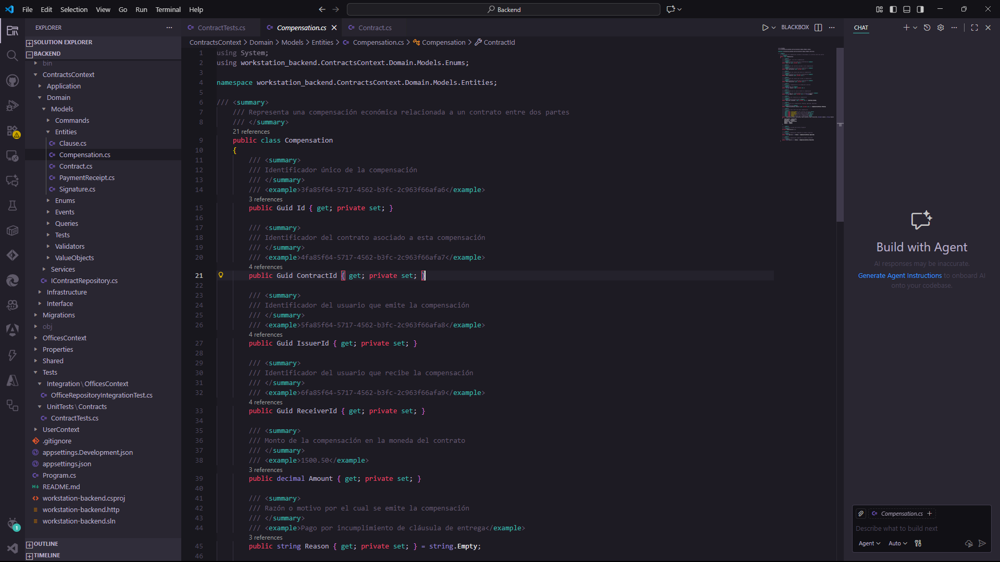

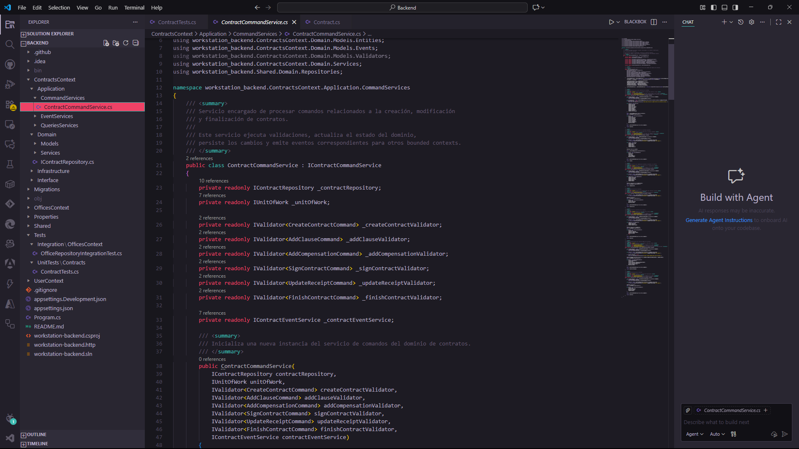

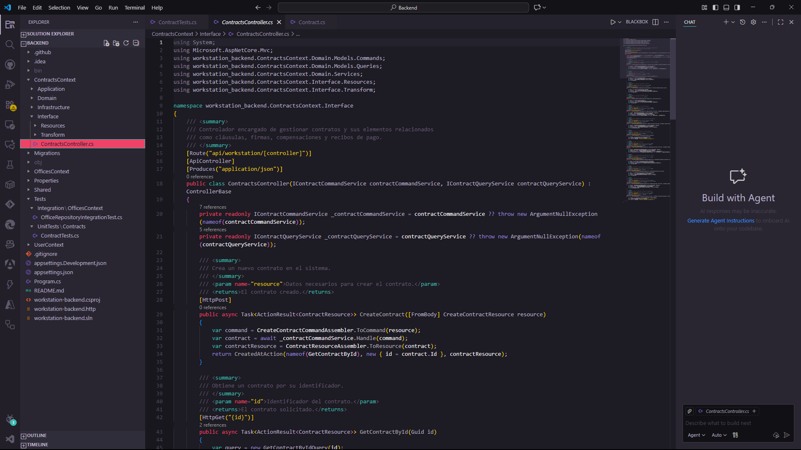

### 5.2.3.3 Testing Suite Evidence for Sprint Review  
Para este sprint se evidencia el testeo que se realizo al momento de realizar las actualizaciones respectivas 

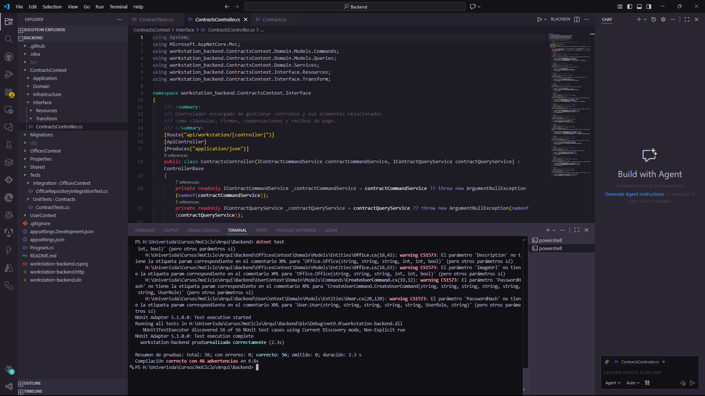

### 5.2.3.4 Execution Evidence for Sprint Review  
Visualizacion de la actualizacion en este sprint mediante swagger


### 5.2.3.5 Microservices Documentation Evidence for Sprint Review  

En este sprint se actualizó la documentación de los microservicios para reflejar las nuevas funcionalidades trabajadas sobre el contexto de Contracts y las mejoras en búsqueda, reseñas y calificaciones. A partir del código del backend se regeneró el archivo Swagger/OpenAPI y se revisaron las colecciones de Postman para asegurar que todos los endpoints expuestos estuvieran alineados con los cambios de nuestro Sprint 3.

Endpoints principales actualizados

| Servicio          | Endpoint                                                     | Método | Descripción                                                                                 |
|-------------------|---------------------------------------------------------------|--------|---------------------------------------------------------------------------------------------|
| **WorkspaceService** | `/api/workspaces/search`                                     | GET    | Búsqueda avanzada con filtros por servicios, precio, capacidad y ubicación.                |
| **ReviewService**    | `/api/reviews`                                               | POST   | Crear una nueva reseña asociada a un workspace y un usuario.                               |
| **ReviewService**    | `/api/reviews/{reviewId}`                                    | PUT    | Actualizar el comentario o la puntuación de una reseña existente.                          |
| **ReviewService**    | `/api/reviews/{reviewId}`                                    | DELETE | Eliminar una reseña registrada por el usuario.                                              |
| **ReviewService**    | `/api/reviews/workspace/{workspaceId}`                       | GET    | Listar reseñas de un workspace específico.                                                  |
| **RatingService**    | `/api/ratings/office/{officeId}`                             | GET    | Obtener el promedio de calificaciones de una oficina.                                       |
| **RatingService**    | `/api/ratings`                                               | POST   | Registrar una nueva calificación de oficina o propietario.                                  |
| **ContractService**  | `/api/workstation/contracts/{contractId}/receipt`            | GET    | Consultar el recibo generado para un contrato.                                              |
| **ContractService**  | `/api/workstation/contracts/{contractId}/receipt`            | PUT    | Actualizar datos del recibo (método de pago, montos, etc.).                                 |
| **AuthService**      | `/api/auth/register`                                         | POST   | Registro de usuarios con validaciones de seguridad.                                         |
| **AuthService**      | `/api/auth/login`                                            | POST   | Inicio de sesión con emisión de token JWT.                                                  |

Todos estos endpoints fueron verificados con colecciones de Postman, comprobando códigos de respuesta exitosos (200/201) y errores controlados (400/401/404) según los casos de prueba definidos. Además, se actualizó la documentación generada automáticamente en Swagger, donde se revisaron descripciones, parámetros y modelos de request/response para mantener la trazabilidad de cada microservicio.  
URL de la documentación Swagger actualizada:  
https://workstation-arqui-fgbngphuh0g4a8at.canadacentral-01.azurewebsites.net/swagger/index.html

A continuacion mostraremos el envio y la repuesta desde el backend, todo en json.
#### Users
Envio de registro:

```json
{
  "firstName": "string",
  "lastName": "string",
  "dni": "string",
  "phoneNumber": "string",
  "email": "string",
  "passwordHash": "string",
  "role": 1
}
```
El registro almacena los datos principales del usuario, como sus nombre completo, dni, celular, email, una contraseña y su rol dentro de la aplicacion.

Al hacer un get se recibe lo siguiente:

```json
  {
    "id": "3fa85f64-5717-4562-b3fc-2c963f66afa6",
    "createdDate": "2025-12-01T13:34:37.510Z",
    "modifiedDate": "2025-12-01T13:34:37.510Z",
    "userId": 0,
    "updatedUserId": 0,
    "isActive": true,
    "firstName": "string",
    "lastName": "string",
    "dni": "string",
    "phoneNumber": "string",
    "email": "string",
    "role": 1,
    "createdAt": "2025-12-01T13:34:37.510Z",
    "passwordHash": "string"
  }
```

Son datos basicos y algunos extra como la fecha en que se creo que perfil y su Id. La contraseña como su mismo nombre indica, esta hasheada, por lo que es seguro.

Asi mismo, tenemos un endpoint para el login:

```json
{
  "email": "string",
  "passwordHash": "string"
}
```

#### Offices
Iniciando por el Post, el json que se envia es de la siguiente manera.
```json
{
  "location": "string",
  "description": "string",
  "imageUrl": "string",
  "capacity": 0,
  "costPerDay": 0,
  "available": true,
  "services": [
    {
      "name": "string",
      "description": "string",
      "cost": 0
    }
  ]
}
```
Donde la ubicacion juega un rol importante, ya que decidimos no tener la variable de "Nombre" dentro de estas oficinas, ya que consideramos que es mas importante una ubicacion, ademas que nos ayudara con la busqueda de las oficinas en el contexto de Search. Asimismo tiene una descripcion, un URL de la imagen que se quiere mostrar, la capacidad maxiam, costo por dia y si es que esta disponible, esta variable puede cambiar si es que un contrato es activado con el ID de la oficina. Por ultimo, tenemos los servicios, que es una entidad con sus propios valores, como el nombre, la descripcion y el costo.

La informacion de las oficinas regresa de la siguiente manera:
```json
  {
    "id": "33d2f2f2-5654-4493-ba7b-53f1d79bb0da",
    "location": "Lima, Miraflores",
    "description": "Oficina moderna cerca al malecón con excelente iluminación.",
    "imageUrl": "https://i.pinimg.com/736x/a7/32/99/a732998348f2be65758af453c2d4b166.jpg",
    "capacity": 12,
    "costPerDay": 50,
    "available": true,
    "services": [
      {
        "name": "Aire acondicionado",
        "description": "Climatización para días de calor",
        "cost": 20
      },
      {
        "name": "Café ilimitado",
        "description": "Máquina de café disponible todo el día",
        "cost": 20
      }
    ]
  }
```
Tan solo agregando el Id de las oficinas.

#### Rating
Para crear un rating en la aplicacion, se realiza lo siguiente:
```json
{
  "score": 0,
  "comment": "string",
  "officeId": "3fa85f64-5717-4562-b3fc-2c963f66afa6"
}
```

Y de regreso, la respuesta es:

```json
{
  "id": "string",
  "score": 0,
  "comment": "string",
  "officeId": "3fa85f64-5717-4562-b3fc-2c963f66afa6"
}

```

#### Contracts

Para los Contratos se tienen mas endpoints que los anteriores conextos, para el envio de un Contrato es de la siguiente manera:

```json
{
  "officeId": "3fa85f64-5717-4562-b3fc-2c963f66afa6",
  "ownerId": "3fa85f64-5717-4562-b3fc-2c963f66afa6",
  "renterId": "3fa85f64-5717-4562-b3fc-2c963f66afa6",
  "description": "string",
  "startDate": "2025-12-01T13:47:53.582Z",
  "endDate": "2025-12-01T13:47:53.582Z",
  "baseAmount": 0,
  "lateFee": 0,
  "interestRate": 0
}
```

La respuesta de este mismo contrato seria:

```json
{
  "id": "3fa85f64-5717-4562-b3fc-2c963f66afa6",
  "officeId": "3fa85f64-5717-4562-b3fc-2c963f66afa6",
  "ownerId": "3fa85f64-5717-4562-b3fc-2c963f66afa6",
  "renterId": "3fa85f64-5717-4562-b3fc-2c963f66afa6",
  "description": "string",
  "startDate": "2025-12-01T13:47:53.588Z",
  "endDate": "2025-12-01T13:47:53.588Z",
  "baseAmount": 0,
  "lateFee": 0,
  "interestRate": 0,
  "status": "string",
  "createdAt": "2025-12-01T13:47:53.588Z",
  "activatedAt": "2025-12-01T13:47:53.588Z",
  "terminatedAt": "2025-12-01T13:47:53.588Z",
  "clauses": [
    {
      "id": "3fa85f64-5717-4562-b3fc-2c963f66afa6",
      "name": "string",
      "content": "string",
      "order": 0,
      "mandatory": true
    }
  ],
  "signatures": [
    {
      "id": "3fa85f64-5717-4562-b3fc-2c963f66afa6",
      "signerId": "3fa85f64-5717-4562-b3fc-2c963f66afa6",
      "signedAt": "2025-12-01T13:47:53.588Z",
      "signatureHash": "string"
    }
  ],
  "compensations": [
    {
      "id": "3fa85f64-5717-4562-b3fc-2c963f66afa6",
      "issuerId": "3fa85f64-5717-4562-b3fc-2c963f66afa6",
      "receiverId": "3fa85f64-5717-4562-b3fc-2c963f66afa6",
      "amount": 0,
      "reason": "string",
      "createdAt": "2025-12-01T13:47:53.588Z",
      "status": "string"
    }
  ],
  "receipt": {
    "id": "3fa85f64-5717-4562-b3fc-2c963f66afa6",
    "receiptNumber": "string",
    "baseAmount": 0,
    "compensationAdjustments": 0,
    "finalAmount": 0,
    "issuedAt": "2025-12-01T13:47:53.588Z",
    "updatedAt": "2025-12-01T13:47:53.588Z",
    "notes": "string",
    "status": "string"
  }
}
```

Se tienen otros endpoints como el enpoint para agregar clausulas, que el envio es de la siguiente manera:

```json
{
  "name": "string",
  "content": "string",
  "order": 0,
  "mandatory": true
}
```

Tambien se encuentra el endpoint para firmar el contrato:

```json
{
  "signerId": "3fa85f64-5717-4562-b3fc-2c963f66afa6",
  "signatureHash": "string"
}
```

Para activar el contrato es el siguiente:
```json
{
  "id": "string"
}
```

Por ultimo, para agregar las compensaciones si es que no se ha pagado durante el periodo esperado, el envio es de la siguiente manera:

```json
{
  "issuerId": "3fa85f64-5717-4562-b3fc-2c963f66afa6",
  "receiverId": "3fa85f64-5717-4562-b3fc-2c963f66afa6",
  "amount": 0,
  "reason": "string"
}
```

Tambien hay una respuesta por parte de las compensaciones que es asi:

```json
[
  {
    "id": "3fa85f64-5717-4562-b3fc-2c963f66afa6",
    "issuerId": "3fa85f64-5717-4562-b3fc-2c963f66afa6",
    "receiverId": "3fa85f64-5717-4562-b3fc-2c963f66afa6",
    "amount": 0,
    "reason": "string",
    "createdAt": "2025-12-01T13:53:20.230Z",
    "status": "string"
  }
]
```

Por ulimo, un enpoint que retorna el recibo final de pago para los usuarios:

```json
{
  "id": "3fa85f64-5717-4562-b3fc-2c963f66afa6",
  "receiptNumber": "string",
  "baseAmount": 0,
  "compensationAdjustments": 0,
  "finalAmount": 0,
  "issuedAt": "2025-12-01T13:53:20.232Z",
  "updatedAt": "2025-12-01T13:53:20.232Z",
  "notes": "string",
  "status": "string"
}
```

### 5.2.3.6 Software Deployment Evidence for Sprint Review  

Durante el Sprint 3 se realizó un nuevo ciclo de despliegue del backend de WorkStation para publicar los cambios en los microservicios y cerrar las tareas relacionadas con Contracts, recibos y la integración con oficinas. El proceso se mantuvo sobre la misma estrategia de contenedores utilizada en sprints anteriores, lo que permitió actualizar la versión sin romper el entorno actual.

Los pasos principales del deployment fueron:

1. Actualización del código y ejecución de pruebas  
   - Se integraron los cambios del Sprint 3 en la rama principal del backend.  
   - Se ejecutaron las pruebas unitarias e integración configuradas para Contracts, búsqueda avanzada y reseñas, verificando que los endpoints actualizados continuaran respondiendo correctamente.

2. Build de imagen Docker  
   - Localmente se levantó el stack con `docker-compose` para validar que todos los microservicios (Auth, Workspace, Booking, Contracts, Reviews/Ratings) se comunicaran correctamente en la red interna.

3. Publicación en la nube  
   - Se actualizó la configuración del servicio en Azure para apuntar a la nueva imagen, reutilizando variables de entorno, cadenas de conexión y credenciales ya definidas en sprints previos.  
   - Se verificó el estado del contenedor desde el panel de Azure, comprobando logs de inicio sin errores críticos.

4. Validación post–despliegue
   


   - Se realizaron pruebas manuales desde Postman contra el entorno desplegado (búsqueda avanzada, creación de reseñas, consulta de recibos) para asegurar que el comportamiento en producción coincidiera con lo observado en el entorno local.

### 5.2.3.7 Team Collaboration Insights during Sprint


### 5.2.3.8 Kanban Board
### Kanban Board Actualizado

| **Backlog**                                                 | **To Do**                                                                        | **In Progress**                                                                     | **Done**                                                                 |
| ----------------------------------------------------------- | -------------------------------------------------------------------------------- | ----------------------------------------------------------------------------------- | ------------------------------------------------------------------------ |
| B1 – Autenticación con JWT y roles (freelancer/host/admin). | T1 – Diagramar arquitectura de despliegue (C4 Level 4 / Deployment).             | P1 – Actualización del Diagrama de Componentes (C4 Level 3).                        | D1 – Lean UX Canvas, entrevistas y Customer Journey Map.                 |
| B2 – Sistema de reservas + calendario + pagos.              | T2 – Documentar pipeline CI/CD (GitHub Actions / Azure DevOps).                  |                                                                                     | D2 – User Personas, Empathy Map y As-Is Scenario.                        |
| B3 – Servicio de notificaciones (email/push).               | T3 – Registrar ADR (Architecture Decision Records).                               |                                                                                     | D3 – User Stories + Product Backlog priorizado.                          |
| B4 – API de mapas (Google Maps / Leaflet).                  | T4 – Diagrama de secuencia del flujo de reserva.                                 |                                                                                     | D4 – Documentación de endpoints con Swagger/OpenAPI (Finalizado).        |
| B6 – Mejoras adicionales de testing (e2e, integración).     |                                                                                  |                                                                                     | D5 – Selección de arquitectura backend (.NET / Spring Boot / NestJS).    |
|                                                             |                                                                                  |                                                                                     | D6 – Diseño del modelo ER + normalización de base de datos.             |
|                                                             |                                                                                  |                                                                                     | D7 – Definición de microservicios y dominios DDD.                        |
|                                                             |                                                                                  |                                                                                     | D8 – Despliegue en la nube (Docker + AWS/Render/Railway).               |
|                                                             |                                                                                  |                                                                                     | D9 – Pruebas unitarias en backend completadas.                            |
|                                                             |                                                                                  |                                                                                     | D10 – Quality Attribute Scenarios definidos.                               |
|                                                             |                                                                                  |                                                                                     | D11 – Drivers arquitectónicos documentados.                                |


### Narrativa del Kanban Board Actualizado

El tablero Kanban actualizado refleja el estado actual del proyecto *WorkStation*, mostrando el flujo de trabajo mediante cuatro columnas principales: **Backlog**, **To Do**, **In Progress** y **Done**. Esta organización permite visualizar con claridad la planificación, las prioridades y el progreso del equipo a lo largo del desarrollo arquitectónico del sistema.

La columna **Backlog** incluye las tareas planificadas para fases posteriores, entre ellas la autenticación con JWT, el sistema de reservas completo con calendario y pagos, así como mejoras futuras en pruebas automatizadas. Estas actividades forman parte del desarrollo del MVP en siguientes etapas.

En la columna **To Do** se ubican tareas de prioridad inmediata relacionadas con decisiones arquitectónicas críticas: la elaboración del diagrama de despliegue (C4 Level 4), la documentación del pipeline CI/CD y el registro de decisiones arquitectónicas (ADR). Estas acciones conectan la visión conceptual del sistema con su implementación técnica.

La columna **In Progress** actualmente contiene la actualización del diagrama de componentes (C4 Level 3), que constituye un paso clave para la transición hacia un diseño arquitectónico más detallado y coherente.

Finalmente, la columna **Done** agrupa las tareas ya completadas por el equipo. Entre ellas destacan los artefactos de investigación y análisis inicial (Lean UX Canvas, entrevistas, Customer Journey Map, User Personas), la documentación de los primeros niveles del modelo C4 y los drivers arquitectónicos.  
Además, se incorporan los avances más recientes del proyecto:

- **Documentación de endpoints con Swagger/OpenAPI**, actualmente desplegada y funcional.  
- **Pruebas unitarias en el backend**, completadas como parte del último entregable.  
- **Selección de la arquitectura backend**, definiendo oficialmente la tecnología base.  
- **Diseño del modelo ER y normalización**, consolidando la estructura de datos.  
- **Definición de microservicios utilizando DDD**, estableciendo la delimitación de dominios clave.  
- **Despliegue en la nube con Docker**, habilitando la disponibilidad del servicio en un entorno remoto.

En conjunto, este tablero evidencia un progreso significativo desde las etapas exploratorias hasta la concreción de elementos arquitectónicos y técnicos esenciales, demostrando un avance sólido hacia la construcción del sistema WorkStation.


## 5.2.4 Sprint 4
#### 5.2.4.1 Sprint Backlog 4

<table>
<thead>
<tr class="header"><th>Sprint #</th><th colspan="7">Sprint 4</th></tr>
<tr class="odd"><th colspan="2">User Story</th><th colspan="6">Work-Item / Task</th></tr>
<tr class="header"><th>Id</th><th>Title</th><th>Id</th><th>Title</th><th>Description</th><th>Estimation (Hours)</th><th>Assigned To</th><th>Status</th></tr>
</thead>
<tbody>


<tr class="odd"><td colspan="2">US-29</td>
<td>WI49</td><td>Optimización API Reseñas</td>
<td>Mejorar endpoints de reseñas y añadir validaciones adicionales</td><td>5</td>
<td>[Braulio]</td><td>Done</td></tr>

<tr class="header"><td colspan="2">US-30</td>
<td>WI50</td><td>Finalización Verificación Usuarios</td>
<td>Completar integración con LinkedIn/DNI y pruebas de validación</td><td>6</td>
<td>[Diego]</td><td>Done</td></tr>

<tr class="odd"><td colspan="2">US-41</td>
<td>WI51</td><td>Optimización Búsqueda Avanzada</td>
<td>Mejorar filtros de búsqueda y rendimiento de consultas</td><td>7</td>
<td>[Rodrigo]</td><td>Done</td></tr>


<tr class="header"><td colspan="2">US-42</td>
<td>WI52</td><td>Finalización API Calificaciones</td>
<td>Completar lógica de calificación y visualización en interfaz</td><td>6</td>
<td>[Henry]</td><td>Done</td></tr>


<tr class="odd"><td colspan="2" rowspan="2">Técnicas</td>
<td>WI53</td><td>Seguridad Avanzada</td>
<td>Implementar roles adicionales y validación de tokens</td><td>5</td>
<td>[Renzo]</td><td>Done</td></tr>
<tr class="header"><td>WI54</td><td>Documentación Final</td>
<td>Documentación completa de APIs, microservicios y despliegue</td><td>6</td>
<td>[Diego]</td><td>Done</td></tr>


<tr class="odd"><td colspan="2" rowspan="2">Migración</td>
<td>WI55</td><td>Cierre WI23</td>
<td>Finalizar lógica de recibos pendiente</td><td>4</td>
<td>[Renzo]</td><td>Done</td></tr>
<tr class="header"><td>WI56</td><td>Cierre WI27</td>
<td>Integración contratos-oficinas completada</td><td>5</td>
<td>[Rodrigo]</td><td>Done</td></tr>

</tbody>
</table>

### 5.2.4.2 Development Evidence for Sprint Review
Durante este Sprint 4, se realizo la separacion de uno de nuestros servicios a un microservicio y la creacion de un API Gateway para manejarlo. Ademas, se ejecuto todo esto dentro de entorno controlado como lo vendria a ser Docker y sus contenedores.

En la siguiente imagen se puede visualizar el nuevo enfoque y orden de nuestros directorios dentro de nuestro proyecto.


Dentro de la carpeta de Gateway se encuentra la configuracion de nuestro API Gateway y de algunos contextos que por falta de tiempo no se logro migrar a microservicios, sin embargo aun siguen completamnete funcionales en conjunto al microservicio separado.


En la siguiente imagen se puede ver el Dockerfile que se creo para poder correr el proyecto hecho en .NET Framework, lo que facilita su ejecucion.


Asimismo, se separo la base de datos en dos, creando una base de datos en MSSQL para almacenar todos los datos de este servicio.


Dentrode la siguiente imagen se puede ver el ultimo contexto realizado, completamente separado del API Gateway y con su propia configuracion. 


Asimismo, este servicio posee su propio Dockerfile para correr por si mismo.


Y se creo una nueva base de datos hecha en Postgres para el almacenamiento de datos.


Para finalizar, dentro de nuestro nuevo proyecto, se creo un `docker-compose` para que todo sea levantado y ejecutado dentro de un entorno controlado, Docker. Aqui se corren las imagenes necesarias, como las bases de datos, el microservicio y NGINX, que nos ayudo en hacer balanceo de carga.


En las siguientes imagenes se podra ver la configuracion que se hizo dentro del documento `nginx.conf` para levantar el servicio y se pueda hacer el balanceo de carga.


Y para terminar, la ejecuccion creo un `docker-build.log` que nos ayuda a tener control de lo que sucede dentro de la aplicacion y poder verificar errores que puedan suceder con requests.


### 5.2.4.3 Testing Suite Evidence for Sprint Review

Para este Sprint, se realizaron mas Tests dentro del contexto de Oficinas.

Estos primeros tests tratan acerca de la creacion de oficinas basicas y probar las validaciones inicales que se tiene dentro de sercivios de la capa Application. Asimismo verifica los tipos de excepciones que son lanzadas al tratar de insertar valores nulos dentro de la clase de Oficinas.


Dentro de los siguientes test se verifica la creacion de ratings y servicios dentro de las oficinas, ademas de probar la creacion de oficinas con mas valores nulos dentro de las clases anteriormente mencionadas.


Los siguientes tests son del siguiente nivel los test de integracion, donde se midio la persistencia de datos dentro de la base de datos creada en MSSQL. Aqui se verifican el uso de los comandos de creacion.


En las siguientes imagenes, se verifican las excepciones al crear ofifinas con la misma ubicacion y una ubicacion erroena.


Por ultimo, se verifica si es que se puede elminar o editar la oficina que ya fueron creadas dentro de la base de datos temporalmente creada.


### 5.2.4.4 Execution Evidence for Sprint Review
Para este Sprint, se realizaron las siguientes ejecuciones como evidencia..<br><br>

Terminal donde se ejecuta docker-compose up -d. El comando levanta exitosamente varios contenedores, incluyendo bases de datos y servicios de la aplicación, configurando el entorno completo.
<br><br>

Se muestra la vista general de los contenedores del backend en Docker Desktop, donde todos están ejecutándose.
<br><br>

En esta vista se observan con más detalle los logs de SQL Server dentro del contenedor workstation-mssql, donde el motor realiza procesos internos de recuperación. 
<br><br>

Aquí se muestran los logs del contenedor workstation-postgres, donde PostgreSQL detecta una base existente, completa correctamente el proceso de arranque y finaliza indicando que el sistema está listo para aceptar conexiones. 
<br><br>

Aqui se muestra los registros de un contenedor que ejecuta Nginx (un servidor web/proxy). Los logs detallan el proceso de inicio automático del servicio, donde ejecuta scripts de configuración para activar soporte IPv6 y definir procesos. El mensaje final confirma que la configuración está completa y el servicio está listo. El estado indica que lleva 38 segundos en ejecución. 
<br><br>


Aquí se observa que el servicio de contratos detecta que la base de datos en PostgreSQL ya existe y que las tablas esperadas también están disponibles. Ejecuta consultas de verificación, confirma la existencia de registros y finaliza mostrando que la configuración con PostgreSQL se completó con éxito. Luego inicia la aplicación en el puerto 80 y queda operativa. 
<br><br>


Aqui vemos que los logs muestran que el contenedor del gateway está ejecutando correctamente todas las migraciones de Entity Framework, creando tablas, índices y llaves foráneas sin errores. Después de completar el proceso, el servicio inicia en modo producción, abre el hosting en el puerto 80 y queda listo para recibir solicitudes. 
<br><br>


En esta vista se presenta la documentación de otra API para gestionar oficinas y calificaciones. Incluye operaciones CRUD para oficinas y un endpoint para crear calificaciones, dirigida a otros equipos consumidores. 
<br><br>

En esta vista se muestra la documentación del microservicio de contratos. Se listan sus endpoints para crear, consultar, firmar y gestionar cláusulas de contratos. Los iconos de verificación sugieren que están implementados. 
<br><br>


### 5.2.4.5 Microservices Documentation Evidence for Sprint Review
### 5.2.4.6 Software Deployment Evidence for Sprint Review
### 5.2.4.7 Team Collaboration Insights during Sprint
## 5.2.4.8 Tablero Kanban (Kanban Board)

Para la gestión del proyecto *WorkStation*, el equipo utiliza un tablero Kanban que permite visualizar el flujo de trabajo en tiempo real, priorizar tareas críticas y limitar el trabajo en progreso (WIP). Esta herramienta ha sido fundamental para la transición desde el diseño inicial hacia la implementación de la arquitectura de microservicios.

### Estado Actual del Tablero

| **Backlog** | **To Do** | **In Progress** | **Done** |
| :--- | :--- | :--- | :--- |
| **B1** – Autenticación con JWT y roles (freelancer/host/admin). | **T1** – Diagramar arquitectura de despliegue (C4 Level 4 / Deployment). | **P1** – Actualización del Diagrama de Componentes (C4 Level 3). | **D1** – Lean UX Canvas, entrevistas y Customer Journey Map. |
| **B2** – Sistema de reservas + calendario + pagos. | **T2** – Documentar pipeline CI/CD (GitHub Actions / Azure DevOps). | | **D2** – User Personas, Empathy Map y As-Is Scenario. |
| **B3** – Servicio de notificaciones (email/push). | **T3** – Registrar ADR (Architecture Decision Records). | | **D3** – User Stories + Product Backlog priorizado. |
| **B4** – API de mapas (Google Maps / Leaflet). | **T4** – Diagrama de secuencia del flujo de reserva. | | **D4** – Documentación de endpoints con Swagger/OpenAPI (Finalizado). |
| **B6** – Mejoras adicionales de testing (e2e, integración). | | | **D5** – Selección de arquitectura backend (.NET / Spring Boot / NestJS). |
| | | | **D6** – Diseño del modelo ER + normalización de base de datos. |
| | | | **D7** – Definición de microservicios y dominios DDD. |
| | | | **D8** – Despliegue en la nube (Docker + AWS/Render/Railway). |
| | | | **D9** – Pruebas unitarias en backend completadas. |
| | | | **D10** – Quality Attribute Scenarios definidos. |
| | | | **D11** – Drivers arquitectónicos documentados. |

### Narrativa del Progreso
El tablero refleja un avance significativo en la infraestructura base del sistema:
1. **Fase de Diseño (Done):** Se han completado los artefactos de diseño estratégico (**D7**, **D11**) y la selección tecnológica (**D5**), definiendo .NET y Docker como el stack principal.
2. **Fase de Implementación (Done/In Progress):** Se ha logrado el despliegue inicial en la nube utilizando contenedores (**D8**). Actualmente, el equipo trabaja en refinar los diagramas de componentes (**P1**) para que coincidan con la reciente reestructuración física del repositorio.
3. **Próximos Pasos (To Do):** La prioridad inmediata es formalizar la documentación de despliegue (**T1**) y el pipeline de integración continua (**T2**) para automatizar los pases a producción.

---

## 5.3 Despliegue de Microservicios (Microservices Deployment)

La arquitectura de *WorkStation* se ha implementado siguiendo un patrón de microservicios contenerizados sobre **.NET Core**. Esta decisión permite desacoplar los dominios de negocio, facilitando el mantenimiento y permitiendo el uso de diferentes motores de base de datos según la necesidad de cada servicio (Persistencia Políglota).

**Inventario de Servicios Desplegados:**

| Servicio | Ubicación en Repositorio | Tecnología | Base de Datos | Puerto Interno |
| :--- | :--- | :--- | :--- | :--- |
| **Gateway Service** | `/Gateway` | .NET Core API | **MSSQL** (Linux Container) | 8080 |
| **Contract Service** | `/Services/ContractService` | .NET Core API | **PostgreSQL** (Alpine) | 8081 |
| **Load Balancer** | `/` (Root) | NGINX | N/A | 80 (Public) |

---

### 5.3.1 Cloud Architecture Diagram

El siguiente diagrama ilustra la topología de red dentro del entorno de despliegue. El sistema utiliza un **Proxy Inverso (NGINX)** como único punto de entrada, el cual distribuye el tráfico hacia los contenedores de backend basándose en la ruta de la URL, manteniendo un estricto aislamiento entre los contextos de datos.


*> Figura 1. Diagrama de Despliegue (C4 Model - Level 4) exportado desde Structurizr, detallando la orquestación de contenedores.*

**Flujo de Comunicación:**
1. **Petición Externa:** El cliente realiza una solicitud HTTP/HTTPS que es interceptada por el **NGINX**.
2. **Enrutamiento Inverso (Reverse Proxy):**
    * Si la ruta es `/api/users` o `/api/offices` → NGINX redirige al contenedor **Gateway Service**.
    * Si la ruta es `/api/contracts` → NGINX redirige al contenedor **Contracts Service**.
3. **Aislamiento de Datos:**
    * El **Gateway** se conecta a su contenedor dedicado de **MSSQL** a través de la red interna de Docker.
    * El servicio de **Contracts** se conecta a su contenedor dedicado de **PostgreSQL**.
    * *Nota:* No existe comunicación cruzada directa entre los servicios y las bases de datos ajenas a su contexto.

---

### 5.3.2 Cloud Architecture Deployment (Microsoft Azure)

Para satisfacer los requisitos de una arquitectura *Cloud Native*, la solución contenerizada se despliega sobre la infraestructura de **Microsoft Azure**, garantizando escalabilidad y alta disponibilidad.

**1. Estrategia de Infraestructura (IaaS):**
El despliegue utiliza una estrategia basada en **Azure Virtual Machines (Linux Ubuntu)** que actúa como *Docker Host* para la orquestación de los servicios.
* **Proveedor Cloud:** Microsoft Azure.
* **Orquestación:** Docker Engine + Docker Compose corriendo dentro de la instancia de nube.
* **Seguridad:** Configuración de Network Security Groups (NSG) para exponer únicamente el puerto 80 del balanceador.

**2. Estructura del Repositorio y Componentes:**
Basado en la rama `features/microservices`, el proyecto se estructura segregando responsabilidades en carpetas independientes, lo que permite ciclos de construcción aislados:
* **📂 /Gateway:** Contiene el código fuente del API Gateway principal (Contexto: Usuarios y Oficinas). Su despliegue está optimizado para trabajar junto a SQL Server.
* **📂 /Services/ContractService:** Contiene el microservicio de Contratos (Contexto: Negocio). Al residir en una ruta distinta, garantiza el desacoplamiento total de dependencias.
* **📄 docker-compose.yml:** Archivo maestro de orquestación. Define la red virtual (`workstation-network`), los volúmenes de datos persistentes y la inyección de variables de entorno.
* **📄 nginx.conf:** Configuración del Proxy Inverso que reside en la raíz. Gestiona las reglas de enrutamiento y balanceo de carga hacia los contenedores internos.


> *Figura 2. Estructura de archivos del repositorio implementando separación de servicios.*

**3. Estrategia de Contenedores (Docker Strategy):**
El despliegue utiliza imágenes ligeras basadas en Linux Alpine para optimizar recursos:
* **Construcción Multi-Etapa (Multi-stage Build):** Los servicios .NET (`Gateway` y `ContractService`) se compilan en una imagen SDK temporal y luego se copian solo los binarios a una imagen *Runtime* final.
* **Persistencia Políglota:** Se despliegan dos motores de base de datos simultáneos mediante Docker: **MSSQL (Linux)** para el Core y **PostgreSQL (Alpine)** para Contratos.
* **Gestión de Secretos:** Las credenciales de base de datos no se incluyen en el código (`appsettings.json`), sino que se inyectan dinámicamente al momento del despliegue mediante variables de entorno en el `docker-compose`.


> *Figura 3. Evidencia de contenedores ejecutándose en el entorno de despliegue.*

---

### 5.3.3 Automatización y Pipeline CI/CD

Para garantizar la estabilidad del despliegue distribuido, se han implementado mecanismos de automatización y verificación continua utilizando **GitHub Actions**.

**Pipeline de Integración Continua:**
Ubicado en la carpeta `.github/workflows`, el pipeline se activa automáticamente ante cada *push* o *pull request* a la rama principal (`main`). El flujo de trabajo ejecuta los siguientes pasos:
1. **Setup Environment:** Configura un entorno virtual con .NET SDK.
2. **Dependency Resolution:** Ejecuta `dotnet restore` para descargar dependencias de NuGet.
3. **Build Validation:** Compila la solución completa para detectar errores de sintaxis o referencias rotas.
4. **Automated Testing:** Ejecuta las pruebas unitarias ubicadas en el proyecto `Tests`, asegurando que la lógica de negocio de los nuevos microservicios no rompa funcionalidades existentes.

**Scripts de Gestión Operativa:**
El equipo ha desarrollado scripts de utilidad (como `manage-services.ps1`) para facilitar la administración del entorno Docker local. Estos scripts automatizan tareas repetitivas como el reinicio ordenado de servicios y la limpieza de contenedores huérfanos.


> *Figura 4. Pipeline de ejecución exitosa en GitHub Actions.*

## Final

### Avance de Conclusiones, Bibliografía y Anexos (links)

### Conclusión TB1:

WorkStation llega a resolver un problema que todo freelancer o dueño de coworking conoce demasiado bien: la fragmentación caótica de la oferta y la demanda. Hoy, conseguir un espacio de trabajo es un vía crucis entre mensajes en WhatsApp, consultas en grupos de Facebook o páginas web que nunca actualizan la disponibilidad. Del otro lado, los propietarios lidian con reservas poco serias, pagos informales y un control limitado sobre lo que pasa en sus espacios. Esa desconexión hace perder tiempo, clientes y, sobre todo, dinero.

La propuesta es simple pero potente: un marketplace centralizado que no necesita alquilar ni operar oficinas propias, sino conectar a ambas partes de manera transparente y eficiente. Para los usuarios, WorkStation ofrece comodidad y confianza: búsqueda con filtros claros (precio, ubicación, servicios), disponibilidad actualizada en vivo y pagos seguros desde un solo lugar. Para los dueños de coworking, la app representa un tablero de control que incluye calendario, reglas visibles para inquilinos, reseñas verificadas y menos carga administrativa. En resumen, cada clic suma productividad y menos dolores de cabeza.

La magia está en convertir interacciones dispersas y poco confiables en un flujo digital directo y fluido: encontrar, comparar, reservar y pagar en minutos. Pasamos de la incertidumbre del clásico “¿hola, sigue disponible?” a una experiencia estandarizada de “reservado en 3 clics”, donde cada parte sabe exactamente qué esperar. Eso no solo eleva la satisfacción del usuario, también genera más ocupación y confianza para los hosts, logrando que el mercado del coworking en ciudades como Lima tenga por fin una solución a la altura del nuevo mundo laboral.
